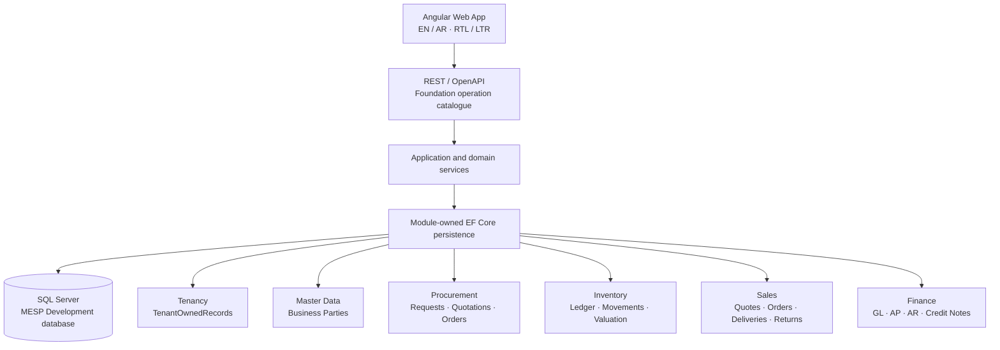

<p align="center">
  <picture>
    <source media="(prefers-color-scheme: dark)" srcset="frontend/assets/Logo_16_9_BG_Removed_Dark.png">
    
  </picture>
</p>

<h1 align="center">Mini_ERP_SaaS_Platform</h1>

<p align="center"><strong>A reusable bilingual, multi-tenant ERP foundation for Saudi small and medium businesses.</strong></p>

<p align="center">
  <a href="https://dotnet.microsoft.com/"></a>
  <a href="https://angular.dev/"></a>
  <a href="https://www.typescriptlang.org/"></a>
  <a href="https://www.microsoft.com/sql-server"></a>
  <a href="https://playwright.dev/"></a>
  
  
</p>

---

MESP is a generic SaaS ERP product under active Release 1 development. Its
architecture is shared across Tenants: Tenant isolation, organization scope,
configuration-led business behavior, server-authoritative authorization, and
module-owned persistence are product rules — not customer-specific forks.

The canonical project identity is **`Mini_ERP_SaaS_Platform`**. The
authoritative source repository is GitHub `Hossam1104/Mini_ERP_SaaS_Platform`;
the authoritative tracker is the Jira project `Mini_ERP_SaaS_Platform`, whose
issue key remains **`MESP`**.

## Current development status

The summary below is a convenience view. The authoritative live position is the
**CURRENT AUTHORITY** block at the top of
[`.ai/CURRENT_STATE.md`](.ai/CURRENT_STATE.md); live Jira and live GitHub
outrank this file for mutable facts.

| Item | Value |
|---|---|
| Accepted `main` | `644e7b364006a3a62dc8e9756b9a9a64afbd33e1` |
| Active capability | **MESP-138** — customer returns, credit notes, receipts (Epic MESP-9) |
| Active branch | `feat/MESP-138-customer-return-credit-receipts` |
| Published as | Draft PR **#86** — Open / Draft / Unmerged |
| Acceptance state | **Not accepted.** Held under GPT-5.6 Sol **HOLD 3** (blockers HOLD-138-J … HOLD-138-N) |
| Next capability | MESP-139 — **To Do, not activated** |
| Accepted fast-track completion | **21 / 26 = 80.8%** (MESP-138 not counted) |
| Production readiness | ~**47%** overall · ~**41%** Procurement/P2P |
| Open production gates | **MESP-48** (supported volume) · **MESP-50** (retention, privacy, legal hold, purge, residency, backup/restore) |
| Continuous integration | **None. Not claimed.** No pipeline exists in this repository; local runs are not CI |

Delivery is strictly sequential: one active capability, one executor, one
focused branch and Pull Request, and an exact one-session
[`TASK.md`](TASK.md) handoff. GPT-5.6 Sol is the planning and acceptance
authority; no executor self-accepts its own work.

## Capability matrix

Legend — **Merged**: accepted and merged at a bounded scope · **In review**:
implemented but not accepted · **Planned**: required Release 1 work not started
· **Gated**: blocked pending validation or an external decision.

| Capability | Status | Current boundary |
|---|:---:|---|
| Tenant, Company, Branch and organization scoping | Merged | Server-derived scope and Tenant isolation |
| Tenant-aware entry routing and operational context | Merged | Host candidate resolution, server membership, context switching |
| Authentication, session, authorization and audit seams | Merged | Production identity provider hardening remains gated |
| English / Arabic localization and RTL | Merged | Coverage expands with each bounded journey |
| Master Data and Business Parties | Merged | Category/UOM, Product, Supplier, Customer, reusable references |
| Tax, Currency, Exchange Rate and Payment Term references | Merged | Internal configuration-led evidence; no external/statutory claim |
| Price Lists and Master Data Import | Merged | Tenant-owned bounded capabilities |
| Purchase Requests and approval foundation | Merged | Configurable demand and approval flow |
| Supplier Quotations and source decision | Merged | Auditable quotation comparison and sourcing choice |
| Purchase Orders and Supplier Confirmation | Merged | Source lineage, approval, issue, confirmation/change/reapproval |
| Goods Receipt, Purchase Invoice handoff, matching | Merged | Physical and commercial evidence |
| Supplier Returns | Merged | Procurement commercial evidence plus Inventory handoff |
| Inventory ledger, opening, availability, reservation, tracking | Merged | MESP-128 authoritative physical ledger foundation |
| Receipt effects, Transfers, In Transit, Supplier Return stock | Merged | MESP-129 immutable movement lineage |
| Stock Adjustment, Counts, Stock Issue, corrections | Merged | MESP-130 count fences, SoD, blind counting, correction history |
| Moving-weighted-average valuation and Inventory reconciliation | Merged | MESP-131 Inventory-owned valuation and Finance handoff facts |
| Core Finance: chart of accounts, periods, journals, GL | Merged | MESP-132 Finance foundation |
| AP / AR / cash and settlement | Merged | MESP-133 manual-only settlement methods, subledger-to-GL reconciliation |
| Tax, FX, reporting currency and revaluation | Merged | MESP-134 internal configuration-led; no statutory scope |
| Finance period close, corrections and reports | Merged | MESP-135 controlled reversal and successor corrections |
| B2B Sales: quotations, Sales Orders, credit control | Merged | MESP-136 server-authoritative pricing, approval/SoD, credit outcomes |
| Sales reservation, fulfillment, Delivery, invoice eligibility | Merged | MESP-137 durable coordinated Delivery handoff and AR seams |
| Customer returns, credit notes, customer receipts | **In review** | MESP-138 — Draft PR #86 under Sol HOLD 3; **not accepted** |
| Generic Reporting and Analytics | Planned | MESP-139; not activated |
| Migration, onboarding and external integrations | Planned / Gated | Production and cutover gates remain open |
| ZATCA / FATOORA / statutory certification | Gated | Qualified external validation required; **no readiness is claimed** |

## Product direction

MESP is designed as a Saudi-localized B2B ERP baseline with English and Arabic
workflows, RTL support, multi-currency reference data, configurable Tax
references, auditability, and a country-pack-friendly architecture. It is not a
Retail POS product and is not a customer fork. A validation Tenant may use
local fixture naming during Development, but no product rule branches on a
customer name.

Release 1 covers the connected business domains needed for a reusable ERP:

- Procurement and Purchase-to-Pay;
- Inventory and Warehouse Management;
- B2B Sales and Order-to-Cash;
- Accounts Receivable, Accounts Payable, Core Accounting and Cash;
- Reporting and Analytics;
- Administration, Tenancy, security, audit, migration and onboarding.

The matrix above distinguishes those required domains from what is actually
usable today.

## Architecture



The backend is a modular monolith with the enforced project direction
`MiniErp.Api → MiniErp.Infrastructure → MiniErp.App → MiniErp.Contracts`.
Contracts hold stable public shapes, App owns application and domain seams,
Infrastructure owns provider-specific persistence and migrations, and Api is
the host and composition root. Application modules are `Audit`,
`BusinessParties`, `Finance`, `Identity`, `Inventory`, `MasterData`,
`Platform`, `Procurement` and `Sales`.

SQL Server is the configured local Development provider when explicitly
enabled; SQLite remains an explicit test and fallback provider where supported.
Production startup does not auto-migrate.

### Boundaries that hold across modules

- **Tenant is the hard security boundary.** Company, Branch and Warehouse are
  operational scopes *inside* an already authorized Tenant. A hostname supplies
  candidate routing only, never authorization.
- **Module ownership is exclusive.** Sales owns the commercial chain, Inventory
  owns physical stock truth, Finance owns GL, AP, AR, credit notes and tax
  effects. Operational modules never fabricate accounting entries outside the
  approved Finance contract.
- **Cross-module work is durable, not distributed-ACID.** The pattern is
  durable source evidence, downstream owner-local commit, deterministic effect
  identity, idempotent retry, explicit acknowledgement and reconciliation
  state, and fail-closed mismatch protection.
- **Posted facts are immutable.** Corrections happen through reversal or
  successor documents with retained lineage, never destructive rewrite.

## Technology stack

| Layer | Repository technology |
|---|---|
| Web client | Angular 22.1, TypeScript 6.0.2, standalone components, RxJS 7.8 |
| API / application | .NET 10 (SDK 10.0.400), C# 14, ASP.NET Core, REST/OpenAPI |
| Persistence | EF Core 10.0.10, SQL Server provider, SQLite test/fallback provider |
| API reference | Generated OpenAPI, rendered with Scalar in Development/QA only |
| Unit / architecture tests | Vitest 4.x on the frontend; xUnit 2.9.2 with .NET test SDK 17.12 |
| Browser checks | Playwright 1.62.1 |
| Local runtime | PowerShell launcher, SQL Server `MESP`, Angular proxy |

Every public REST operation is expected to carry Foundation catalogue metadata,
generated OpenAPI documentation, and an architecture/contract test. Scalar is a
Development/QA rendering of that generated contract, not a production surface.

## Repository map

```text
backend/       .NET projects, module application code, persistence and tests
frontend/      Angular shell, feature workspaces, unit tests and Playwright
docs/          BRDs, ADRs, specifications, decisions and the progress tracker
scripts/       Official local Development and validation helpers
wireframes/    Product and UI reference material
.ai/           Executor authorization policy and verified current state
AGENTS.md      Durable working agreement and AI model routing baseline
CLAUDE.md      Reading order and bounded execution rules for AI executors
TASK.md        Exact bounded prompt for the next session
Run.md         Local runtime, SQL and validation guide
```

## Local quick start

Prerequisites:

- .NET SDK 10.0.400 (pinned in `backend/global.json`);
- Node.js/npm compatible with the checked-in `package-lock.json`;
- Angular CLI dependencies installed by `npm install`;
- SQL Server for the local `MESP` Development database when exercising the
  authoritative SQL path.

The official launcher is the normal path. Configure local values in the process
or user environment; never commit them:

```powershell
$env:ASPNETCORE_ENVIRONMENT = 'Development'
$env:MESP_SQLSERVER_CONNECTION_STRING = '<your local SQL Server connection configured outside Git>'
$env:MESP_DEV_AUTH_BYPASS = 'true' # explicit local convenience; disabled by default
$env:MESP_DEV_TENANT_DISPLAY_NAME = 'Local validation workspace'

dotnet build .\backend\MiniErp.sln --configuration Release
.\scripts\Start-MiniErpDevelopment.ps1 -ApiPort 5300 -FrontendPort 4300 -Restart
```

The local SQL target convention is server `.` and database `MESP`; the
connection value itself must stay outside tracked documentation. The
Development bypass is exact-environment, loopback-only, server-actor based, and
does not bypass ordinary authorization or allow client impersonation. It fails
startup if enabled outside Development. For normal credential testing, leave it
disabled and follow [`Run.md`](Run.md).

> **Note for test runs:** because the bypass guard fails closed, leaving
> `MESP_DEV_AUTH_BYPASS=true` in your ambient shell will fail the host security
> suite with `permitted only when ASPNETCORE_ENVIRONMENT is exactly
> Development`. Clear it — or use `.\scripts\Test-MiniErpBackend.ps1` — before
> running tests.

Expected local addresses:

- Angular / common entry: <http://localhost:4300>
- Tenant entry fixture: <http://tenant.localhost:4300>
- Platform boundary fixture: <http://admin.localhost:4300>
- API health: <http://localhost:5300/health>
- OpenAPI / Scalar: Development/QA-only surfaces described in [`Run.md`](Run.md)

The launcher and generated proxy preserve the browser `Host` so the API can
resolve the entry mode. The browser consumes `auth/entry`; it does not
authorize a Tenant from a subdomain, route parameter, local storage, or any
client-supplied Tenant identifier.

If another local service owns port 5000, the explicit 5300/4300 override keeps
that unrelated service untouched.

## Database and migrations

The Development SQL database is `MESP`, with module-owned schemas and separate
EF migration histories per module context. Tenancy owns the shared
`tenancy.TenantOwnedRecords` table; other module contexts do not compete for
that physical table. Formal migrations are intentionally a Development and
runtime concern here. Deployment migrations, backup and restore, high
availability, capacity, retention and residency, and production cutover all
remain open gates.

## Quality checks

Run from the repository root:

```powershell
# Safe backend test runner — uses a dedicated disposable LocalDB connection.
# This script assigns a MiniErpFoundation_* target only to
# MESP_SQLSERVER_SAFETY_CONNECTION_STRING and leaves the persistent
# MESP_SQLSERVER_CONNECTION_STRING runtime variable completely unchanged.
.\scripts\Test-MiniErpBackend.ps1

# Or run the full Foundation validation (backend + Angular + Playwright + audit):
.\scripts\validate-foundation.ps1
```

Frontend checks from `frontend/`:

```powershell
npm test -- --watch=false
npm run build
npm run test:e2e
npm audit --omit=dev
```

Environment variable roles:

| Variable | Purpose |
|---|---|
| `MESP_SQLSERVER_CONNECTION_STRING` | Persistent Owner Development database (SQL Server `.` / `MESP`). Used by the application runtime only. |
| `MESP_SQLSERVER_SAFETY_CONNECTION_STRING` | Disposable `MiniErpFoundation_*` LocalDB target for destructive SQL safety tests. Never points at `MESP`. |

Do not conflate them. The safety harness rejects any connection that is not
`(localdb)\MSSQLLocalDB` with a `MiniErpFoundation_*` database name, and the
SQL Server safety suite reports as **gated** rather than passing when
`MESP_SQLSERVER_SAFETY_CONNECTION_STRING` is absent. Gated evidence is never
reported as passed.

There is **no continuous integration pipeline** in this repository. A passing
local Development suite does not by itself establish production readiness.

## Documentation

- [Local Development and integrated runtime guide](Run.md)
- [Backend technical reference](backend/README.md)
- [Frontend technical reference](frontend/README.md)
- [Current verified state](.ai/CURRENT_STATE.md)
- [AI executor authorization policy](.ai/AI_EXECUTION_POLICY.md)
- [Repository working agreement and model routing](AGENTS.md)
- [Project statistics and production-readiness tracker](docs/staticts.md)
- [Backend project/module boundaries](docs/ADR-002_Backend_Project_Structure_and_Module_Enforcement.md)
- [SQL schemas, migrations and provider boundaries](docs/ADR-006_Module_Schemas_EF_Core_Migrations_Transactions.md)
- [Testing environments and production gates](docs/ADR-018_Testing_Environments_SQL_Server_Containers_and_Gates.md)
- [Tenant host resolution, workspace context and branding](docs/ADR-019_Tenant_Host_Resolution_Workspace_Context_and_Branding.md)
- [Release 1 approved decision and dependency map](docs/33_Release_1_MESP_116_Approved_Decision_and_Dependency_Map.md)
- [Next exact session prompt](TASK.md)

## Production-readiness disclaimer

MESP is **not** production-ready and is not advertised as such. Open areas
include deployment topology, secure production identity and infrastructure, SQL
provider and production migration governance, backup and restore, capacity and
performance, monitoring, legal and privacy review, Saudi statutory and
regulatory validation, specialist accounting and inventory review, migration
and cutover, and external integration decisions.

No ZATCA, FATOORA, statutory, tax-authority, or certification readiness is
claimed anywhere in this repository. Do not use the Development authentication
convenience or the local database process as a production deployment model.

## Scope discipline

- MESP-138 is **in review and not accepted**. Draft PR #86 must not be marked
  Ready, merged, rebased, force-pushed, or counted as delivered capability
  while Sol HOLD 3 stands.
- MESP-139 must not be started until GPT-5.6 Sol explicitly activates it.
- Owner-managed source assets under `frontend/assets` must never be deleted,
  renamed, replaced, regenerated, optimized, recolored, moved, or restored from
  Git without explicit Owner instruction. Untracked files there are not
  temporary.
- The tracker filename `docs/staticts.md` is canonical and must not be
  "corrected" or duplicated.
- Retail POS, customer-specific core forks, external production integrations,
  and statutory implementation remain out of Release 1 scope.
