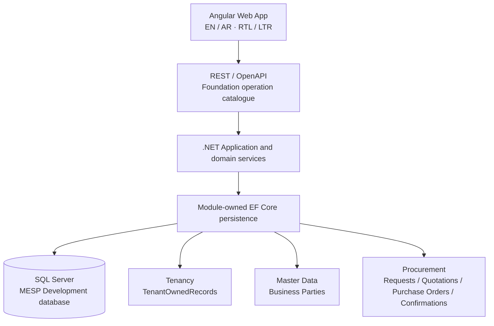

<p align="center">
  <picture>
    <source media="(prefers-color-scheme: dark)" srcset="frontend/assets/Logo_16_9_BG_Removed_Dark.png">
    
  </picture>
</p>

<p align="center"><strong>A reusable bilingual, multi-tenant ERP foundation for Saudi small and medium businesses.</strong></p>

<p align="center">
  <a href="https://dotnet.microsoft.com/"></a>
  <a href="https://angular.dev/"></a>
  <a href="https://www.typescriptlang.org/"></a>
  <a href="https://www.microsoft.com/sql-server"></a>
  <a href="https://playwright.dev/"></a>
  
</p>

MESP is a generic SaaS ERP product under active Release 1 development. Its
architecture is shared across Tenants: Tenant isolation, organization scope,
configuration-led business behavior, server-authoritative authorization, and
module-owned persistence are product rules—not customer-specific forks.

## Current development status

### Current checkpoint: MESP-144 HOLD 3 repository-health reconciliation - 30 August 2026

MESP-144 is **In Progress** under Sol HOLD 3 comment `12288`. PR #82 is the
repository-health reconciliation checkpoint on
`chore/project-health-reconciliation-cleanup`; its reviewed starting head was
`0eae673ac49cdbc51503709323f49cce2a8aa138`, and accepted current `main` is
`4d6e33189a3835d5d8d2a58736055a837a3f5bc9`. The current-main history is
integrated without rebase or rewrite; the PR remains subject to independent
Sol review at the executor handoff, with GitHub authoritative for lifecycle.

MESP-137 is Done/accepted/merged. No implementation capability is active;
MESP-138 and MESP-139 remain To Do/inactive; fast-track completion is
`21/26 = 80.8%`; production readiness remains approximately `47%` overall and
`41%` Procurement/P2P; and MESP-48/MESP-50 remain open production gates.
This checkpoint changes documentation/state only and does not claim a new
product, test, migration, asset, Jira, or downstream-capability change.

### Historical MESP-135 Finance close, corrections, reconciliation and reports - 26 August 2026

MESP-134 is Done and squash-merged to `main` at
`1e49814172843c2ec2279b8dcc5fc0a41e5da372` through PR #78; closure comment is
`12122`. MESP-135 is the only active Finance implementation capability under
MESP-10, In Progress/activated by `12123`, with Finance reconciliation `12124`.
The bounded implementation branch is `feat/MESP-135-finance-close-reports`.

MESP-135 covers Finance-owned period lifecycle and durable close readiness,
controlled reopen/reclose, year-end, exact corrections/reversals,
reconciliation, Trial Balance, General Ledger, AP/AR aging, valid
account-classified P&L/Balance Sheet reports, and authorized deterministic
export. It reuses the MESP-132/133/134 authorities. MESP-139 generic Reporting,
scheduling, consolidation, statutory/provider work, and Wafra-specific core
behavior remain outside scope. No Jira writes, Opus review, merge, or Ready
transition is permitted in this bounded session.

Fast-track remains `18/26 = 69.2%`; production readiness remains approximately
`47%` overall and `41%` Procurement/P2P. MESP-48 and MESP-50 remain open
production gates.

The implementation feature SHA is
`6dca68888c4300dff2575d99b3edf919e965d783`, with additive migration
`20260826133441_MESP135FinanceCloseReports`. It exposes 22 public Finance
operations and lazy `/app/finance/close` and `/app/finance/reports` workspaces.
Final evidence is Release 0 warnings/0 errors, focused MESP-135 persistence
3/3, REST/OpenAPI/host 55/55, SQL safety 77/77, full backend 1,062/1,062 with
0 failures and 0 skips, Angular 283/283, focused Chromium 5/5, full Chromium
47/47, clean EF model-change detection, and both npm audits at 0
vulnerabilities. The production bundle is 496.45 kB initial; Finance/GL,
close, reports, and settlement lazy chunks are 34.52 kB, 16.28 kB, 16.59 kB,
and 56.04 kB. The runtime is API 5300 PID 46612 and frontend 4300 PID 43716;
all required probes returned HTTP 200. One Draft/Open/Unmerged PR remains for
Sol acceptance; MESP-135 is not marked Done and no Jira, Opus, merge, or Ready
transition occurred.

### Historical MESP-134 Tax / FX / Reporting Currency / Revaluation HOLD 2 - 26 August 2026

MESP-132 and MESP-133 are Done/merged/closed at their accepted bounded scopes.
MESP-133 merged at `3c616dd85b9cebb53990934321f1ae7d0d5410c9` from accepted
feature head `6908c003a32be8a3a31782d855b8358f2a9505f5`. MESP-134 is the only
active Finance capability under MESP-10 and is being delivered on Draft PR #78,
which remains Open, Draft, and Unmerged. Sol closure `12037`, Finance
reconciliation `12038`, and MESP-134 activation `12039` are historical/current
activation authority; Sol HOLD 1 `12044`, HOLD 2 `12080`, and MESP-10 HOLD 2
reconciliation `12081` govern this remediation. MESP-10 is still In Progress,
MESP-135 remains inactive, and no Jira writes were performed by this session.

MESP-134 HOLD 2 is implemented on this branch at its bounded Finance scope. It adds
Company-owned monetary policy, exact MESP-120 transaction/functional/Reporting
currency evidence and rounding, MESP-119 tax reclassification, realized FX
allocation/reversal, controlled AP/AR/unallocated revaluation batches,
reconciliation, protected REST/OpenAPI operations, and the lazy bilingual
EN/AR RTL Tax/FX workspace at `/app/finance/tax-fx`. HOLD 1 additionally
persists immutable journal monetary evidence, source snapshots, posting-rule
lineage, supplier-declared-tax evidence, and visible realized/unrealized/
reporting reconciliation feeds, with provider-realistic SQL concurrency races.
Complete tax evidence snapshots and revaluation rate validity bounds are
persisted. HOLD 2 additionally corrects one-sided allocation monetary evidence,
replaces SQL REV03 with a real revaluation-versus-allocation race, adds direct
Tax/historical-FX/realized-FX/revaluation persistence regressions, and provides
exact EN/AR mappings for current Finance error codes. External providers, bank
feeds, statutory VAT/ZATCA/FATOORA, generic Reporting, and Wafra-specific core
behavior remain outside scope.

Final bounded validation is Release 0 warnings/0 errors, disposable LocalDB
backend 1052/1052, SQL safety 70/70, focused MESP-134 persistence 24/24,
Angular 283/283 across 39 specs, focused Tax/FX 9/9, focused Finance Chromium
10/10, full Chromium 42/42, REST/OpenAPI/host 55/55, EF model-change detection
clean, initial 496.44 kB, Finance/GL lazy 34.52 kB, Tax/FX lazy 40.38 kB,
settlement lazy 56.04 kB, and both npm audits at 0 vulnerabilities. The
repository-owned loopback SQLite runtime is API 5300 (PID 25840) and frontend
4300 (PID 35964); health, OpenAPI, root, `main.js`, Finance, AP, AR, settlements,
and Tax/FX route probes returned HTTP 200. Fast-track remains 17/26 = 65.4%
and production readiness remains approximately 47% overall / 41% Procurement/P2P
pending Sol acceptance and merge.

### Historical MESP-133 acceptance snapshot

HOLD 4 changes tests only. The real `ProcurementFinanceSupplierInvoiceSourceProvider`
is directly exercised with bounded authoritative dependency fakes for active,
missing, inactive, cross-Tenant, missing-date/CreatedAt, and unsupported
date-basis cases. A real Finance persistence regression recognizes February
under recognition Posting Rule A and May under non-overlapping Rule B, inspects
the actual AP Control A/B journal lines, and proves historical reconciliation
does not reinterpret the earlier item. HOLD 3 adds authoritative Supplier existence, Tenant, Active-lifecycle,
candidate-Company, and handoff-identity validation to AP source readiness;
trusted AP dates are the Supplier Invoice Date/document date only, with no
CreatedAt fallback. It also makes AP recognition consume trusted MESP-126 evidence with
historical payment-term snapshots and reproducible due dates, reuses the
MESP-132 `IFinanceSourceApprovalPolicy`, enforces internal manual-only
settlement methods, binds cash/bank posting to the selected linked GL account,
reconciles active AP/AR and cash movement against actual journal lines, and
applies accounting-date as-of semantics to aging and exposure. Route/document
direction and rejected-document correction paths are explicit and fail closed.
No realized FX, provider, bank-feed, gateway, statutory, Sales, or Wafra-
specific core behavior was added. Manual AR and Payment/Receipt journeys use
config-led MESP-120 Exchange Rate selection and exact document-date references;
functional-currency transactions carry no FX evidence and realized FX remains
out of scope.

The focused source/test remediation commits are
`b9eba368922899165324086aa59298d054fec25d` and
`a9c46a27349cb617770277699ad74456262b81c4` (HOLD 3 implementation); HOLD 4
test commit is `7cf177e8eaf694824a91b8b5b0cf3642d0f049f7`.

Verified remediation evidence is REST/OpenAPI/host `54/54`, SQL safety `61/61`,
full backend `1014/1014`, focused Finance `16/16`, Angular `274/274` across 38 spec files, focused
Finance Chromium `6/6`, full Chromium `38/38`, Release build `0 warnings / 0
errors`, initial bundle `496.44 kB`, Finance/GL lazy chunk `34.31 kB`,
settlement lazy chunk `56.04 kB`, and both npm audits at `0 vulnerabilities`.
The repository runtime is running for owner inspection at backend
`http://localhost:5300` (PID `32024`) and frontend `http://localhost:4300`
(PID `1164`). The backend health and the
frontend `/`, `/main.js`, `/app/finance`, `/app/finance/ap`,
`/app/finance/ar`, and `/app/finance/settlements` routes returned HTTP 200.

Accepted fast-track completion remains **16/26 = 61.5%** and production
readiness remains approximately **47% overall / 41% Procurement/P2P**. MESP-133
does not count as an accepted capability until Sol accepts it and the owner
controls the merge. The next planned Finance capability is MESP-134, but it is
not activated.

### Historical MESP-131 guarded merge complete - 24 August 2026

The final bounded MESP-131 capability is merged through PR #75 into `main` at
the exact squash SHA `a8664d6a0d006e463a1a03fadd76c28475475f58`. The approved
feature head is `db624fbb71d15ee55022e247df0f83894d026257`; the pre-merge main
base is `b470179e1d18ef75c0a9247b2340407da6220dc4`. The final bounded
remediation was implemented from the
pre-repair baseline `42794bda13bada7f37dcbf6ef6b8cc8e73eba889`; the bounded
EF migration repair starts at exact SHA
`48ddf07a645da0130699314243ae8b23907b3bfc`. It isolates known-policy
valuation failures by tracking scope, preserves conservative missing-policy
base-pool blocking, closes full depletion against stored value with explicit
formula/rounding/actual-value evidence, and reports impossible valuation state
as `ValuationMismatch` instead of complete reconciliation. MESP-131 Jira
closure is recorded in comment `11842`. MESP-133 is now the active Finance
implementation/remediation capability on its dedicated feature branch.

The final P1 correction-quantity commit is
`64c4f4ea9b917119d07cb26df7ecac8c2239bfac`.
Drifted-average corrections fail closed as Blocked evidence with
`correction_would_orphan_residual_value`, stop only the affected valuation
scope, and leave unrelated same-Company pools processing. Physical quantity
arithmetic preserves Stock Ledger `decimal(28,8)` precision; `AmountScale`
remains monetary-only, and reconciliation compares exact stored quantities.
The direct and product-reachable fractional correction regressions prove
`1.005 - 0.001 = 1.004`, truthful outbound Finance evidence, final state
`1.004 / 100.40 / 100.00`, and `Reconciled` status.

Final evidence is focused valuation `44/44`, combined Inventory regression
`89/89`, SQL safety `40/40`, full backend `963/963` with zero failures/skips,
model-change detection clean, isolated
Release build `0/0`, Angular `254/254`,
focused/full Chromium `5/5` and `32/32`, initial bundle `499.94 kB`, and both
npm audits at `0 vulnerabilities`. The regenerated additive migration is
`20260823225921_MESP131SolFinalValuationIntegrity`; `frontend/assets` is
untouched.

The preceding merged Inventory capability was **MESP-130 — Stock Adjustment,
Inventory Count, Stock Issue, and Corrections**, merged in PR #74 at
`b470179e1d18ef75c0a9247b2340407da6220dc4`.

The current merged capability is **MESP-131 — Moving Weighted Average valuation, reconciliation, and inventory reporting**. Its accepted feature head is `db624fbb71d15ee55022e247df0f83894d026257` and PR #75 is merged into `main`.

MESP-131 is **Done in Jira** through closure comment `11842`. MESP-132 is
**In Progress / activated** through activation comment `11845` and remains
open on its Draft PR for Sol acceptance.

The implementation adds Inventory-owned deterministic MWA valuation evidence over the immutable physical ledger: Company-scoped `LedgerSequence`, versioned valuation policy, functional currency and MESP-120 Exchange Rate snapshots, append-only valuation history, pending/blocked predecessor handling, Warehouse Transfer/In-Transit value lineage, correction/reversal evidence, reconciliation, Finance handoff facts, bounded valuation reporting/export, and a lazy EN/AR RTL valuation workspace.

It does **not** implement GL, AP, AR, tax posting, payments, Sales, generic Reporting, migration/cutover, external providers, statutory/ZATCA/FATOORA, or Wafra-specific reusable core behavior.

### MESP-132 Core Finance foundation - merged capability - 24 August 2026

MESP-132 is merged through PR #76 from the bounded source-authority and SQL
concurrency implementation, whose accepted feature head is
`c0e04553db3c7b04fa7f7870b60fc439ec8a40b7` and whose implementation commit
was `dcae7e2`, based on `fcec241dfedb529fef89d4336adf1e571917c52a`.
The bounded capability adds Company-owned
Chart of Accounts, Fiscal Calendar/Year/Period controls, approved Cost
Center dimension support, manual journals, balanced functional-currency
posting, reversal, immutable GL facts, versioned effective-dated posting
rules, durable source-to-GL uniqueness, and consumption of the accepted
`inventory-valuation-finance.v1` handoff. Finance uses trusted Tenant and
Company scope, exact operation permissions, antiforgery, idempotency,
optimistic concurrency, audit, safe REST/OpenAPI outcomes, server-owned Manual
Journal identity, and provider-realistic SQL Server race evidence.

The Angular surface is lazy `/app/finance`, with Company selectors, COA,
periods, journals, posting rules, Inventory handoff, and GL inquiry tabs in
EN/AR with RTL support. It contains no raw GUID entry. The implementation
does not add AP/AR, cash/bank, tax/VAT/ZATCA/FATOORA, financial statements,
generic Reporting, Sales, production migration/cutover, external providers,
or Wafra-specific Finance behavior. The squash merge is accepted at the
source/test head above; Sol still owns Jira closure and Finance Epic
reconciliation. No Jira writes were performed by this session.

### MESP-132 validation evidence

| Check | Result |
|---|---:|
| Focused Finance foundation and correctness remediation | 12/12 |
| REST/OpenAPI and host-security subset | 53/53 |
| Prior Inventory regression | 89/89 |
| SQL Server safety harness | 46/46 against disposable LocalDB |
| Full backend disposable-LocalDB suite | 982/982, 0 failed, 0 skipped |
| Release build | 0 warnings / 0 errors |
| Angular unit tests | 259/259 across 37 spec files |
| Production initial bundle | 496.34 kB |
| Finance lazy chunk | 36.45 kB |
| Focused Chromium Finance journeys | 2/2 |
| Full Chromium suite | 34/34 |
| npm audits | 0 vulnerabilities |
| `frontend/assets` | untouched |

The tracked project-control source of truth is [`docs/staticts.md`](docs/staticts.md). The conservative production-readiness headline remains approximately **47% overall** and approximately **41% Procurement/P2P**; the merge does not change those production-readiness figures. Fast-track capability completion is **16/26 = 61.5%**; that is not production readiness.

### MESP-131 accepted implementation evidence

| Check | Executor-reported result |
|---|---:|
| Focused MESP-131 valuation | 44/44 |
| Combined Inventory regression | 89/89 |
| SQL Server safety harness | 40/40 against disposable LocalDB (previous baseline 39) |
| Full backend disposable-LocalDB suite | 963/963, 0 failed, 0 skipped |
| Release build | 0 warnings / 0 errors |
| Angular unit tests | 254/254 across 35 spec files |
| Production initial bundle | 499.94 kB |
| Valuation lazy chunk | 35.96 kB |
| Focused Chromium | 5/5 |
| Full Chromium | 32/32 |
| npm audits | 0 vulnerabilities |
| `frontend/assets` | untouched |

No schema migration was required for the final P1 correction. The four non-blocking
Opus P2 observations remain explicitly deferred.

Jira synchronization completed on 23 August 2026:
- MESP-131 implementation handoff comment `11779`;
- MESP-8 Inventory Epic moved to In Progress, comment `11780`;
- MESP-54 FX consumption traceability `11781`;
- MESP-53 reporting-boundary traceability `11782`;
- MESP-113 Inventory-policy consumption traceability `11783`;
- MESP-120 Exchange Rate downstream-consumption traceability `11784`;
- MESP-132 Finance upstream-handoff traceability `11785`;
- MESP-139 Reporting source-handoff traceability `11786`.

Sol acceptance comments `11788` and `11789` remain the independent review
authority. No Jira writes were performed in this implementation session.

## Capability matrix

Legend: ✅ merged/usable at a bounded scope · 🚧 implemented/active but not yet accepted and merged · 📋 planned · 🔒 gated/validation pending.

| Capability | Status | Current boundary |
|---|:---:|---|
| Tenant, Company, Branch and organization scoping | ✅ | Server-derived scope and Tenant isolation |
| Tenant-aware entry routing and operational context | ✅ | Host candidate resolution, server membership and context switching |
| Authentication, session, authorization and audit seams | ✅ | Production provider hardening remains gated |
| English / Arabic localization and RTL | ✅ | Coverage expands with each bounded journey |
| Master Data and Business Parties | ✅ | Category/UOM, Product, Supplier, Customer and reusable references |
| Tax, Currency, Exchange Rate and Payment Term references | ✅ | Internal configuration-led evidence; no external/statutory claim |
| Price Lists and Master Data Import | ✅ | Tenant-owned bounded capabilities |
| Purchase Requests / approval foundation | ✅ | Configurable demand and approval flow |
| Supplier Quotations / source decision | ✅ | Auditable quotation comparison and sourcing choice |
| Purchase Orders / Supplier Confirmation | ✅ | Source lineage, approval, issue, confirmation/change/reapproval |
| Goods Receipt / Purchase Invoice handoff / matching | ✅ | Physical/commercial evidence; no AP/GL posting |
| Supplier Returns | ✅ | Procurement commercial evidence plus Inventory handoff |
| Inventory ledger/opening/availability/reservation/tracking | ✅ | MESP-128 authoritative physical ledger foundation |
| Goods Receipt physical effects / Transfers / In Transit / Supplier Return stock | ✅ | MESP-129 immutable movement lineage |
| Stock Adjustment / Counts / Stock Issue / corrections | ✅ | MESP-130 count fences, SoD, blind counting and correction history |
| MWA valuation / Inventory reconciliation | merged | MESP-131 PR #75 merged; bounded Inventory-owned capability, Jira closure recorded in comment `11842` |
| Core Finance: COA / periods / journals / GL | merged | MESP-132 PR #76 squash-merged; Sol Jira closure pending |
| AP / AR / cash / settlement | 📋 | Downstream Finance |
| B2B Sales / Order-to-Cash | 📋 | Required Release 1 work; not started |
| Generic Reporting and Analytics | 📋 / 🔒 | MESP-139; MESP-131 only provides Inventory-owned source views |
| Migration/onboarding and external integrations | 📋 / 🔒 | Production/cutover gates remain |
| ZATCA/FATOORA/statutory certification | 🔒 | Qualified external validation required |

## Product direction

MESP is designed as a Saudi-localized B2B ERP baseline with English and
Arabic workflows, RTL support, multi-currency reference data, configurable
Tax references, auditability, and a country-pack-friendly architecture. It is
not a Retail POS product and is not a Wafra fork. A validation Tenant may use
local fixture naming during Development, but no product rule branches on a
customer name.

Release 1 covers the connected business domains needed for a reusable ERP:

- Procurement and Purchase-to-Pay;
- Inventory and Warehouse Management;
- B2B Sales and Order-to-Cash;
- Accounts Receivable, Accounts Payable, Core Accounting and Cash;
- Reporting and Analytics;
- Administration, Tenancy, security, audit, migration and onboarding.

The matrix above distinguishes those required domains from what is actually
usable today.

## Architecture



The backend is a modular monolith with the enforced project direction
`MiniErp.Api → MiniErp.Infrastructure → MiniErp.App → MiniErp.Contracts`.
Contracts hold stable public shapes, App owns application/domain seams,
Infrastructure owns provider-specific persistence and migrations, and Api is
the host/composition root. SQL Server is the configured local Development
provider when explicitly enabled; SQLite remains an explicit test/fallback
provider where supported. Production startup does not auto-migrate.

## Technology stack

| Layer | Repository technology |
|---|---|
| Web client | Angular 22.1, TypeScript 6.0, standalone components, RxJS 7.8 |
| API / application | .NET 10, C# 14, ASP.NET Core, REST/OpenAPI |
| Persistence | EF Core 10.0.10, SQL Server provider, SQLite test/fallback provider |
| API reference | Generated OpenAPI with Scalar available in Development/QA |
| Unit / architecture tests | Vitest 4.x on the frontend; xUnit 2.9.2 and .NET test SDK 17.12 |
| Browser checks | Playwright 1.62 |
| Local runtime | PowerShell launcher, SQL Server `MESP`, Angular proxy |

Every public REST operation is expected to have Foundation catalogue metadata,
generated OpenAPI documentation, and an architecture/contract test. Scalar is
a Development/QA rendering of that generated contract, not a production
agent surface.

## Repository map

```text
backend/       .NET projects, module application code, persistence and tests
frontend/      Angular shell, feature workspaces, unit tests and Playwright
docs/          BRDs, ADRs, specifications, decisions and progress tracker
scripts/       Official local Development and validation helpers
wireframes/    Product/UI reference material
.ai/           Verified current-state handoffs
TASK.md        Exact bounded prompt for the next session
Run.md         Local runtime, SQL and validation guide
```

## Local quick start

Prerequisites:

- .NET SDK 10.0.400 (the pinned SDK is in `backend/global.json`);
- Node.js/npm compatible with the checked-in `package-lock.json`;
- Angular CLI dependencies installed by `npm install`;
- SQL Server for the local `MESP` Development database when exercising the
  authoritative SQL path.

The official launcher is the normal path. Configure local values in the
process/user environment; never commit them:

```powershell
$env:ASPNETCORE_ENVIRONMENT = 'Development'
$env:MESP_SQLSERVER_CONNECTION_STRING = '<your local SQL Server connection configured outside Git>'
$env:MESP_DEV_AUTH_BYPASS = 'true' # explicit local convenience; disabled by default
$env:MESP_DEV_TENANT_DISPLAY_NAME = 'Local validation workspace'

dotnet build .\backend\MiniErp.sln --configuration Release
.\scripts\Start-MiniErpDevelopment.ps1 -ApiPort 5300 -FrontendPort 4300 -Restart
```

The local SQL target convention is server `.` and database `MESP`; the
connection value itself must stay outside tracked documentation. The
Development bypass is exact-environment, loopback-only, server-actor based,
and does not bypass ordinary authorization or allow client impersonation. For
normal credential testing, leave it disabled and follow [`Run.md`](Run.md).

Expected local addresses:

- Angular: <http://localhost:4300>
- Common entry: <http://localhost:4300>
- Tenant entry fixture: <http://tenant.localhost:4300>
- Platform boundary fixture: <http://admin.localhost:4300>
- API health: <http://localhost:5300/health>
- OpenAPI/Scalar: Development/QA-only surfaces described in [`Run.md`](Run.md)

The launcher and generated proxy preserve the browser `Host` so the API can
resolve the MESP-143 entry mode. The browser consumes `auth/entry`; it does
not authorize a Tenant from a subdomain, route parameter, local storage, or
client-supplied Tenant identifier.

If another local service owns port 5000, the explicit 5300/4300 override keeps
the unrelated service untouched. Do not stop RMS or other unrelated listeners.

## Database and migrations

The Development SQL database is `MESP` with module-owned schemas and separate
EF migration histories for Tenancy, Master Data, Business Parties and
Procurement. Tenancy owns the shared `tenancy.TenantOwnedRecords` table;
other module contexts do not compete for that physical table. Formal
migrations are intentionally a Development/runtime concern here. Deployment
migrations, backup/restore, high availability, capacity, retention/residency,
and production cutover remain open gates.

## Quality checks

Run from the repository root:

```powershell
# Safe backend test runner — uses a dedicated disposable LocalDB connection.
# This script assigns a MiniErpFoundation_* target only to
# MESP_SQLSERVER_SAFETY_CONNECTION_STRING and leaves the persistent
# MESP_SQLSERVER_CONNECTION_STRING runtime variable completely unchanged.
.\scripts\Test-MiniErpBackend.ps1

# Or run the full Foundation validation (backend + Angular + Playwright + audit):
.\scripts\validate-foundation.ps1
```

Frontend checks from `frontend/`:

```powershell
npm test -- --watch=false
npm run build
npm run test:e2e
npm audit --omit=dev
```

Environment variable roles:

| Variable | Purpose |
|---|---|
| `MESP_SQLSERVER_CONNECTION_STRING` | Persistent Owner Development database (SQL Server `.` / `MESP`). Used by the application runtime only. |
| `MESP_SQLSERVER_SAFETY_CONNECTION_STRING` | Disposable `MiniErpFoundation_*` LocalDB target for destructive SQL safety tests. Never points at `MESP`. |

Do not conflate them. The safety harness rejects any connection that is not
`(localdb)\MSSQLLocalDB` with a `MiniErpFoundation_*` database name.

The current bounded session evidence is recorded in the tracked statistics
and handoff documents, including SQL/provider gating where applicable. A
passing Development suite does not by itself establish production readiness.

## Documentation

- [Local Development and integrated runtime guide](Run.md)
- [Backend technical reference](backend/README.md)
- [Frontend technical reference](frontend/README.md)
- [Current verified state](.ai/CURRENT_STATE.md)
- [Project statistics and production-readiness tracker](docs/staticts.md)
- [Backend project/module boundaries](docs/ADR-002_Backend_Project_Structure_and_Module_Enforcement.md)
- [SQL schemas, migrations and provider boundaries](docs/ADR-006_Module_Schemas_EF_Core_Migrations_Transactions.md)
- [Testing environments and production gates](docs/ADR-018_Testing_Environments_SQL_Server_Containers_and_Gates.md)
- [Tenant host resolution, workspace context & branding](docs/ADR-019_Tenant_Host_Resolution_Workspace_Context_and_Branding.md)
- [Release 1 approved decision/dependency map](docs/33_Release_1_MESP_116_Approved_Decision_and_Dependency_Map.md)
- [Next exact session prompt](TASK.md)

## Production-readiness disclaimer

MESP is not advertised here as production-ready. Open areas include
deployment topology, secure production identity and infrastructure, SQL
provider/production migration governance, backup and restore, capacity and
performance, monitoring, legal/privacy review, Saudi statutory/regulatory
validation, specialist accounting/inventory review, migration/cutover, and
external integration decisions. Do not use the Development auth convenience
or local database process as a production deployment model.

## Scope discipline

MESP-130 is merged to `main` at `b470179e1d18ef75c0a9247b2340407da6220dc4`. MESP-131 is merged through PR #75 at `a8664d6a0d006e463a1a03fadd76c28475475f58` and Jira Done through closure comment `11842`. MESP-132 is the latest bounded Finance foundation merged through PR #76 at `ccc52a892c8258778f57c55c12fa0032bd3e276b`; Sol owns Jira closure.

Inventory valuation produces operational valuation and Finance handoff facts only; MESP-132 consumes that handoff without mutating Inventory. MESP-132 creates bounded Finance journals and GL facts, but does not add AP/AR, tax/payment effects, B2B Sales, generic Reporting, migration/cutover, external/statutory integrations, or Wafra-specific core behavior.

See [`docs/34_MESP-131_MWA_Valuation_Architecture.md`](docs/34_MESP-131_MWA_Valuation_Architecture.md) for the current bounded architecture.
See [`docs/35_MESP-132_Finance_Foundation_Architecture.md`](docs/35_MESP-132_Finance_Foundation_Architecture.md) for the Finance handoff.
