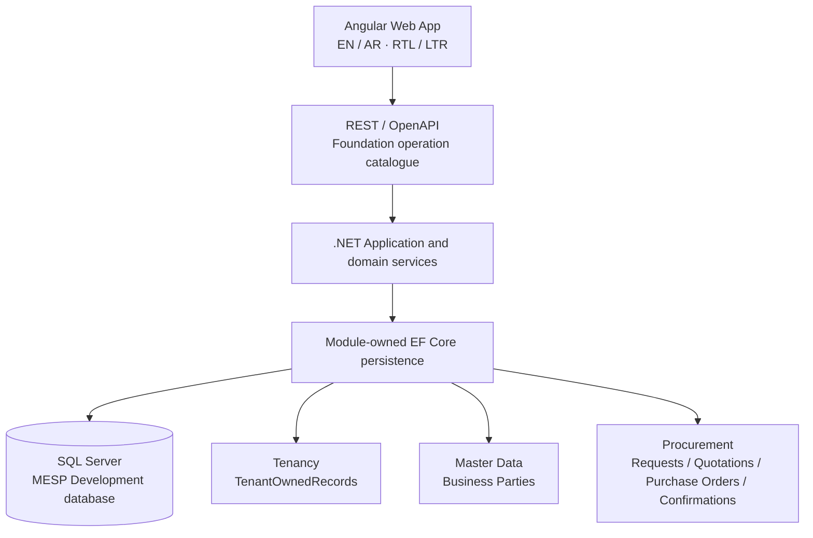

<p align="center">
  <picture>
    <source media="(prefers-color-scheme: dark)" srcset="frontend/assets/Logo_16_9_BG_Removed_Dark.png">
    
  </picture>
</p>

<p align="center"><strong>A reusable bilingual, multi-tenant ERP foundation for Saudi small and medium businesses.</strong></p>

<p align="center">
  <a href="https://dotnet.microsoft.com/"></a>
  <a href="https://angular.dev/"></a>
  <a href="https://www.typescriptlang.org/"></a>
  <a href="https://www.microsoft.com/sql-server"></a>
  <a href="https://playwright.dev/"></a>
  
</p>

MESP is a generic SaaS ERP product under active Release 1 development. Its
architecture is shared across Tenants: Tenant isolation, organization scope,
configuration-led business behavior, server-authoritative authorization, and
module-owned persistence are product rules—not customer-specific forks.

## Current development status

### MESP-131 final valuation-integrity remediation - 24 August 2026

The final bounded remediation is implemented on Draft PR #75 at the
pre-repair baseline `42794bda13bada7f37dcbf6ef6b8cc8e73eba889`; the bounded
EF migration repair starts at exact SHA
`48ddf07a645da0130699314243ae8b23907b3bfc`. It isolates known-policy
valuation failures by tracking scope, preserves conservative missing-policy
base-pool blocking, closes full depletion against stored value with explicit
formula/rounding/actual-value evidence, and reports impossible valuation state
as `ValuationMismatch` instead of complete reconciliation. MESP-131 remains
In Progress, Draft, unmerged, and pending Sol acceptance; no downstream
Finance or MESP-132 implementation was started.

Final evidence is focused valuation `34/34`, SQL safety `40/40`, full backend
`953/953` with zero failures/skips, model-change detection clean, isolated
Release build `0/0`, Angular `254/254`,
focused/full Chromium `5/5` and `32/32`, initial bundle `499.94 kB`, and both
npm audits at `0 vulnerabilities`. The regenerated additive migration is
`20260823225921_MESP131SolFinalValuationIntegrity`; `frontend/assets` is
untouched.

The latest **merged** Inventory capability is **MESP-130 — Stock Adjustment, Inventory Count, Stock Issue, and Corrections**, merged in PR #74 at `b470179e1d18ef75c0a9247b2340407da6220dc4`.

The current active capability is **MESP-131 — Moving Weighted Average valuation, reconciliation, and inventory reporting**. It is implemented on Draft PR #75 at remediation commit `958339d395323106e83b59caeb3b64bbcd0758fd` from the required main base `b470179e1d18ef75c0a9247b2340407da6220dc4`.

MESP-131 remains **In Progress, Draft, unmerged, and pending Sol acceptance**.

The implementation adds Inventory-owned deterministic MWA valuation evidence over the immutable physical ledger: Company-scoped `LedgerSequence`, versioned valuation policy, functional currency and MESP-120 Exchange Rate snapshots, append-only valuation history, pending/blocked predecessor handling, Warehouse Transfer/In-Transit value lineage, correction/reversal evidence, reconciliation, Finance handoff facts, bounded valuation reporting/export, and a lazy EN/AR RTL valuation workspace.

It does **not** implement GL, AP, AR, tax posting, payments, Sales, generic Reporting, migration/cutover, external providers, statutory/ZATCA/FATOORA, or Wafra-specific reusable core behavior.

The tracked project-control source of truth is [`docs/staticts.md`](docs/staticts.md). The conservative production-readiness headline remains approximately **47% overall** and approximately **41% Procurement/P2P** pending Sol acceptance and merge of MESP-131. Fast-track capability completion before accepting MESP-131 is **14/26 = 53.8%**; that is not production readiness.

### MESP-131 implementation evidence pending Sol acceptance

| Check | Executor-reported result |
|---|---:|
| Focused MESP-131 valuation | 34/34 |
| Prior Inventory regression | 52/52 |
| SQL Server safety harness | 40/40 against disposable LocalDB (previous baseline 39) |
| Full backend disposable-LocalDB suite | 953/953, 0 failed, 0 skipped |
| Release build | 0 warnings / 0 errors |
| Angular unit tests | 254/254 across 35 spec files |
| Production initial bundle | 499.94 kB |
| Valuation lazy chunk | 35.96 kB |
| Focused Chromium | 5/5 |
| Full Chromium | 32/32 |
| npm audits | 0 vulnerabilities |
| `frontend/assets` | untouched |

Jira synchronization completed on 23 August 2026:
- MESP-131 implementation handoff comment `11779`;
- MESP-8 Inventory Epic moved to In Progress, comment `11780`;
- MESP-54 FX consumption traceability `11781`;
- MESP-53 reporting-boundary traceability `11782`;
- MESP-113 Inventory-policy consumption traceability `11783`;
- MESP-120 Exchange Rate downstream-consumption traceability `11784`;
- MESP-132 Finance upstream-handoff traceability `11785`;
- MESP-139 Reporting source-handoff traceability `11786`.

Sol acceptance comments `11788` and `11789` remain the independent review
authority. No Jira writes were performed in this implementation session.

## Capability matrix

Legend: ✅ merged/usable at a bounded scope · 🚧 implemented/active but not yet accepted and merged · 📋 planned · 🔒 gated/validation pending.

| Capability | Status | Current boundary |
|---|:---:|---|
| Tenant, Company, Branch and organization scoping | ✅ | Server-derived scope and Tenant isolation |
| Tenant-aware entry routing and operational context | ✅ | Host candidate resolution, server membership and context switching |
| Authentication, session, authorization and audit seams | ✅ | Production provider hardening remains gated |
| English / Arabic localization and RTL | ✅ | Coverage expands with each bounded journey |
| Master Data and Business Parties | ✅ | Category/UOM, Product, Supplier, Customer and reusable references |
| Tax, Currency, Exchange Rate and Payment Term references | ✅ | Internal configuration-led evidence; no external/statutory claim |
| Price Lists and Master Data Import | ✅ | Tenant-owned bounded capabilities |
| Purchase Requests / approval foundation | ✅ | Configurable demand and approval flow |
| Supplier Quotations / source decision | ✅ | Auditable quotation comparison and sourcing choice |
| Purchase Orders / Supplier Confirmation | ✅ | Source lineage, approval, issue, confirmation/change/reapproval |
| Goods Receipt / Purchase Invoice handoff / matching | ✅ | Physical/commercial evidence; no AP/GL posting |
| Supplier Returns | ✅ | Procurement commercial evidence plus Inventory handoff |
| Inventory ledger/opening/availability/reservation/tracking | ✅ | MESP-128 authoritative physical ledger foundation |
| Goods Receipt physical effects / Transfers / In Transit / Supplier Return stock | ✅ | MESP-129 immutable movement lineage |
| Stock Adjustment / Counts / Stock Issue / corrections | ✅ | MESP-130 count fences, SoD, blind counting and correction history |
| MWA valuation / Inventory reconciliation | 🚧 | MESP-131 Draft PR #75; pending Sol acceptance and merge |
| Core Finance: COA / periods / journals / GL | 📋 | MESP-132+ |
| AP / AR / cash / settlement | 📋 | Downstream Finance |
| B2B Sales / Order-to-Cash | 📋 | Required Release 1 work; not started |
| Generic Reporting and Analytics | 📋 / 🔒 | MESP-139; MESP-131 only provides Inventory-owned source views |
| Migration/onboarding and external integrations | 📋 / 🔒 | Production/cutover gates remain |
| ZATCA/FATOORA/statutory certification | 🔒 | Qualified external validation required |

## Product direction

MESP is designed as a Saudi-localized B2B ERP baseline with English and
Arabic workflows, RTL support, multi-currency reference data, configurable
Tax references, auditability, and a country-pack-friendly architecture. It is
not a Retail POS product and is not a Wafra fork. A validation Tenant may use
local fixture naming during Development, but no product rule branches on a
customer name.

Release 1 covers the connected business domains needed for a reusable ERP:

- Procurement and Purchase-to-Pay;
- Inventory and Warehouse Management;
- B2B Sales and Order-to-Cash;
- Accounts Receivable, Accounts Payable, Core Accounting and Cash;
- Reporting and Analytics;
- Administration, Tenancy, security, audit, migration and onboarding.

The matrix above distinguishes those required domains from what is actually
usable today.

## Architecture



The backend is a modular monolith with the enforced project direction
`MiniErp.Api → MiniErp.Infrastructure → MiniErp.App → MiniErp.Contracts`.
Contracts hold stable public shapes, App owns application/domain seams,
Infrastructure owns provider-specific persistence and migrations, and Api is
the host/composition root. SQL Server is the configured local Development
provider when explicitly enabled; SQLite remains an explicit test/fallback
provider where supported. Production startup does not auto-migrate.

## Technology stack

| Layer | Repository technology |
|---|---|
| Web client | Angular 22.1, TypeScript 6.0, standalone components, RxJS 7.8 |
| API / application | .NET 10, C# 14, ASP.NET Core, REST/OpenAPI |
| Persistence | EF Core 10.0.10, SQL Server provider, SQLite test/fallback provider |
| API reference | Generated OpenAPI with Scalar available in Development/QA |
| Unit / architecture tests | Vitest 4.x on the frontend; xUnit 2.9.2 and .NET test SDK 17.12 |
| Browser checks | Playwright 1.62 |
| Local runtime | PowerShell launcher, SQL Server `MESP`, Angular proxy |

Every public REST operation is expected to have Foundation catalogue metadata,
generated OpenAPI documentation, and an architecture/contract test. Scalar is
a Development/QA rendering of that generated contract, not a production
agent surface.

## Repository map

```text
backend/       .NET projects, module application code, persistence and tests
frontend/      Angular shell, feature workspaces, unit tests and Playwright
docs/          BRDs, ADRs, specifications, decisions and progress tracker
scripts/       Official local Development and validation helpers
wireframes/    Product/UI reference material
.ai/           Verified current-state handoffs
TASK.md        Exact bounded prompt for the next session
Run.md         Local runtime, SQL and validation guide
```

## Local quick start

Prerequisites:

- .NET SDK 10.0.400 (the pinned SDK is in `backend/global.json`);
- Node.js/npm compatible with the checked-in `package-lock.json`;
- Angular CLI dependencies installed by `npm install`;
- SQL Server for the local `MESP` Development database when exercising the
  authoritative SQL path.

The official launcher is the normal path. Configure local values in the
process/user environment; never commit them:

```powershell
$env:ASPNETCORE_ENVIRONMENT = 'Development'
$env:MESP_SQLSERVER_CONNECTION_STRING = '<your local SQL Server connection configured outside Git>'
$env:MESP_DEV_AUTH_BYPASS = 'true' # explicit local convenience; disabled by default
$env:MESP_DEV_TENANT_DISPLAY_NAME = 'Local validation workspace'

dotnet build .\backend\MiniErp.sln --configuration Release
.\scripts\Start-MiniErpDevelopment.ps1 -ApiPort 5300 -FrontendPort 4300 -Restart
```

The local SQL target convention is server `.` and database `MESP`; the
connection value itself must stay outside tracked documentation. The
Development bypass is exact-environment, loopback-only, server-actor based,
and does not bypass ordinary authorization or allow client impersonation. For
normal credential testing, leave it disabled and follow [`Run.md`](Run.md).

Expected local addresses:

- Angular: <http://localhost:4300>
- Common entry: <http://localhost:4300>
- Tenant entry fixture: <http://tenant.localhost:4300>
- Platform boundary fixture: <http://admin.localhost:4300>
- API health: <http://localhost:5300/health>
- OpenAPI/Scalar: Development/QA-only surfaces described in [`Run.md`](Run.md)

The launcher and generated proxy preserve the browser `Host` so the API can
resolve the MESP-143 entry mode. The browser consumes `auth/entry`; it does
not authorize a Tenant from a subdomain, route parameter, local storage, or
client-supplied Tenant identifier.

If another local service owns port 5000, the explicit 5300/4300 override keeps
the unrelated service untouched. Do not stop RMS or other unrelated listeners.

## Database and migrations

The Development SQL database is `MESP` with module-owned schemas and separate
EF migration histories for Tenancy, Master Data, Business Parties and
Procurement. Tenancy owns the shared `tenancy.TenantOwnedRecords` table;
other module contexts do not compete for that physical table. Formal
migrations are intentionally a Development/runtime concern here. Deployment
migrations, backup/restore, high availability, capacity, retention/residency,
and production cutover remain open gates.

## Quality checks

Run from the repository root:

```powershell
# Safe backend test runner — uses a dedicated disposable LocalDB connection.
# This script assigns a MiniErpFoundation_* target only to
# MESP_SQLSERVER_SAFETY_CONNECTION_STRING and leaves the persistent
# MESP_SQLSERVER_CONNECTION_STRING runtime variable completely unchanged.
.\scripts\Test-MiniErpBackend.ps1

# Or run the full Foundation validation (backend + Angular + Playwright + audit):
.\scripts\validate-foundation.ps1
```

Frontend checks from `frontend/`:

```powershell
npm test -- --watch=false
npm run build
npm run test:e2e
npm audit --omit=dev
```

Environment variable roles:

| Variable | Purpose |
|---|---|
| `MESP_SQLSERVER_CONNECTION_STRING` | Persistent Owner Development database (SQL Server `.` / `MESP`). Used by the application runtime only. |
| `MESP_SQLSERVER_SAFETY_CONNECTION_STRING` | Disposable `MiniErpFoundation_*` LocalDB target for destructive SQL safety tests. Never points at `MESP`. |

Do not conflate them. The safety harness rejects any connection that is not
`(localdb)\MSSQLLocalDB` with a `MiniErpFoundation_*` database name.

The current bounded session evidence is recorded in the tracked statistics
and handoff documents, including SQL/provider gating where applicable. A
passing Development suite does not by itself establish production readiness.

## Documentation

- [Local Development and integrated runtime guide](Run.md)
- [Backend technical reference](backend/README.md)
- [Frontend technical reference](frontend/README.md)
- [Current verified state](.ai/CURRENT_STATE.md)
- [Project statistics and production-readiness tracker](docs/staticts.md)
- [Backend project/module boundaries](docs/ADR-002_Backend_Project_Structure_and_Module_Enforcement.md)
- [SQL schemas, migrations and provider boundaries](docs/ADR-006_Module_Schemas_EF_Core_Migrations_Transactions.md)
- [Testing environments and production gates](docs/ADR-018_Testing_Environments_SQL_Server_Containers_and_Gates.md)
- [Tenant host resolution, workspace context & branding](docs/ADR-019_Tenant_Host_Resolution_Workspace_Context_and_Branding.md)
- [Release 1 approved decision/dependency map](docs/33_Release_1_MESP_116_Approved_Decision_and_Dependency_Map.md)
- [Next exact session prompt](TASK.md)

## Production-readiness disclaimer

MESP is not advertised here as production-ready. Open areas include
deployment topology, secure production identity and infrastructure, SQL
provider/production migration governance, backup and restore, capacity and
performance, monitoring, legal/privacy review, Saudi statutory/regulatory
validation, specialist accounting/inventory review, migration/cutover, and
external integration decisions. Do not use the Development auth convenience
or local database process as a production deployment model.

## Scope discipline

MESP-130 is merged to `main` at `b470179e1d18ef75c0a9247b2340407da6220dc4`. MESP-131 is implemented on Draft PR #75 and remains unmerged pending Sol acceptance.

Inventory valuation produces operational valuation and Finance handoff facts only. It does not create Finance journals, GL/AP/AR, tax/payment effects, B2B Sales, generic Reporting, migration/cutover, external/statutory integrations, or Wafra-specific core behavior.

See [`docs/34_MESP-131_MWA_Valuation_Architecture.md`](docs/34_MESP-131_MWA_Valuation_Architecture.md) for the current bounded architecture.
