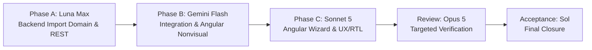

# Next session — MESP-122 — Implement Master Data import, audit/report integration, and downstream references

## Session boundary

MESP-121 is complete at its approved bounded Price List and deterministic B2B
pricing scope. Focused PR #64 was reviewed at final head
`2f1d7fa20bc5adb591fd42e04519ee66931018db` and squash-merged to `main` at
`87be98f58d2d6de3f151ed3de0ef31276e682e5a`. Jira MESP-121 is **Done** with
activation evidence `11025`, Phase D evidence `11093`, validation/review
evidence `11094`, and closure evidence `11095`. Opus 5 targeted review approved
the squash merge with findings P1-1 and P1-2 closed and no P0/P1 findings.

The exact next capability is **MESP-122 — Implement Master Data import,
audit/report integration, and downstream references**. It is activated under
Parent Epic `MESP-6 — EPIC 06 - Master Data and Product Catalog` with Jira
activation comment `11096`. This is the single active implementation capability.
Execute only MESP-122 sequentially and stop after its bounded completion or a
real blocker. Do not start MESP-123 or any other capability in the same session.

Release 1 remains the full-feature reusable B2B ERP baseline. **31 August 2026 —
Release 1 Integrated Preview** is an integrated running preview of the real
codebase, not an MVP, throwaway/demo UI, Wafra fork, or scope reduction.
Unfinished capability remains required Release 1 work after the preview.

---

## Capability Overview & Work Scope

MESP-122 completes the Master Data lifecycle by providing reusable, Tenant-owned
batch import mechanics, row validation and quarantine, idempotent replay,
audit/report integration, and downstream reference integrity for all ten
Release-1 Master Data entities:

1. **Category**
2. **Unit of Measure (UOM)**
3. **Product**
4. **Supplier**
5. **Business Customer**
6. **Currency**
7. **Payment Term**
8. **Tax / VAT**
9. **Exchange Rate**
10. **Price List**

### Backend Scope

- **Batch Import Domain & Engine**: Tenant-owned import batch identity,
  source/provenance metadata, status lifecycle (`Draft`, `Simulating`, `Validated`,
  `Completed`, `CompletedWithErrors`, `Failed`), and batch summary metrics.
- **Dry-Run / Simulation Mode**: Full execution simulation performing syntax,
  structural, and business validation without database state mutation.
- **Row-Level Outcomes**: Granular per-row classification into `Accepted`,
  `Rejected`, and `Quarantined`, with stable 1-indexed row referencing, exact field
  pointers, and diagnostic error/warning codes.
- **Duplicate & Conflict Policy**: Configurable duplicate handling (reject duplicate,
  skip existing, or update mutable fields where explicitly approved by entity policy)
  without silent data corruption or cross-row ambiguity.
- **Idempotent Replay & Deterministic Retry**: Re-running an identical import batch
  produces idempotent outcomes; quarantined rows can be corrected and replayed.
- **Audit & Evidence Preservation**: Every batch run and row mutation records
  Tenant-scoped audit entries with actor, timestamp, correlation ID, and summary.
- **Report / Read Contracts**: Integration of approved read/reporting query models
  under PD-042 (catalogue export, status breakdown, audit trail, reconciliation).
- **Downstream Reference Integrity & Historical Snapshots**: Enforce foreign-key and
  logical reference integrity across Master Data entities, preventing deletion of
  in-use entities and ensuring downstream modules (Sales, Procurement, Inventory,
  Finance) consume immutable historical snapshots rather than mutable live state.
- **REST & OpenAPI**: Complete Foundation REST catalogue endpoints with generated
  OpenAPI operation metadata and Scalar documentation.

### Frontend (Angular) Scope

- **Multi-Step Import Wizard**: Intuitive, step-by-step UX for resource selection,
  file upload / payload input, column mapping, validation preview, dry-run review,
  and execution.
- **Preview & Error Reconciliation UI**: Interactive row-level grid showing valid
  rows, quarantined items, error details, and summary reconciliation counters.
- **Audit & Reporting Views**: Deep-linked audit histories, batch run summaries,
  and export triggers integrated into the existing Master Data workspace.
- **Bilingual & Responsive Design**: Complete English/Arabic (EN/AR) translations,
  flawless RTL/LTR layout transitions, accessibility labels, and loading/empty/error states.

---

## Decision Gates & Policy Boundaries

1. **MESP-51 / PD-041 (Migration Contract) is Consumed**: Generic import mechanics,
   validation schemas, and reconciliation totals are built according to the approved
   Release-1 migration architecture.
2. **MESP-53 / PD-042 (Reporting Contract) is Consumed**: Approved read contracts,
   export structures, and audit views conform to the reporting catalogue contract.
3. **MESP-50 Remains OPEN as a Production-Policy Boundary**:
   - MESP-50 (Data retention, residency, purge, PDPL compliance, legal hold) remains
     an open production-policy gate and does **not** block bounded MESP-122 engineering.
   - **MESP-122 MUST NOT** implement, invent, or claim: contractual retention periods,
     legal-hold rules, tenant deletion commitments, PDPL rights workflows, residency
     guarantees, backup-location promises, production privacy certification, or provider/region decisions.
4. **No Customer-Specific Hardcoding**: No Wafra-specific schemas, columns, extraction
   scripts, or legacy workarounds may be hardcoded. All import processors must be
   strictly generic and reusable across any B2B SaaS tenant.
5. **DO NOT Turn MESP-122 into MESP-40**:
   - MESP-122 builds **reusable import and reference capabilities**.
   - MESP-122 does **not** execute actual customer migration, opening GL journal
     entries, AP/AR opening balances, stock valuation cutovers, or transaction cutover.
   - Actual customer cutover remains governed by MESP-40 in the migration wave.

---

## Sequential Execution Model

Delivery is strictly sequential across specialist phases. Do not run parallel agents.

- **Phase A — GPT-5.6 Luna Max**:
  Backend import domain, import batch persistence, entity-specific validators/processors,
  dry-run simulation, row-level quarantine engine, idempotency/replay, audit linkages,
  report/read contracts under PD-042, authorization policies, and REST/OpenAPI endpoints.
- **Phase B — Gemini 3.7 Flash**:
  Backend/frontend integration contract, import file-handling seam (JSON/CSV parser models),
  Angular nonvisual services/models/state management, and test harness integration.
- **Phase C — Claude Sonnet 5**:
  Complete Angular Import Wizard UI, preview & reconciliation table, row error inspector,
  audit/report links in Master Data workspace, full EN/AR translations, RTL/LTR styling,
  responsive layouts, and component specs.
- **Kimi K3 256K**: RESERVED ONLY for an explicitly bounded deep investigation or complex
  fix if requested by the planner. Do not consume Kimi quota automatically.
- **Opus 5**: Reserved for independent targeted review at the completion checkpoint.
- **GPT-5.6 Sol**: Planner, architect, and final acceptance.

---

## Import Safety & Integrity Rules

Every import processor must strictly implement the following safety guarantees:

1. **Explicit Tenant Isolation**: Every import batch and imported record must be
   explicitly scoped to the ambient authenticated Tenant context. Cross-tenant
   references must fail closed immediately.
2. **Two-Phase Dry-Run Guarantee**: The system must support running full validation
   and simulation without committing any database transactions.
3. **Atomic Batch or Isolated Quarantine**: Batches must support either atomic
   rollback on error or clean row-level quarantine where valid rows commit and invalid
   rows are isolated with actionable error logs.
4. **Stable Row Referencing**: Errors must reference original 1-indexed file/payload
   row numbers and specific field names to allow easy user correction.
5. **No Silent Overwrite / No Partial Mutation**: Partial field updates must only
   occur if explicitly permitted by the entity policy; otherwise, duplicate records
   are rejected or skipped without mutating existing data.
6. **Immutable Historical Snapshot Protection**: Master Data entities referenced by
   commercial documents cannot be hard-deleted; downstream consumers must snapshot
   relevant commercial properties at transaction time.
7. **Concurrency & Audit**: Optimistic concurrency tokens (`rowversion`) and comprehensive
   audit logging must accompany all import mutations.

---

## Required Entry Reading & Hierarchy

Read in order before modifying files:
1. `AGENTS.md`, `CLAUDE.md`, `.ai/CURRENT_STATE.md`, `TASK.md`;
2. `docs/30_Release_1_Full_Feature_Fast_Track_Delivery_Plan.md`,
   `docs/31_Release_1_Consolidated_Owner_Decision_Pack.md`, and
   `docs/33_Release_1_MESP_116_Approved_Decision_and_Dependency_Map.md`;
3. `docs/16_Master_Data_and_Product_Catalog_BRD.md`, `docs/29_Security_Audit_and_Data_Governance_BRD.md`;
4. Approved decisions PD-041 (Migration) and PD-042 (Reporting);
5. Existing Master Data implementations (`Category`, `UOM`, `Product`, `Supplier`,
   `Customer`, `Currency`, `PaymentTerm`, `Tax`, `ExchangeRate`, `PriceList`);
6. Foundation contracts: `FoundationRestContracts.cs`, `MasterDataDbContext.cs`,
   `MasterDataOperationCatalog.cs`, and Angular `MasterDataService`.

---

## Verification & Quality Gates

Every implementation phase must satisfy:
- **Backend Build**: `dotnet build backend/MiniErp.sln --configuration Release` with 0 warnings and 0 errors.
- **Backend Tests**: Focused import/reference tests passing, and full non-SQL backend suite (703+ passing).
- **SQL Safety Gate**: 21 SQL Server safety tests remain connection-gated when `MESP_SQLSERVER_CONNECTION_STRING` is not configured; report honestly without fabrication.
- **Frontend Tests**: `npm test -- --watch=false` in `frontend/` passing 100% of tests.
- **Frontend Build**: `npm run build` in `frontend/` generating initial raw bundle within the 500 kB budget.
- **Runtime Self-Test**: `scripts/Start-MiniErpDevelopment.ps1` and `scripts/Test-MiniErpDevelopmentRuntime.ps1` verifying clean runtime on safe ports (MiniERP 5300 / Angular 4300).
- **Repository Hygiene**: No tracked cookies, auth tokens, passwords, SQLite files, `.runtime` files, `.vs` artifacts, or temporary logs.

---

## Next Action

Begin **Phase A (GPT-5.6 Luna Max)**: Design and implement the backend import domain,
batch lifecycle, row-level quarantine engine, entity import processors, audit linkages,
and Foundation REST/OpenAPI contracts for Master Data import.
