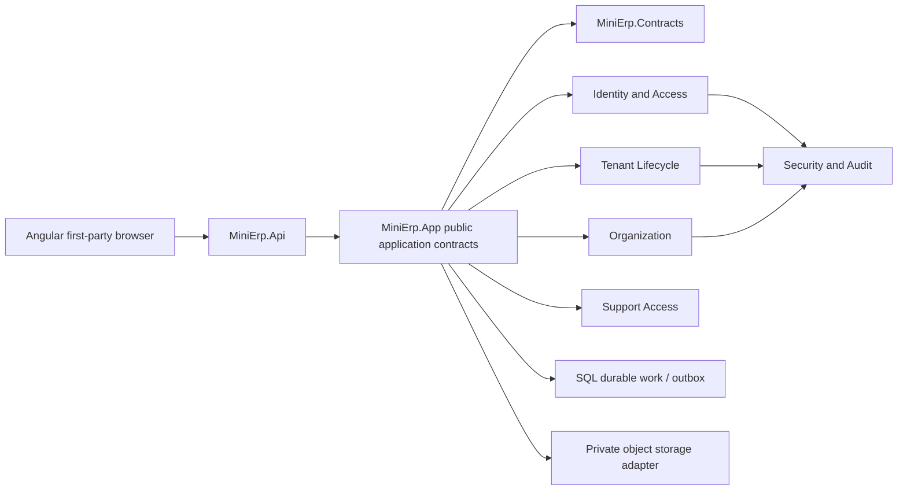
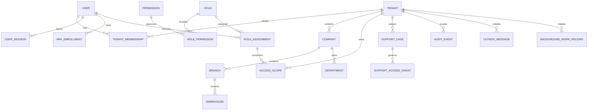

# Foundation Release 1 Lean Implementation Specification

**Version:** v0.1 - Draft for Critical Architecture and Security Review  
**Status:** Draft - Not Approved for Implementation  
**Jira:** MESP-86 - Produce Foundation Release 1 Lean Implementation Specification  
**Scope:** Identity and Access, Multi-Tenancy and Tenant Lifecycle, Organization and Company Structure  
**Branch:** `docs/foundation-release1-lean-spec`  
**Owner:** Hossam / Product Owner  
**Date:** 2 August 2026

This is a design and implementation-preparation document. It does not authorize
application code, database migrations, API or UI implementation, automated-test
implementation, a Sprint, or a production release.

## 1. Document Control

| Field | Value |
|---|---|
| Document | Foundation Release 1 Lean Implementation Specification |
| Version/status | v0.1 / Draft for Critical Architecture and Security Review |
| Governing Jira Task | MESP-86 (In Progress; outside all Sprints) |
| Parent Epic | MESP-1 - Product Governance and BRD Management (In Progress) |
| Approved BRD baselines | MESP-28, MESP-29, MESP-30, each v0.2 Approved Release 1 Baseline |
| Technical baseline | `docs/01_Technology_Architecture_Baseline.md` |
| Planned review | Critical architecture, security, and tenant-isolation review |
| Top-level sections | 55 (sections 1-55) |
| Relevant context/module boundaries | 8 |
| Aggregate roots | 14 |
| Domain entities | 22 |
| Value objects | 12 |
| Numbered invariants | 36 |
| Commands / queries | 28 / 18 |
| API operations | 55 (catalogue only; no endpoints implemented) |
| UI journeys/pages | 17 (route and state inventory only) |
| Mandatory safety tests | 27 (strategy only; no tests created) |
| Open technical decisions | 7 |

## 2. Executive Summary

Release 1 foundation is a single modular-monolith design for a B2B ERP. A
globally identified User authenticates once, then operates through an explicitly
selected Tenant context. Tenant business data is isolated by server-derived
context, explicit ownership, relational constraints, deny-by-default policies,
and negative tests. Organization provides the approved Company, Branch,
Warehouse, and Department hierarchy. Identity and access controls determine
whether a user may act; tenant and organization scope determine where the act
may apply.

The design intentionally keeps the three domains separate. It uses small
aggregate boundaries and explicit contracts rather than one graph-shaped
aggregate. Cross-module writes are coordinated by application services and
transactional integration records; implementation must not introduce
microservices, event sourcing, or a second database per Tenant.

Business values approved in MESP-28/29/30 are normative here. Technical session
mechanisms, cookie configuration, session storage, framework settings, and
implementation details remain downstream design concerns and must not change
the approved values. The document is therefore a blueprint for review, not an
implementation authorization.

## 3. Authority and Source Priority

When sources disagree, the following order applies and the discrepancy is
recorded for Product Owner decision rather than silently resolved:

1. MESP-86 approved Jira scope and explicit founder decisions.
2. Approved PRD v1.2.
3. `docs/01_Technology_Architecture_Baseline.md`.
4. `docs/11_SaaS_Platform_Administration_BRD.md`.
5. `docs/12_Identity_and_Access_BRD.md` (MESP-28 v0.2).
6. `docs/13_Multi_Tenancy_BRD.md` (MESP-29 v0.2).
7. `docs/14_Organization_and_Company_Structure_BRD.md` (MESP-30 v0.2).
8. `docs/00_ERP_Business_Glossary.md`.
9. `docs/Decisions.md` and the MVP Founder Decision Pack.
10. The MESP-27 Wave 1 backlog and the Product Delivery Master Plan.
11. Current MESP-57 code only as evidence of the existing solution seam.

The glossary supplies terms, not new behavior. Wafra is used only to validate
generic behavior. Retail POS and later domain BRDs are not sources for this
document.

## 4. Scope

This specification prepares the first Release 1 foundation slice:

- global identity, credentials, sessions, MFA, invitation and recovery behavior;
- Tenant membership, context selection, switching, suspension and termination;
- Roles, Platform-approved Permissions, scoped assignments, support access and
  audit evidence;
- Company / Legal Entity, Branch, Warehouse, and Department ownership and
  lifecycle;
- logical persistence, API contracts, UI route/state inventory, security
  controls, observability, and a targeted test strategy for those capabilities;
- implementation slicing guidance for the existing MESP-58 through MESP-64
  Enablers, without changing those Jira issues.

## 5. Out of Scope

The following remain outside this document and outside Release 1 foundation
implementation:

- Procurement, Inventory, Finance, B2B Sales, Production, and Retail POS
  transactions;
- MESP-31 and all downstream BRDs;
- implementation of MESP-58, MESP-59, or any other Enabler;
- physical SQL migrations, controllers, Angular components, tests, or a Sprint;
- microservices, Kubernetes, event sourcing, message brokers, CQRS/mediator
  frameworks, database-per-Tenant, or a separate identity server;
- tenant-specific core code for Wafra;
- production hosting, supported-volume limits, retention, legal hold, purge,
  backup, restoration, residency, or RPO/RTO values governed by MESP-48 and
  MESP-50;
- consolidation, intercompany processing, transfer pricing, or a consolidation
  currency.

## 6. Approved Technology Baseline

| Concern | Approved baseline | Why it fits this slice |
|---|---|---|
| Web client | Angular 22 and TypeScript | First-party enterprise shell, typed contracts, Arabic/RTL support |
| API | ASP.NET Core Web API on .NET 10 LTS | Supported long-lived host with policy middleware and OpenAPI |
| Data access | Entity Framework Core 10 | One operational context initially; module-owned mappings and transactions |
| Database | Microsoft SQL Server 2025 | Shared operational database with schema separation and relational integrity |
| Architecture | Modular Monolith | One deployable boundary for a one-developer team; explicit seams without distributed operations |
| Contract | REST and OpenAPI | Stable, reviewable application boundary; no endpoint implementation in this draft |
| Identity | ASP.NET Core Identity | Password, lockout, MFA capability, and user lifecycle primitives |
| Browser authentication | Secure HTTP-only first-party cookie | Avoids browser token storage; technical options remain downstream design |
| Authorization | Server-side policy and resource authorization | Composes membership, permission, organization scope, lifecycle and support checks |
| Work | SQL-backed durable work plus transactional outbox/inbox | Reliable tenant-aware background processing without a broker |
| Files | Private object storage behind an interface | Tenant-scoped files and future provider choice without coupling the domain |
| Local development | Docker Compose | Repeatable SQL Server, object-storage emulator and telemetry dependencies |
| Observability | OpenTelemetry-compatible logs, metrics and traces | Correlation across API, jobs and security/audit evidence |
| Testing tools | xUnit; Playwright TypeScript | Backend isolation and API validation plus critical browser journeys |

The baseline is a design constraint, not permission to add infrastructure. The
existing three production projects remain `MiniErp.Api`, `MiniErp.App`, and
`MiniErp.Contracts`; module internals remain internal to `MiniErp.App` and
public composition contracts remain explicit.

## 7. Context Map

The eight relevant boundaries are Platform Governance, Identity and Access,
Tenant Lifecycle, Organization, Support Access, Security/Audit, Files, and
Durable Work/Integration. They share contracts and transaction infrastructure,
not mutable domain state. A request enters through one trusted Tenant context.

## 8. Module and Ownership Boundaries

| Boundary | Owns | May consume | Must not own |
|---|---|---|---|
| Platform Governance | Platform roles, approved permission catalogue, governance records | Tenant lifecycle status for governance | Tenant business data |
| Identity and Access | User, credential, session, MFA, membership, invitations, recovery, roles and assignments | Tenant and organization scope facts | Business transactions |
| Tenant Lifecycle | Tenant status, membership eligibility facts, tenant context | Identity references and organization summaries | Credentials or role definitions |
| Organization | Company, Branch, Warehouse, Department and hierarchy lifecycle | Tenant context, identity actor | Users, permissions, transactions |
| Support Access | Cases, named grants, approvals, expiry and evidence | Identity, Tenant, audit contracts | General Tenant authority |
| Security/Audit | Immutable security/audit evidence and correlation | Events from all boundaries | Passwords, raw recovery secrets, business payloads |
| Files | Tenant-scoped object references and private storage adapter | Tenant context, audit contracts | Public blobs or cross-tenant search |
| Durable Work/Integration | Outbox, inbox and background work records | Initiating Tenant and scope context | Unscoped work or hidden business writes |

Each boundary exposes intent-level contracts. Direct access to another module's
tables is prohibited; application orchestration validates the receiving
module's invariants before committing a cross-module operation.

## 9. Ubiquitous Language

| Term | Meaning in this specification |
|---|---|
| Platform | The SaaS control plane above all Tenants. |
| Tenant | Subscription and data-isolation boundary. |
| Company / Legal Entity | Tenant-owned legal/accounting organization. |
| Branch | Operational subdivision of a Company; not a legal entity or ledger. |
| Warehouse | Stock/location identity below a Branch; transactions are out of scope here. |
| Department | Tenant Company-owned organizational grouping, reusable across Company branches. |
| User | Global login identity; not a Person, Employee, Supplier, or Customer. |
| Membership | Explicit relationship granting a User eligibility in one Tenant. |
| Tenant context | Server-derived, one-Tenant request/workspace/session context. |
| Role | Tenant assignment of Platform-approved Permissions. |
| Access Scope | Downward path from Tenant to Company, Branch, or Warehouse. |
| Support grant | Named, case-bound, Tenant-approved, time-bounded support authority. |
| Active | Lifecycle state that permits the operation in question. |
| Historical reference | Authorized read of a previously used inactive/closed record without rewriting it. |

## 10. Foundation Domain Model

The following model is the minimum cross-domain vocabulary. `Platform` means the
record is global and purpose-bound; `Tenant` means exactly one Tenant key is
required. Lifecycle and invariant references are expanded in sections 13-15.

| Entity | Owner | Platform/Tenant ownership | Lifecycle | Transaction boundary | Cross-module contract |
|---|---|---|---|---|---|
| User | Identity | Platform/global | Active, suspended, offboarded | User security change | User identity reference |
| Credential / Identity User | Identity | Platform/global | Enabled, locked | Credential or lockout change | Authentication result |
| User Session | Identity | Platform record linked to User and Tenant context | Active, expired, revoked | Session issue/revoke | Revocation evidence |
| MFA Method / Enrollment | Identity | Platform/global per User | Pending, enabled, revoked | Enrollment/change | MFA assurance claim |
| Tenant | Tenant Lifecycle | Platform-owned identity; Tenant boundary | Provisioning, active, suspended, terminated | Tenant lifecycle change | Tenant context eligibility |
| Tenant Membership | Identity/Tenant | Exactly one Tenant | Invited, active, suspended, revoked | Membership change | Permission evaluation input |
| Invitation | Identity | One target Tenant | Issued, accepted, withdrawn, expired | Issue/accept/withdraw | User and membership creation |
| Password-Recovery Request | Identity | Platform record linked to User | Issued, consumed, expired, revoked | Recovery request | Session-revocation event |
| Role | Identity | Platform definition or one Tenant custom role | Draft, active, retired | Role definition change | Permission-set reference |
| Permission | Platform Governance | Platform-owned catalogue | Active, retired | Catalogue governance | Policy requirement |
| Role Permission | Identity | Follows Role ownership | Active, removed | Role edit | Effective permission set |
| Role Assignment | Identity | One Tenant and optional scope | Pending, active, revoked, expired | Assignment/approval change | Authorization grant |
| Access Scope | Identity/Organization | One Tenant; optional Company/Branch/Warehouse | Active, revoked | Scope change | Resource authorization path |
| Support Case | Support Access | One Tenant and named requester | Open, approved, closed | Case change | Support approval context |
| Support Access Grant | Support Access | One Tenant, one case, named actor | Requested, active, expired, revoked | Grant lifecycle | Bounded support policy |
| Company / Legal Entity | Organization | Exactly one Tenant | Draft, active, inactive, closed | Company lifecycle/configuration | Parent organization reference |
| Branch | Organization | Exactly one Company/Tenant | Draft, active, inactive, closed | Branch lifecycle | Company scope reference |
| Warehouse | Organization | Exactly one Branch/Company/Tenant | Draft, active, inactive, closed | Warehouse lifecycle | Branch scope reference |
| Department | Organization | Exactly one Company/Tenant | Draft, active, inactive, closed | Department lifecycle | Company scope reference |
| Audit Event | Security/Audit | Platform record with optional Tenant key | Immutable | Append only | Evidence reference |
| Outbox Message | Durable Work | Initiating Tenant when applicable | Pending, dispatched, failed, dead-lettered | Same transaction as source change | Integration delivery |
| Background Work Record | Durable Work | Initiating Tenant and scope | Queued, running, succeeded, failed, cancelled | Work state change | Tenant-aware worker contract |

## 11. Aggregate Roots and Consistency Boundaries

There is no giant aggregate. Fourteen roots own only the state that must change
atomically; read models and audit/outbox records are separate persistence
records. Cross-root operations use application orchestration and explicit
contracts.

| Root | Owning boundary | Atomic decisions | Cross-root reference |
|---|---|---|---|
| User | Identity | Identity status and global normalized email | User ID |
| Tenant | Tenant Lifecycle | Tenant lifecycle status | Tenant ID |
| Tenant Membership | Identity | One User's membership in one Tenant | User ID, Tenant ID |
| Invitation | Identity | Invitation issue/withdraw/accept | Target User/Tenant IDs |
| Password-Recovery Request | Identity | Single-use recovery lifecycle | User ID |
| Role | Identity | Role metadata and permission set | Permission IDs |
| Role Assignment | Identity | Assignment, approver and revocation | User, Tenant, Role, Scope IDs |
| Access Scope | Identity/Organization | Scope path validation | Company/Branch/Warehouse IDs |
| Support Case | Support Access | Case purpose, tenant and requester | Tenant/User IDs |
| Support Access Grant | Support Access | Approval, exact scope, expiry | Case, Tenant, User IDs |
| Company | Organization | Company identity and approved configuration | Tenant ID |
| Branch | Organization | Branch identity and lifecycle | Company ID |
| Warehouse | Organization | Warehouse identity and lifecycle | Branch ID |
| Department | Organization | Department identity and lifecycle | Company ID |

Sessions, MFA enrollments, audit events, outbox messages, and background work
records have independent persistence lifecycles and are not hidden inside a
domain root. A root never loads an unbounded Tenant graph.

## 12. Entities and Value Objects

The 22 entities are the rows in section 10. The twelve value objects are
immutable, validated at the boundary, and carry no persistence identity:

| Value object | Validation purpose |
|---|---|
| NormalizedEmail | Canonical, globally unique login key |
| TenantContext | Exactly one Tenant plus selected scope and correlation |
| SessionWindow | Maximum and inactivity timestamps |
| MfaAssurance | Required level and fresh-auth timestamp |
| MembershipStatus | Explicit active eligibility |
| LifecycleState | Draft/active/inactive/closed or security state |
| ScopePath | Tenant -> Company -> Branch -> Warehouse downward path |
| CompanyConfiguration | Calendar, time zone, functional currency references |
| FiscalCalendarRef | Company calendar selection without physical policy values |
| TimeZoneId | Company time-zone identifier |
| CurrencyCode | Company functional currency code |
| CorrelationId | Request/job/audit trace key |

Credentials, raw MFA secrets, recovery tokens, and cookie values are sensitive
values handled by approved framework/adapters and are never represented as
auditable domain value objects.

## 13. Domain Invariants

The following 36 invariants are the non-negotiable Release 1 safety baseline.

1. **I-01:** Normalized email is globally unique.
2. **I-02:** User is a global identity and is not duplicated per Tenant.
3. **I-03:** Business access requires an active, explicit Membership.
4. **I-04:** Every protected request, workspace, and session has exactly one Tenant context.
5. **I-05:** Separate authorized contexts may coexist without sharing mutable state.
6. **I-06:** A client-supplied Tenant identifier never expands authority.
7. **I-07:** Tenant A state is never displayed, submitted, searched, or reused in Tenant B.
8. **I-08:** Every Tenant-owned record has exactly one Tenant owner.
9. **I-09:** Platform records are purpose-bound and cannot expose business data.
10. **I-10:** Cross-Tenant access is deny-by-default on reads, writes, search, reports, exports, files, jobs, notifications, integrations, audit, and support.
11. **I-11:** Platform Administrator alone does not grant Tenant business-data access.
12. **I-12:** Scope flows only downward Tenant -> Company -> Branch -> Warehouse.
13. **I-13:** Branch/Warehouse scope cannot be used upward to Company/Tenant-wide data.
14. **I-14:** Release 1 has no explicit-deny overlay; absence of a grant denies.
15. **I-15:** Roles contain only Platform-approved Permissions.
16. **I-16:** Privileged assignments have a separate named approver; self-approval is prohibited.
17. **I-17:** MFA is mandatory for approved privileged actors and operations.
18. **I-18:** Five failed attempts cause a 15-minute lockout.
19. **I-19:** Ordinary sessions have an 8-hour maximum lifetime.
20. **I-20:** Ordinary sessions expire after 30 minutes of inactivity.
21. **I-21:** Concurrent sessions are allowed, subject to independent revocation.
22. **I-22:** Suspension, offboarding, password reset, and critical access changes revoke affected sessions.
23. **I-23:** Administrators cannot view or set a user's password.
24. **I-24:** Support access is named, case-bound, Tenant-approved, exact-scope, and time-bounded.
25. **I-25:** Support access is at most 8 hours per grant and does not alone grant export authority.
26. **I-26:** Company belongs to one Tenant; Branch to one Company; Warehouse to one Branch; Department to one Company.
27. **I-27:** Inactive or closed units reject new users, documents, jobs, integrations, and transactions.
28. **I-28:** Parent inactivity blocks descendants; parent reactivation does not auto-restore descendants.
29. **I-29:** Authorized historical references remain readable and preserve original ownership.
30. **I-30:** Used parent ownership cannot be silently rewritten.
31. **I-31:** Wafra is validation-only and cannot create Tenant-specific core behavior.
32. **I-32:** Retail POS is excluded from Release 1 foundation scope.
33. **I-33:** Files, exports, reports, search indexes, notifications, and audit evidence carry Tenant scope where applicable.
34. **I-34:** Background work preserves initiating Tenant and organization scope.
35. **I-35:** MESP-50 controls retention, legal hold, purge, residency, backup, and restoration; no physical purge is designed here.
36. **I-36:** MESP-48 controls supported volume and performance evidence; this document invents no limits.

## 14. Lifecycle and State Models

| Object | States | Allowed transitions and guard |
|---|---|---|
| User | Active, Suspended, Offboarded | Security/owner action; suspension/offboarding revokes affected sessions; reactivation requires review |
| Membership | Invited, Active, Suspended, Revoked | Active only after explicit assignment; revoked membership cannot select context |
| Tenant | Provisioning, Active, Suspended, Terminated | Suspension blocks ordinary work but preserves data; termination revokes access and preserves evidence |
| Invitation | Issued, Accepted, Withdrawn, Expired | Seven-day business value; single target and non-transferable |
| Recovery request | Issued, Consumed, Expired, Revoked | One-use verified-email path; success revokes affected sessions |
| Role/assignment | Draft, Active, Retired / Pending, Active, Revoked, Expired | Permission catalogue and approval policies apply before activation |
| Support case/grant | Open, Approved, Closed / Requested, Active, Expired, Revoked | Exact Tenant/scope, named approver, maximum eight-hour grant |
| Company/Branch/Warehouse/Department | Draft, Active, Inactive, Closed | Parent and historical-reference rules in section 32 |

No state transition silently restores old privileges. A state change emits a
domain event and an audit record after the transaction is durable.

## 15. Domain Events

Events are internal integration facts, not a mandate for event sourcing. Every
event includes a correlation ID, actor ID, initiating Tenant when applicable,
scope snapshot, occurred-at time, schema version, and sensitivity classification.

| Event | Producer | Consumers |
|---|---|---|
| UserActivated / UserSuspended / UserOffboarded | Identity | Session revocation, audit |
| CredentialChanged / PasswordResetCompleted | Identity | Session revocation, audit |
| MfaEnrolled / MfaRevoked | Identity | Assurance policy, audit |
| MembershipActivated / MembershipSuspended / MembershipRevoked | Identity/Tenant | Context eligibility, session revocation |
| InvitationIssued / Accepted / Withdrawn / Expired | Identity | Membership workflow, audit |
| RoleChanged / AssignmentApproved / AssignmentRevoked | Identity | Policy cache invalidation, audit |
| SupportCaseApproved / SupportGrantActivated / Expired / Revoked | Support | Support policy, audit |
| TenantActivated / Suspended / Reactivated / Terminated | Tenant | Context, work and session guards |
| CompanyChanged / BranchChanged / WarehouseChanged / DepartmentChanged | Organization | Scope validation, audit |
| OutboxDispatched / WorkCompleted / WorkFailed | Durable Work | Observability and retry policy |

## 16. Commands and Queries

Commands are intent-level application operations; queries are read operations.
The catalogue contains 28 commands and 18 queries. They do not imply controllers.

### Commands (28)

1. RegisterUser; 2. ConfirmEmail; 3. SignIn; 4. SignOut; 5. RevokeSession;
6. BeginMfaChallenge; 7. VerifyMfa; 8. EnrollMfa; 9. RevokeMfa;
10. RequestPasswordRecovery; 11. CompletePasswordRecovery;
12. IssueInvitation; 13. AcceptInvitation; 14. WithdrawInvitation;
15. ActivateMembership; 16. SuspendMembership; 17. RevokeMembership;
18. CreateRole; 19. UpdateRole; 20. AssignRole; 21. ApprovePrivilegedAssignment;
22. RevokeAssignment; 23. OpenSupportCase; 24. ApproveSupportGrant;
25. RevokeSupportGrant; 26. CreateCompany; 27. CreateBranch/Warehouse/Department;
28. ChangeOrganizationLifecycle.

### Queries (18)

1. GetSessionStatus; 2. ListSessions; 3. ListEligibleMemberships;
4. GetCurrentTenantContext; 5. ListUsers; 6. GetUser;
7. ListMemberships; 8. ListRoles; 9. GetRole; 10. ListPermissions;
11. ListAssignments; 12. ListAccessReviewEvidence; 13. ListCompanies;
14. GetCompanyHierarchy; 15. ListBranches; 16. ListWarehouses;
17. ListDepartments; 18. ListSupportCasesAndAuditEvidence.

Every query derives Tenant context on the server, applies authorization and
lifecycle guards, and returns only records safe for that context.

## 17. User Journeys

| Journey | Primary actor | Outcome | Blocking dependency |
|---|---|---|---|
| Sign in and establish context | User | Authenticated session with one eligible Tenant context | Identity and membership |
| MFA challenge and fresh auth | Privileged user | Required assurance for protected operation | MFA policy and session evidence |
| Recover password | User | Verified recovery and affected-session revocation | Email delivery adapter decision |
| Accept invitation | Invitee | User and explicit Membership established | Invitation validity |
| Select/switch Tenant | Multi-Tenant user | Safe context replacement with no state leakage | Context resolver |
| Manage users and memberships | Tenant Admin | Explicit member lifecycle | Tenant and organization scope |
| Manage Role and Permissions | Tenant Admin / Platform approver | Approved grant without self-approval | Permission catalogue |
| Review/revoke sessions | User/Admin | Independent session control | Revocation evidence |
| Manage Company hierarchy | Tenant Admin | Company, Branch, Warehouse, Department lifecycle | Parent active and same Tenant |
| Request and approve support | Support actor / Tenant approver | Named exact-scope time-bounded grant | Case and MFA policy |
| Review audit/access evidence | Authorized reviewer | Evidence without secrets or leakage | Audit boundary |

## 18. Screen and Route Inventory

The 17 pages/journeys are route-level design references only:

1. `/login` Login; 2. `/mfa` MFA challenge; 3. `/password-recovery` password recovery;
4. `/invitation/accept` invitation acceptance; 5. `/tenant/select` Tenant selection;
6. context indicator/switcher; 7. user list/details; 8. membership management;
9. Role catalogue/editor; 10. Permission catalogue; 11. Role/scope assignment;
12. session management; 13. Company list/details; 14. Branch list/details;
15. Warehouse list/details; 16. Department list/details; 17. support approval,
monitoring, access-review and audit evidence.

## 19. UI States and Validation

Each route must specify loading, empty, success, validation failure, restricted,
expired, suspended, no-access, and unexpected-error states. Context-dependent
pages show the current Tenant and relevant organization path; they never trust a
hidden input as authority. Mutating controls require server confirmation and
refresh after a lifecycle or permission change.

Arabic and English labels, RTL layout, keyboard navigation, focus order,
screen-reader names, visible validation summaries, and non-color-only status
indicators are required. Expired sessions and revoked support grants return to a
safe re-authentication or no-access state without revealing protected data.

## 20. Authentication Architecture

ASP.NET Core Identity owns the global User and credential lifecycle. The API
creates a secure HTTP-only first-party cookie after successful credential and,
when required, MFA verification. The server resolves the User from the cookie,
then evaluates active Membership and Tenant context. No password, raw token, or
cookie value is exposed to the Angular application.

Authentication is distinct from authorization. A valid global User without an
active Membership cannot access Tenant business data. Identity events are
correlated with audit evidence without storing raw secrets.

## 21. Session Architecture

Business values are fixed at eight-hour maximum ordinary lifetime, thirty-minute
inactivity timeout, and concurrent sessions allowed. The technical mechanism for
session records, cookie ticket renewal, revocation lookup, and clock source is a
downstream design decision under ADR-004; it must preserve those values.

Each session has a revocation state, issued/last-seen/expiry evidence, User ID,
and one selected Tenant context at a time. Revocation is independent per session
unless a security event requires affected-session invalidation. An API request
with an expired or revoked session fails safely and does not disclose whether a
protected resource exists.

## 22. MFA and Fresh-Authentication Behavior

MFA capability is required. MFA is mandatory for Platform Administrators,
Support Users, Tenant Administrators, privileged assignments, and approved
high-risk operations. A fresh-auth claim is required when a policy marks an
operation high risk or when support approval is extended.

The concrete factor, enrollment UX, recovery-code handling, and technical
assurance storage remain downstream design decisions. Failed challenges do not
leak factor details. MFA enrollment/revocation and failed challenge evidence are
audited without secrets.

## 23. Password, Recovery, Invitation, and Lockout Behavior

- Passwords are handled only by ASP.NET Core Identity; administrators cannot set
  or view them.
- Five failed attempts cause the approved fifteen-minute lockout behavior.
- Recovery starts from a verified email path, uses a single-use opaque request,
  and revokes affected sessions after completion.
- Invitations are single-target, non-transferable, withdrawable, and valid for
  seven days; acceptance creates or activates the explicit Membership only after
  all Tenant and User guards pass.
- Safe errors do not reveal whether an email, account, Tenant, or invitation
  exists.

## 24. Tenant Context Resolution

The trusted server pipeline resolves context in this order:

1. Authenticate the global User and session.
2. Load the requested or persisted context only from server-side membership and
   lifecycle facts.
3. Verify exactly one Tenant, then optional Company/Branch/Warehouse scope.
4. Verify support-case/grant constraints when the actor is support.
5. Attach an immutable request context to application services, queries, audit,
   file access, and background work creation.

Missing, stale, suspended, terminated, or ambiguous context is denied. A client
Tenant ID is a selector hint, never an authorization input.

## 25. Tenant Context Switching

Switching is an explicit command that re-evaluates membership, Tenant status,
organization scope, support grant, and session assurance. The old context is
cleared from request/workspace state before the new one is attached. Separate
authorized browser sessions may coexist; a switch never copies filters, draft
commands, cached data, files, reports, or search results across Tenants.

Returning to a prior Tenant requires the same authorization and lifecycle
re-evaluation. Invalid state is not restored automatically. Audit records capture
the actor, old/new Tenant identifiers where safe, decision, and correlation ID.

## 26. Tenant-Isolation Enforcement Model

Defense in depth is mandatory:

1. Trusted server-derived Tenant context.
2. Explicit Tenant ownership on every Tenant-owned record.
3. Deny-by-default policy and resource guards.
4. Tenant-aware unique constraints.
5. Tenant-aware relationships/FKs where appropriate.
6. No unscoped repository/query path for Tenant data.
7. Background work keeps initiating Tenant and organization scope.
8. Tenant-specific files, exports, reports, search, cache and audit evidence.
9. Safe context switching with state clearing.
10. Cross-Tenant negative tests for every protected surface.
11. Logging of denied cross-Tenant attempts without leaking the target data.

Optional SQL Server row-level security is a defense-in-depth decision, not a
prerequisite for this design. ADR-016 must be approved before production if RLS
is adopted; application and relational ownership controls remain required.

## 27. Role, Permission, and Assignment Model

Platform Governance owns the Permission catalogue. A Role references only
active Platform-approved Permissions. Tenant administrators may manage ordinary
Tenant Roles within their authority; privileged Role or scope assignments need a
separate named approver and never permit self-approval. Assignment records carry
User, Tenant, Role, scope, approver, effective state, and revocation evidence.

Role changes, scope removal, Membership suspension, and other critical access
changes invalidate affected sessions. UI visibility is advisory; every command
and protected query repeats server-side policy and resource checks.

## 28. Organization Access-Scope Enforcement

An Access Scope is a Tenant-owned downward path: Tenant-wide, Company, Branch,
or Warehouse. A grant at a parent can authorize descendants; a child grant
cannot authorize a parent or sibling. Release 1 has no explicit deny overlay.
Organization lifecycle is evaluated after scope: inactive or closed parents and
descendants block new work even if a Role exists. Department is Company-owned
and is not an authorization level unless a later approved requirement adds one.

## 29. Platform Administrator Boundary

Platform Administrators may manage Platform governance records, approved
Permissions, Tenant lifecycle governance, and evidence required for operations.
The role alone does not grant Tenant business-data access. A separate explicit
Tenant Membership and applicable Permission/scope are required. Platform
records that reference a Tenant are purpose-bound and must not become a covert
business-data query path.

## 30. Support-Access Boundary

Support access starts with a named Support Case, the target Tenant, a purpose,
requested exact scope, named support actor, Tenant approval, and MFA. A grant is
time-bounded to at most eight hours, can be revoked or expire, and must be
re-approved for extension. Support access does not alone grant export authority
and cannot cross into another Tenant. All requests, approvals, activations,
denials, expiries, and revocations are immutable evidence without raw secrets or
business payloads.

## 31. Company, Branch, Warehouse, and Department Design

- Company / Legal Entity belongs to exactly one Tenant and owns the active
  fiscal-calendar, time-zone, and functional-currency selections defined by the
  approved Organization BRD. Finance owns later accounting behavior.
- Branch belongs to one Company; it is not a legal entity or independent ledger.
- Warehouse belongs to one Branch. Stock effects belong to Inventory, while this
  slice owns identity and hierarchy.
- Department belongs to one Company and may be reused across that Company's
  branches; it is not a scope level by itself.
- Saudi Gregorian January-December, Asia/Riyadh, and SAR are approved BRD
  recommendations/prefills where applicable, not a new country-specific code
  path in this specification.

## 32. Parent Lifecycle and Historical-Reference Behavior

An inactive or closed Company, Branch, Warehouse, or Department rejects new
users, documents, jobs, integrations, and transactions. Parent inactivity blocks
descendants. Reactivating a parent does not auto-restore descendants; each
descendant is re-evaluated independently.

Historical references remain readable to an authorized actor and retain original
ownership. A used parent cannot be silently reassigned. A Draft parent may only
change its valid same-Tenant parent before it has been Active and before any
transactions, stock, documents, files, reports, numbering, integrations, jobs,
users, or historical references; otherwise a controlled migration or closure is
required. The physical migration is outside this draft.

## 33. Logical Data Model

The logical model uses stable identifiers, explicit ownership, status, audit
metadata, and optimistic concurrency markers without specifying SQL lengths or
physical migrations.

| Record family | Required keys and relationships | Integrity and lifecycle rule |
|---|---|---|
| Identity | User ID; NormalizedEmail unique; sessions/MFA/recovery reference User | Global identity; secrets are framework-managed |
| Membership | Membership ID, User ID, Tenant ID, status | Unique active relationship per User/Tenant; explicit state required |
| Tenant | Tenant ID, lifecycle status | Platform-governed boundary; termination preserves evidence |
| Roles | Role ID, Permission IDs, Tenant/Platform owner | Permission catalogue FK; privileged assignment approval evidence |
| Scope | Scope ID, Tenant ID, optional Company/Branch/Warehouse IDs | Same-Tenant hierarchy and downward-path validation |
| Support | Case ID and Grant ID with Tenant/User/scope/approver | Exact scope, expiry, revocation and no-export-alone rule |
| Organization | Company ID/Tenant ID; Branch/Company ID; Warehouse/Branch ID; Department/Company ID | Same-Tenant FKs, parent lifecycle and historical references |
| Audit | Event ID, correlation, actor, purpose, optional Tenant | Append-only; no raw auth secrets or sensitive payloads |
| Durable work | Message/work ID, initiating Tenant/scope, status | Idempotency key and retry state; no unscoped work |

All Tenant-owned records carry one non-null Tenant owner in the logical model,
including file references, exports, reports, search documents, notifications,
and audit/work records where applicable. Composite uniqueness is Tenant-aware.
Deletion is not a default lifecycle operation; deactivation, closure, revocation,
and retention gates preserve historical evidence.

## 34. Logical ERD

The ERD is logical only. It does not prescribe table names, column lengths,
physical indexes, migrations, or an RLS implementation.

## 35. Persistence Ownership and Constraints

The shared SQL Server database uses module-owned schemas and one operational EF
Core context initially. Identity, Tenant, Organization, Audit, Files, and
Integration mappings are owned by their boundaries; a module cannot update
another module's records directly.

Required logical constraints include Tenant-aware uniqueness, same-Tenant parent
relationships, required parent ownership, lifecycle checks, and concurrency
tokens on mutable aggregates. Repositories and query handlers require an
explicit TenantContext parameter for Tenant data; there is no ambient unscoped
Tenant repository. RLS remains optional and gated by ADR-016.

## 36. Concurrency and Idempotency

Mutable roots use optimistic concurrency and return a safe conflict when a
version is stale. Commands that may be retried carry an idempotency key scoped to
the authenticated actor, operation, and Tenant context. Invitation acceptance,
recovery completion, membership transitions, approvals, support grant changes,
and organization lifecycle commands are single-effect operations.

Outbox messages and background work use durable status, deduplication, retry and
dead-letter evidence. A worker revalidates Tenant, Membership, lifecycle,
support grant, and scope before executing. No new rate, volume, retention, or
concurrency limits are invented; MESP-48/MESP-50 own those decisions.

## 37. API Catalogue

The catalogue contains 55 operation intents grouped by boundary. Names are
illustrative contract identifiers, not implemented routes.

| Group | Operations | Actor and required context |
|---|---|---|
| Authentication | login, logout, session-status, revoke-session, begin-mfa, verify-mfa, enroll-mfa, revoke-mfa, request-recovery, complete-recovery, accept-invitation | Anonymous or authenticated User; session and MFA rules |
| Tenant context | eligible-memberships, select-context, switch-context, current-context | Authenticated User; exactly one server-derived Tenant |
| IAM administration | list-users, get-user, list-memberships, activate-membership, suspend-membership, revoke-membership, list-roles, get-role, create-role, update-role, list-permissions, list-assignments, assign-role, approve-assignment, revoke-assignment, list-sessions, list-access-review | Authorized Tenant/Platform actor; membership, permission and scope checks |
| Organization | list-companies, get-company, create-company, change-company-lifecycle, list-branches, get-branch, create-branch, change-branch-lifecycle, list-warehouses, get-warehouse, create-warehouse, change-warehouse-lifecycle, list-departments, get-department, create-department, change-department-lifecycle, hierarchy-lookup | Tenant actor with downward organization scope |
| Support and evidence | open-support-case, approve-support-grant, activate-support-grant, revoke-support-grant, list-support-evidence, list-audit-evidence | Named support/Tenant approver; case-bound exact scope |

The rows total 55 operation intents. Each operation must declare purpose, actor,
authentication/MFA, Tenant context, validation, concurrency/idempotency, audit,
safe-error behavior, and response semantics before implementation.

## 38. Request, Response, Validation, and Error Contracts

Every request carries correlation and idempotency metadata where applicable;
the server supplies User, Tenant, scope, and authorization facts. Responses use
stable resource identifiers, lifecycle state, version/concurrency metadata, and
safe links to follow-up evidence. Errors use a consistent problem shape with a
correlation ID, machine-readable code, field errors when safe, and no existence
or cross-Tenant leakage.

Validation is layered: transport shape, authentication/session, Tenant context,
permission and resource scope, lifecycle, domain invariant, concurrency, then
durability. A failed layer does not invoke later business effects. Unauthorized,
expired, suspended, revoked, conflict, validation, and dependency failures are
distinguishable to the client only to the extent that doing so is safe.

## 39. Cookie, Antiforgery, and Browser-Security Behavior

The first-party cookie is secure, HTTP-only, appropriately SameSite, scoped to
the application, and never read by Angular code. Unsafe state-changing requests
require an antiforgery mechanism compatible with the cookie model. CORS is
restricted to approved first-party origins. Security headers, clickjacking
protection, content-type enforcement, and safe redirect handling are required.

Technical cookie names, renewal details, key storage, and antiforgery token
transport are downstream ADR-004 decisions. Logout, revocation and expiry clear
usable browser state without returning protected payloads.

## 40. Background Jobs and Asynchronous Tenant Context

Durable SQL-backed work and transactional outbox/inbox records are created in
the same transaction as the initiating change. Each record carries initiating
Tenant, optional Company/Branch/Warehouse scope, actor/purpose, correlation,
idempotency, and lifecycle status. Workers run with no browser authority and
revalidate Tenant lifecycle, Membership/permission policy where relevant,
support expiry, and organization state before touching Tenant data.

Retries are bounded by approved operational policy; dead-letter records remain
auditable. A job cannot fall back to a global query or execute against a different
Tenant because a client payload contains another identifier.

## 41. Audit Evidence

Audit is immutable, append-only evidence. It records actor, action, purpose,
decision, target type/ID, Tenant and scope where applicable, correlation,
timestamp, result, and policy version. It covers authentication, MFA, recovery,
membership, Role/Permission/scope changes, approvals, support access, Tenant and
organization lifecycle, denied cross-Tenant attempts, jobs, exports and files.

Raw passwords, cookies, MFA secrets, recovery tokens, private payloads, and
unnecessary target data are never recorded. Retention, legal hold, purge,
residency, and evidence export policy remain MESP-50 gates.

## 42. Logging, Metrics, and Tracing

OpenTelemetry-compatible telemetry uses correlation IDs across API requests,
application services, SQL calls, outbox dispatch, workers, file adapters, and
security/audit decisions. Logs are structured and redact credentials, tokens and
Tenant data. Metrics cover authentication outcomes, lockouts, context denials,
authorization denials, lifecycle transitions, outbox/work status, and latency;
they do not disclose business payloads or invent MESP-48 limits. Traces preserve
Tenant-safe attributes only and apply access controls to diagnostic views.

## 43. Threat Model

| Threat | Consequence | Primary mitigations |
|---|---|---|
| Forged Tenant ID | Cross-Tenant disclosure/change | Server context, membership, ownership and negative tests |
| Stale browser state after switch | Data submitted in wrong Tenant | Context clearing, one-context request, safe revalidation |
| Privilege escalation by role/scope | Unauthorized business action | Platform permissions, downward scope, approval, fresh auth |
| Session theft or stale session | Continued access after change | HTTP-only cookie, revocation, expiry, antiforgery |
| Support grant overreach | Unbounded operator access | Named case, exact scope, Tenant approval, expiry, no export alone |
| Parent lifecycle bypass | New work under inactive unit | Descendant checks and historical-reference rules |
| Async Tenant confusion | Background cross-Tenant write | Context-carried durable work and revalidation |
| Sensitive telemetry/audit | Secret or data leakage | Redaction, purpose-bound evidence, controlled access |
| Duplicate/replayed command | Double invitation/approval/change | Idempotency and optimistic concurrency |
| Misconfigured infrastructure | Loss or exposure | MESP-48/MESP-50 gates, deployment review and private storage |

## 44. Security Controls

Required controls include least privilege, default deny, secure cookie and
antiforgery protections, MFA and fresh authentication, lockout, session
revocation, safe errors, input/output validation, tenant-aware relational
integrity, private object storage, secret management outside source, audit
redaction, dependency scanning, security headers, controlled support access,
separation of approval duties, and security review of every critical path.

Production-specific hosting, key management, scanning, retention, restoration,
residency, purge, and supported-volume controls cannot be closed here; see
sections 52-53.

## 45. Localization, Arabic, RTL, and Accessibility

Angular routes and messages use localization resources for Arabic and English.
RTL is a first-class layout mode with logical CSS direction, mirrored navigation
where appropriate, Arabic-friendly form ordering, and no hard-coded LTR-only
assumptions. Dates, times, numbers, currency and calendars follow the Company
configuration and approved Saudi defaults where applicable.

All foundation pages require keyboard access, focus management, semantic labels,
screen-reader announcements for validation and state changes, sufficient
contrast, non-color-only status, and accessible error recovery. Localized safe
errors must preserve security semantics without revealing protected existence.

## 46. Migration and Seed Strategy

No migration is created by this document. Before implementation, the team must
define an idempotent seed for Platform-approved Permissions and the minimum
Platform governance records, with founder approval for any initial data. Tenant,
Company, Branch, Warehouse, Department, User and Membership data require an
explicit migration/cutover plan, ownership mapping, duplicate handling,
validation report, rollback/recovery plan, and audit evidence.

Seed data must not contain Wafra-specific branching in core behavior. Production
retention, purge, legal hold, backup, restoration and residency remain MESP-50
decisions.

## 47. Automated-Test Strategy

The eventual implementation should use focused layers, not a large speculative
suite:

- domain tests for invariants and lifecycle transitions;
- application tests for commands, policy composition, idempotency and safe errors;
- authentication/authorization tests for session, MFA, scope and support rules;
- persistence/integrity tests for Tenant ownership, relationships and concurrency;
- API contract tests for error/response behavior and correlation;
- architecture tests for `Api -> App -> Contracts` and internal module seams;
- Playwright TypeScript for critical login, MFA, invite, switch, lifecycle and
  denied-access journeys.

Tests must create independent Tenant fixtures, assert negative cross-Tenant
paths, and avoid real production secrets. No test implementation is included in
this draft.

## 48. Mandatory Security and Isolation Test Matrix

The minimum matrix has 27 scenarios; each becomes a targeted automated test
across the appropriate domain/application/auth/persistence/API/Playwright layer.

| # | Required assertion |
|---:|---|
| 1 | Cross-Tenant read is denied |
| 2 | Cross-Tenant write is denied |
| 3 | Cross-Tenant search/report/export/file access is denied |
| 4 | Client Tenant ID cannot expand authority |
| 5 | Context switch causes no state leakage |
| 6 | Concurrent authorized contexts remain isolated |
| 7 | Company scope permits only downward resources |
| 8 | Branch/Warehouse scope cannot read upward |
| 9 | Revoked Membership is denied |
| 10 | Role/scope revocation invalidates affected sessions |
| 11 | Suspended Tenant denies ordinary work |
| 12 | Parent suspension blocks descendants |
| 13 | Offboarded User is denied |
| 14 | Expired support grant is denied |
| 15 | Support grant cannot reach another Tenant |
| 16 | Support grant alone cannot export |
| 17 | Privileged operation requires MFA |
| 18 | Five-attempt lockout lasts 15 minutes |
| 19 | Ordinary session cannot exceed 8 hours |
| 20 | Inactivity at 30 minutes expires the session |
| 21 | Password reset invalidates affected sessions |
| 22 | Missing/invalid antiforgery is denied |
| 23 | Inactive units reject new work |
| 24 | Authorized historical reference remains readable |
| 25 | Used parent ownership cannot be rewritten |
| 26 | Architecture dependency direction remains valid |
| 27 | Tenant-aware database integrity rejects mismatched ownership |

## 49. Traceability Matrix

| Source baseline | Covered sections and evidence |
|---|---|
| MESP-28 IAM v0.2 | 9-10, 13-15, 20-30, 37-48; identity, session, MFA, Roles, support and security controls |
| MESP-29 Multi-Tenancy v0.2 | 4-5, 7-8, 13-15, 24-26, 30, 33-36, 41-48, 52; context, isolation, suspension and gates |
| MESP-30 Organization v0.2 | 9-10, 13-15, 17-19, 28, 31-36, 48; hierarchy, configuration and lifecycle |
| Architecture baseline | 6-8, 26, 33-47, 51-53; modular seam, SQL, cookies, work, files and telemetry |
| PRD/glossary/Decisions | 2-5, 9, 31, 45, 52-55; Release 1, B2B, Wafra, Arabic/RTL and gates |
| MESP-86 Jira scope | 1-5, 50-55; design-only boundary and review control |

Coverage is 100% for the three approved BRDs, approved technology direction,
and the required foundation safety controls. Items intentionally deferred are
named with owners and gates rather than guessed.

## 50. Implementation Slicing Recommendation

This draft recommends an order, not a start authorization. The smallest safe
first implementation slice is the existing architecture seam plus tenant-aware
contracts; it must remain gated by this document's approval and MESP-48/MESP-50.

| Order | Existing Enabler | Proposed refinement before Ready | Dependency |
|---:|---|---|---|
| 1 | MESP-58 Shared SQL persistence and Tenant-context guard | Explicit context object, ownership constraints, no unscoped query path, negative tests | Approved foundation specification; MESP-48 evidence before scale claims |
| 2 | MESP-59 Authentication and authorization seam | Identity cookie/session/revocation, policy/resource checks, MFA hooks, scope composition | MESP-58 context contract; technical ADR-004 details |
| 3 | MESP-60 REST/OpenAPI/errors/correlation/idempotency | Problem contract, safe errors, correlation and retry semantics | MESP-58/59 contracts |
| 4 | MESP-62 Immutable audit/OpenTelemetry | Redaction, correlation, denial evidence and audit ownership | MESP-58/59/60 decisions |
| 5 | MESP-63 Angular shell/components/RTL | Context indicator, safe states, localization/accessibility shell | MESP-59/60 contracts |
| 6 | MESP-64 local/critical-flow test harness | Isolated Tenant fixtures, xUnit/Playwright harness and 27-case matrix | All preceding seams |
| 7 | MESP-61 durable work/files/notification adapters | Tenant-carrying work, private storage interface, no provider decision assumed | MESP-58/60; MESP-50 gates |

MESP-58 through MESP-64 remain unchanged in Jira by this task. No Enabler is
marked Ready, placed in a Sprint, or started.

## 51. Existing Jira Enabler Impact

The refinement table above is the proposed description/acceptance/dependency
impact for MESP-58 through MESP-64. It preserves the existing issue ownership
and scope. Before implementation, each issue needs a source link to this
specification, explicit Tenant-isolation acceptance, and a Definition of Ready
review. The recommended order is sequential because context and authorization
contracts are blocking for all later slices.

## 52. MESP-48 and MESP-50 Gates

MESP-48 remains the supported-volume and performance evidence gate. This draft
defines hooks for telemetry, isolation, and test fixtures but invents no record
counts, rates, payload limits, concurrency targets, storage limits, or capacity
claims.

MESP-50 remains the retention, privacy, legal-hold, purge, residency, backup,
restoration and evidence-governance gate. This draft defines immutable audit and
deactivation hooks but no retention duration, purge schedule, physical purge
execution, legal policy, region, RPO/RTO, or provider commitment.

## 53. Open Technical Decisions

Seven genuine decisions remain. Each has an owner and latest resolution point;
none changes an approved business value.

| ID / decision | Why open | Safe Release 1 default | Owner / latest point |
|---|---|---|---|
| TD-01 RLS adoption | ADR-016 leaves SQL RLS optional; operational complexity and policy testing need evidence | Application and relational ownership guards remain mandatory; do not depend on RLS | Security/Architecture; before production, with ADR |
| TD-02 Hosting, region, topology | ADR-012 and MESP-48/50 own production deployment/residency evidence | Docker/local and a documented single deployable topology for development only | Product Owner/Operations; before production |
| TD-03 Object storage provider, scanning, signed downloads | ADR-009/MESP-50 require provider and privacy decisions | Private adapter interface and deny-by-default access; no provider commitment | Architecture/Security; before file implementation/production |
| TD-04 Session technical mechanism | Business timeout values are approved, technical store/renewal is not | Secure cookie plus server-side revocation evidence; preserve 8h/30m values | Security/Architecture; before MESP-59 Ready |
| TD-05 External partner authentication | ADR-017 is not needed for first-party foundation | First-party cookie only; partner auth deferred | Product/Architecture; before first partner integration |
| TD-06 Module ownership reconciliation | Some later domain effects (Warehouse stock, Finance configuration) are provisional | Organization owns identity/hierarchy; consuming modules own effects through contracts | Architecture; before affected Enabler Ready |
| TD-07 Arabic search/collation | ADR-011 needs implementation-specific SQL/search validation | Use localized display and deterministic comparison rules; do not promise search behavior yet | Architecture/Product; before search implementation |

## 54. Definition of Ready

The specification is implementation-ready only after critical architecture and
security review confirms: all three BRDs remain unchanged; Tenant ownership and
negative paths are testable; session/MFA technical decisions preserve approved
values; API and UI contracts are safe; persistence constraints are reviewable;
MESP-48/MESP-50 gates have explicit owners; and the relevant Enabler description,
acceptance criteria, dependencies, and scope are refined. Ready does not itself
start work: a separate controlled authorization, Sprint decision, and Jira
transition are required.

## 55. Review and Approval

**Current state:** Draft - Not Approved for Implementation.  
**Required reviewers:** Product Owner, Solution Architect, Security Architect,
and a critical Tenant-isolation reviewer.  
**Approval evidence:** Jira MESP-86 comment referencing the reviewed commit and
document version, followed by explicit founder approval.  
**Next action:** Critical architecture and security review of this file.  
**Stop condition:** Do not create code, migrations, APIs, Angular pages, tests,
Sprints, implementation Stories, MESP-31 work, MESP-58/MESP-59 work, Retail POS,
or Wafra-specific behavior from this draft.
