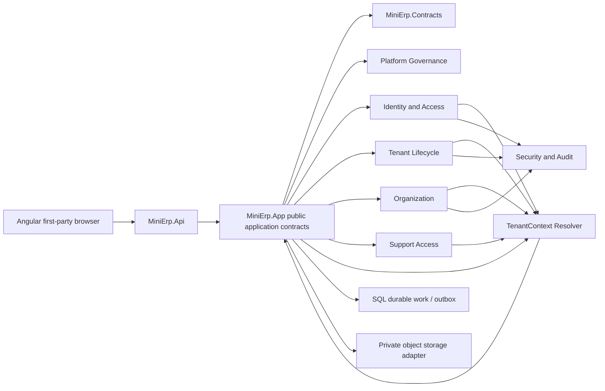
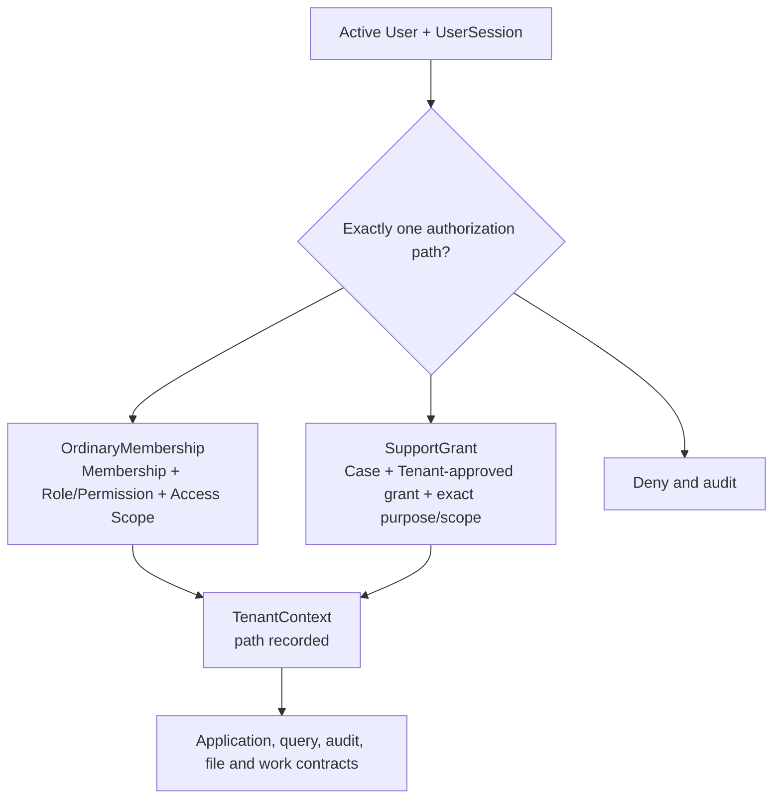
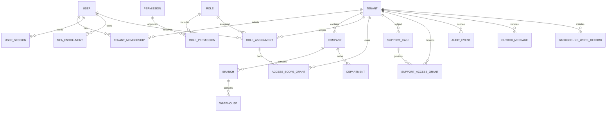

# Foundation Release 1 Lean Implementation Specification

**Version:** v0.3 — Draft for Final Focused Architecture and Security Review
**Status:** Draft — Not Approved for Implementation
**Jira:** MESP-86 - Produce Foundation Release 1 Lean Implementation Specification  
**Scope:** Identity and Access, Multi-Tenancy and Tenant Lifecycle, Organization and Company Structure  
**Branch:** `docs/foundation-release1-lean-spec`  
**Owner:** Hossam / Product Owner  
**Date:** 3 August 2026

This is a design and implementation-preparation document. It does not authorize
application code, database migrations, API or UI implementation, automated-test
implementation, a Sprint, or a production release.

## 1. Document Control

| Field | Value |
|---|---|
| Document | Foundation Release 1 Lean Implementation Specification |
| Version/status | v0.3 / Draft for Final Focused Architecture and Security Review |
| Governing Jira Task | MESP-86 (In Progress; outside all Sprints) |
| Parent Epic | MESP-1 - Product Governance and BRD Management (In Progress) |
| Approved BRD baselines | MESP-28, MESP-29, MESP-30, each v0.2 Approved Release 1 Baseline |
| Technical baseline | `docs/01_Technology_Architecture_Baseline.md` |
| Planned review | Focused architecture, security, and tenant-isolation delta review |
| Top-level sections | 55 (sections 1-55) |
| Relevant context/module boundaries | 8 |
| Aggregate roots | 13 |
| Domain entities | 22 |
| Value objects | 12 |
| Numbered invariants | 65 |
| Commands / queries | 64 / 32 |
| API operations | 94 across 20 named security profiles (catalogue only; no endpoints implemented) |
| UI journeys/pages | 18 (route and state inventory only) |
| Mandatory safety tests | 68 (strategy only; no tests created) |
| Open technical decisions | 7 |

## 2. Executive Summary

Release 1 foundation is a single modular-monolith design for a B2B ERP. A
globally identified User authenticates once, then operates through an explicitly
selected Tenant context. Tenant business data is isolated by server-derived
context, explicit ownership, relational constraints, deny-by-default policies,
and negative tests. Organization provides the approved Company, Branch,
Warehouse, and Department hierarchy. Identity and access controls determine
whether a user may act; tenant and organization scope determine where the act
may apply.

The design intentionally keeps the three domains separate. It uses small
aggregate boundaries and explicit contracts rather than one graph-shaped
aggregate. Cross-module writes are coordinated by application services and
transactional integration records; implementation must not introduce
microservices, event sourcing, or a second database per Tenant.

Business values approved in MESP-28/29/30 are normative here. Technical session
mechanisms, cookie configuration, session storage, framework settings, and
implementation details remain downstream design concerns and must not change
the approved values. The document is therefore a blueprint for review, not an
implementation authorization.

## 3. Authority and Source Priority

When sources disagree, the following order applies and the discrepancy is
recorded and escalated rather than silently reconciled:

1. Explicit founder-approved decisions and approved change-control records.
2. Approved PRD v1.2.
3. The approved BRD that owns the relevant business concept: MESP-27, MESP-28,
   MESP-29, or MESP-30.
4. The approved architecture baseline and approved ADRs for technical
   feasibility and implementation constraints.
5. Jira MESP-86 for the scope and delivery control of this specification.
6. The approved glossary and decision registers.
7. The Wave 1 backlog and Product Delivery Master Plan.
8. Existing code only as evidence of the current implementation seam.

Jira scope controls this task but cannot override an approved business rule.
Architecture may identify infeasibility or require an explicit ADR, but cannot
silently change approved business behavior. Any conflict is recorded for the
Product Owner and appropriate specialist review.

The glossary supplies terms, not new behavior. Wafra is used only to validate
generic behavior. Retail POS and later domain BRDs are not sources for this
document.

## 4. Scope

This specification prepares the first Release 1 foundation slice:

- global identity, credentials, sessions, MFA, invitation and recovery behavior;
- Tenant membership, context selection, switching, suspension and termination;
- Roles, Platform-approved Permissions, scoped assignments, support access and
  audit evidence;
- Company / Legal Entity, Branch, Warehouse, and Department ownership and
  lifecycle;
- logical persistence, API contracts, UI route/state inventory, security
  controls, observability, and a targeted test strategy for those capabilities;
- implementation slicing guidance for the existing MESP-58 through MESP-64
  Enablers, without changing those Jira issues.

## 5. Out of Scope

The following remain outside this document and outside Release 1 foundation
implementation:

- Procurement, Inventory, Finance, B2B Sales, Production, and Retail POS
  transactions;
- MESP-31 and all downstream BRDs;
- implementation of MESP-58, MESP-59, or any other Enabler;
- physical SQL migrations, controllers, Angular components, tests, or a Sprint;
- microservices, Kubernetes, event sourcing, message brokers, CQRS/mediator
  frameworks, database-per-Tenant, or a separate identity server;
- tenant-specific core code for Wafra;
- production hosting, supported-volume limits, retention, legal hold, purge,
  backup, restoration, residency, or RPO/RTO values governed by MESP-48 and
  MESP-50;
- consolidation, intercompany processing, transfer pricing, or a consolidation
  currency.

## 6. Approved Technology Baseline

| Concern | Approved baseline | Why it fits this slice |
|---|---|---|
| Web client | Angular 22 and TypeScript | First-party enterprise shell, typed contracts, Arabic/RTL support |
| API | ASP.NET Core Web API on .NET 10 LTS | Supported long-lived host with policy middleware and OpenAPI |
| Data access | Entity Framework Core 10 | One operational context initially; module-owned mappings and transactions |
| Database | Microsoft SQL Server 2025 | Shared operational database with schema separation and relational integrity |
| Architecture | Modular Monolith | One deployable boundary for a one-developer team; explicit seams without distributed operations |
| Contract | REST and OpenAPI | Stable, reviewable application boundary; no endpoint implementation in this draft |
| Identity | ASP.NET Core Identity | Password, lockout, MFA capability, and user lifecycle primitives |
| Browser authentication | Secure HTTP-only first-party cookie | Avoids browser token storage; technical options remain downstream design |
| Authorization | Server-side policy and resource authorization | Composes membership, permission, organization scope, lifecycle and support checks |
| Work | SQL-backed durable work plus transactional outbox/inbox | Reliable tenant-aware background processing without a broker |
| Files | Private object storage behind an interface | Tenant-scoped files and future provider choice without coupling the domain |
| Local development | Docker Compose | Repeatable SQL Server, object-storage emulator and telemetry dependencies |
| Observability | OpenTelemetry-compatible logs, metrics and traces | Correlation across API, jobs and security/audit evidence |
| Testing tools | xUnit; Playwright TypeScript | Backend isolation and API validation plus critical browser journeys |

The baseline is a design constraint, not permission to add infrastructure. The
existing three production projects remain `MiniErp.Api`, `MiniErp.App`, and
`MiniErp.Contracts`; module internals remain internal to `MiniErp.App` and
public composition contracts remain explicit.

## 7. Context Map

The eight relevant boundaries are Platform Governance, Identity and Access,
Tenant Lifecycle, Organization, Support Access, Security/Audit, Files, and
Durable Work/Integration. They share contracts and transaction infrastructure,
not mutable domain state. `TenantContext` is an immutable technical value
assembled by the application/security pipeline; it is not a jointly owned
persisted business aggregate.

## 8. Module and Ownership Boundaries

| Boundary | Owns | May consume | Must not own |
|---|---|---|---|
| Platform Governance | Approved Permission catalogue, governance policy, and approval/seed authority for system Role definitions | Tenant lifecycle status for governance | Role persistence, Tenant business data |
| Identity and Access | User, Credential/ASP.NET Core Identity User, User Session, MFA Enrollment, Tenant Membership, Invitation, Password Recovery Request, Role definitions, Role Permissions, Role Assignments, Access Scope Grants | Tenant lifecycle eligibility and valid organization facts through contracts | Tenant lifecycle or organization tables |
| Tenant Lifecycle | Tenant identity, lifecycle and status, and lifecycle eligibility facts | Identity references and organization summaries through contracts | Credentials, memberships, roles, or organization tables |
| Organization | Company/Legal Entity, Branch, Warehouse, Department, hierarchy and organization lifecycle | Tenant identity and authenticated actor through contracts | Users, permissions, memberships, or Tenant tables |
| Support Access | Cases, named grants, approvals, expiry and evidence | Identity, Tenant, audit contracts | General Tenant authority |
| Security/Audit | Immutable security/audit evidence and correlation | Events from all boundaries | Passwords, raw recovery secrets, business payloads |
| Files | Tenant-scoped object references and private storage adapter | Tenant context, audit contracts | Public blobs or cross-tenant search |
| Durable Work/Integration | Outbox, inbox and background work records | Initiating Tenant and scope context | Unscoped work or hidden business writes |

Each boundary exposes intent-level contracts. Direct access to another module's
tables is prohibited; application orchestration validates the receiving
module's invariants before committing a cross-module operation. Identity and
Access owns Role definitions, Role Permissions, Role Assignments, and Access
Scope Grants. Platform Governance owns the approved Permission catalogue and
may approve or seed Platform/system Role definitions, but Role persistence
remains owned by Identity and Access. No module directly mutates another
module's tables.

The authorization path is explicit. A protected Tenant request records exactly
one `AuthorizationPath`: `OrdinaryMembership` or `SupportGrant`. A Platform
Administrator role by itself is neither path and cannot authorize Tenant
business data.

## 9. Ubiquitous Language

| Term | Meaning in this specification |
|---|---|
| Platform | The SaaS control plane above all Tenants. |
| Tenant | Subscription and data-isolation boundary. |
| Company / Legal Entity | Tenant-owned legal/accounting organization. |
| Branch | Operational subdivision of a Company; not a legal entity or ledger. |
| Warehouse | Stock/location identity below a Branch; transactions are out of scope here. |
| Department | Tenant Company-owned organizational grouping, reusable across Company branches. |
| User | Global login identity; not a Person, Employee, Supplier, or Customer. |
| Membership | Explicit relationship granting a User eligibility in one Tenant. |
| Tenant context | Server-derived, one-Tenant request/workspace/session context. |
| Role | Tenant assignment of Platform-approved Permissions. |
| Access Scope | Downward path from Tenant to Company, Branch, or Warehouse. |
| Support grant | Named, case-bound, Tenant-approved, time-bounded support authority. |
| Active | Lifecycle state that permits the operation in question. |
| Historical reference | Authorized read of a previously used inactive/closed record without rewriting it. |

## 10. Foundation Domain Model

The following model is the minimum cross-domain vocabulary. `Platform` means the
record is global and purpose-bound; `Tenant` means exactly one Tenant key is
required. Lifecycle and invariant references are expanded in sections 13-15.

| Entity | Owner | Ownership class (Platform or Tenant) | Lifecycle | Transaction boundary | Cross-module contract |
|---|---|---|---|---|---|
| User | Identity | Platform/global | Active, suspended, offboarded | User security change | User identity reference |
| Credential / Identity User | Identity | Platform/global | Enabled, locked | Credential or lockout change | Authentication result |
| User Session | Identity | Platform record linked to User and Tenant context | Active, expired, revoked | Session issue/revoke | Revocation evidence |
| MFA Method / Enrollment | Identity | Platform/global per User | Pending, enabled, revoked | Enrollment/change | MFA assurance claim |
| Tenant | Tenant Lifecycle | Platform-owned identity; Tenant boundary | Draft, Provisioning, Configuration Required, Ready for Activation, Active, Grace Period, Suspended, Reactivated, Export Requested, Termination Pending, Terminated, Retained | Tenant lifecycle change | Tenant context eligibility |
| Tenant Membership | Identity | Exactly one Tenant | Invited, active, suspended, revoked | Membership change | Permission evaluation input |
| Invitation | Identity | One target Tenant | Issued, accepted, withdrawn, expired | Issue/accept/withdraw | User and membership creation |
| Password-Recovery Request | Identity | Platform record linked to User | Issued, consumed, expired, revoked | Recovery request | Session-revocation event |
| Role | Identity | Platform/system definition (Platform Governance approved) or exactly one non-null Tenant custom role | Draft, active, retired | Role definition change | Permission-set reference |
| Permission | Platform Governance | Platform-owned catalogue | Active, retired | Catalogue governance | Policy requirement |
| Role Permission | Identity | Follows Role ownership | Active, removed | Role edit | Effective permission set |
| Role Assignment | Identity | One Tenant; aggregate root owning child Access Scope Grants | Pending, active, revoked, expired | Assignment/approval and child-grant change | Authorization grant |
| Access Scope Grant | Identity (owned by Role Assignment) | One non-null Tenant; optional Company/Branch/Warehouse references validated by Organization | Active, revoked | Child-grant change | Resource authorization path |
| Support Case | Support Access | One Tenant and named requester | Open, approved, closed | Case change | Support approval context |
| Support Access Grant | Support Access | One Tenant, one case, named actor; never an ordinary Membership or Role Assignment | Requested, active, expired, revoked | Grant lifecycle | Exceptional bounded support policy |
| Company / Legal Entity | Organization | Exactly one Tenant | Draft, active, inactive, closed | Company lifecycle/configuration | Parent organization reference |
| Branch | Organization | Exactly one Company/Tenant | Draft, active, inactive, closed | Branch lifecycle | Company scope reference |
| Warehouse | Organization | Exactly one Branch/Company/Tenant | Draft, active, inactive, closed | Warehouse lifecycle | Branch scope reference |
| Department | Organization | Exactly one Company/Tenant | Draft, active, inactive, closed | Department lifecycle | Company scope reference |
| Audit Event | Security/Audit | Platform record with optional Tenant key | Immutable | Append only | Evidence reference |
| Outbox Message | Durable Work | Initiating Tenant when applicable | Pending, dispatched, failed, dead-lettered | Same transaction as source change | Integration delivery |
| Background Work Record | Durable Work | Initiating Tenant and scope | Queued, running, succeeded, failed, cancelled | Work state change | Tenant-aware worker contract |

## 11. Aggregate Roots and Consistency Boundaries

There is no giant aggregate. Thirteen roots own only the state that must change
atomically; read models and audit/outbox records are separate persistence
records. Cross-root operations use application orchestration and explicit
contracts.

| Root | Owning boundary | Atomic decisions | Cross-root reference |
|---|---|---|---|
| User | Identity | Identity status and global normalized email | User ID |
| Tenant | Tenant Lifecycle | Tenant lifecycle status | Tenant ID |
| Tenant Membership | Identity | One User's membership in one Tenant | User ID, Tenant ID |
| Invitation | Identity | Invitation issue/withdraw/accept | Target User/Tenant IDs |
| Password-Recovery Request | Identity | Single-use recovery lifecycle | User ID |
| Role | Identity | Role metadata and permission set; Platform/system definitions are governance-approved while persistence remains Identity-owned | Permission IDs |
| Role Assignment | Identity | Assignment, approver/decision, revocation, and all child Access Scope Grants | User, Tenant, Role, AccessScopeGrant IDs |
| Support Case | Support Access | Case purpose, tenant and requester | Tenant/User IDs |
| Support Access Grant | Support Access | Approval, exact scope, expiry | Case, Tenant, User IDs |
| Company | Organization | Company identity and approved configuration | Tenant ID |
| Branch | Organization | Branch identity and lifecycle | Company ID |
| Warehouse | Organization | Warehouse identity and lifecycle | Branch ID |
| Department | Organization | Department identity and lifecycle | Company ID |

Sessions, MFA enrollments, audit events, outbox messages, and background work
records have independent persistence lifecycles and are not hidden inside a
domain root. A root never loads an unbounded Tenant graph.

## 12. Entities and Value Objects

The 22 entities are the rows in section 10. The twelve value objects are
immutable, validated at the boundary, and carry no persistence identity:

| Value object | Validation purpose |
|---|---|
| NormalizedEmail | Canonical, globally unique login key |
| TenantContext | Immutable non-persisted request/workspace/session value assembled from User/User Session, exactly one authorization path (`OrdinaryMembership` or `SupportGrant`), Tenant lifecycle, Organization hierarchy, and applicable support grant |
| SessionWindow | Maximum and inactivity timestamps |
| MfaAssurance | Required level and fresh-auth timestamp |
| MembershipStatus | Explicit active eligibility |
| LifecycleState | Draft/active/inactive/closed or security state |
| ScopePath | Tenant -> Company -> Branch -> Warehouse downward path |
| CompanyConfiguration | Calendar, time zone, functional currency references |
| FiscalCalendarRef | Company calendar selection without physical policy values |
| TimeZoneId | Company time-zone identifier |
| CurrencyCode | Company functional currency code |
| CorrelationId | Request/job/audit trace key |

Credentials, raw MFA secrets, recovery tokens, and cookie values are sensitive
values handled by approved framework/adapters and are never represented as
auditable domain value objects.

## 13. Domain Invariants

The following 65 invariants are the non-negotiable Release 1 safety baseline.

1. **I-01:** Normalized email is globally unique.
2. **I-02:** User is a global identity and is not duplicated per Tenant.
3. **I-03:** Ordinary Tenant business access requires an authenticated active User, a valid active UserSession, an active explicit Tenant Membership, an applicable Role and Permission, a valid organization Access Scope, and eligible Tenant and organization lifecycle.
4. **I-04:** Every protected Tenant request, workspace, and session has exactly one Tenant context and exactly one recorded authorization path: `OrdinaryMembership` or `SupportGrant`.
5. **I-05:** Separate authorized contexts may coexist without sharing mutable state.
6. **I-06:** A client-supplied Tenant identifier never expands authority.
7. **I-07:** Tenant A state is never displayed, submitted, searched, or reused in Tenant B.
8. **I-08:** Every Tenant-owned record has exactly one Tenant owner.
9. **I-09:** Platform records are purpose-bound and cannot expose business data.
10. **I-10:** Cross-Tenant access is deny-by-default on reads, writes, search, reports, exports, files, jobs, notifications, integrations, audit, and support.
11. **I-11:** Platform Administrator alone does not grant Tenant business-data access.
12. **I-12:** Scope flows only downward Tenant -> Company -> Branch -> Warehouse.
13. **I-13:** Branch/Warehouse scope cannot be used upward to Company/Tenant-wide data.
14. **I-14:** Release 1 has no explicit-deny overlay; absence of a grant denies.
15. **I-15:** Roles contain only Platform-approved Permissions.
16. **I-16:** Privileged assignments have a separate named approver; self-approval is prohibited.
17. **I-17:** MFA is mandatory for approved privileged actors and operations.
18. **I-18:** Five failed attempts cause a 15-minute lockout.
19. **I-19:** Ordinary sessions have an 8-hour maximum lifetime.
20. **I-20:** Ordinary sessions expire after 30 minutes of inactivity.
21. **I-21:** Concurrent sessions are allowed, subject to independent revocation.
22. **I-22:** Suspension, offboarding, password reset, and critical access changes revoke affected sessions.
23. **I-23:** Administrators cannot view or set a user's password.
24. **I-24:** Exceptional Support access requires an authenticated active named Support User, valid active UserSession, MFA and operation-bound fresh authentication, active named Support Case, active Tenant-approved Support Access Grant, exact Tenant, purpose and scope, an applicable Permission, and current lifecycle eligibility.
25. **I-25:** Support Access Grant expiry is at most eight hours, does not create or require ordinary Membership or a normal Tenant Role Assignment, does not provide standing access, does not grant export authority, cannot perform ordinary Tenant business operations, and cannot cross into another Tenant.
26. **I-26:** Company belongs to one Tenant; Branch to one Company; Warehouse to one Branch; Department to one Company.
27. **I-27:** Inactive or closed units reject new users, documents, jobs, integrations, and transactions.
28. **I-28:** Parent inactivity blocks descendants; parent reactivation does not auto-restore descendants.
29. **I-29:** Authorized historical references remain readable and preserve original ownership.
30. **I-30:** Used parent ownership cannot be silently rewritten.
31. **I-31:** Wafra is validation-only and cannot create Tenant-specific core behavior.
32. **I-32:** Retail POS is excluded from Release 1 foundation scope.
33. **I-33:** Files, exports, reports, search indexes, notifications, and audit evidence carry Tenant scope where applicable.
34. **I-34:** Background work preserves initiating Tenant and organization scope.
35. **I-35:** MESP-50 controls retention, legal hold, purge, residency, backup, and restoration; no physical purge is designed here.
36. **I-36:** MESP-48 controls supported volume and performance evidence; this document invents no limits.
37. **I-37:** Tenant lifecycle transitions are limited to the approved Draft, Provisioning, Configuration Required, Ready for Activation, Active, Grace Period, Suspended, Reactivated, Export Requested, Termination Pending, Terminated, and Retained states, with no dead-end transition and no Purged Release 1 state.
38. **I-38:** Tenant suspension blocks ordinary interactive and asynchronous business operations; required Platform safety and governance operations may continue.
39. **I-39:** Tenant reactivation re-evaluates Users, Memberships, sessions, integrations, jobs, descendants, drafts, and pending work and never automatically restores them.
40. **I-40:** Tenant termination revokes ordinary access while preserving evidence; Retained remains subject to MESP-50 and Purged is not a Release 1 state.
41. **I-41:** Valid Tenant A working state remains explicitly owned by Tenant A when switching away, is never automatically deleted, and can return only after current authorization re-evaluation; invalid state is never restored.
42. **I-42:** A persistence write is rejected when TenantId is missing, inconsistent with trusted context, or changed after a used record is established.
43. **I-43:** Same-Tenant composite relationships are enforced for hierarchy, membership, assignments, scopes, support records, files, exports, reports, and work metadata.
44. **I-44:** IgnoreQueryFilters, raw SQL, bulk, Platform maintenance, and migration paths are unavailable to ordinary Tenant application paths and require a named privileged, purpose-bound, authorized, reviewed, audited contract.
45. **I-45:** Session renewal never extends the original absolute maximum; fresh authentication is bound to the specific protected operation or challenge completion unless a separate security decision approves a reusable window.
46. **I-46:** `TenantContext.AuthorizationPath` is exactly `OrdinaryMembership` or `SupportGrant`; missing, ambiguous, or mixed paths are denied.
47. **I-47:** A Support Access Grant never creates or requires an ordinary Tenant Membership or normal Tenant Role Assignment, never creates standing access, and never becomes a path into another Tenant.
48. **I-48:** Platform/system Role definitions are Platform-owned in meaning, persisted by Identity and Access, use only Platform-approved Permissions, and are assignable only through approved governance; the definition alone never grants Tenant business access.
49. **I-49:** A Tenant custom Role has exactly one non-null Tenant owner, uses only Platform-approved Permissions, is assignable only inside that Tenant, and cannot be made Platform-global by update.
50. **I-50:** A RoleAssignment TenantId equals the TenantId of every child AccessScopeGrant and, for a custom Role, equals the Role TenantId; every referenced Company, Branch, or Warehouse belongs to that same Tenant.
51. **I-51:** RoleAssignment is the aggregate root for scope authority; an active Tenant Role Assignment has one or more explicit AccessScopeGrants, including an explicit Tenant-level grant when Tenant-wide authority is intended.
52. **I-52:** Company grants inherit only downward to their Branches and Warehouses; Branch grants apply only to that Branch and its Warehouses; Warehouse grants apply only to that Warehouse; child grants never reach parents or siblings; multiple valid grants combine; absence of a valid grant denies.
53. **I-53:** Revoking a RoleAssignment revokes all child AccessScopeGrants; scope additions and removals are concurrency-controlled, single-effect, and audited.
54. **I-54:** `SelectTenantContext` and `SwitchTenantContext` are owned by the application/security TenantContext Resolver, consume Identity, Tenant Lifecycle, Organization, and Support contracts, and never silently rely on Tenant Lifecycle alone.
55. **I-55:** `Export Requested` is an offboarding/export milestone that stores an explicit operational access decision; it does not silently broaden, stop, or restore ordinary access.
56. **I-56:** Reactivated Tenants cannot perform ordinary interactive or asynchronous business operations until they return to Active; failed or incomplete revalidation remains restricted.
57. **I-57:** Registration is an internal step only of the approved invitation/activation path; password recovery never registers a new User, and RegisterUser/ConfirmEmail are not public operations.
58. **I-58:** Privileged-assignment and Support-Grant approval decisions record both approval and rejection evidence; a rejected request is not represented as revocation of previously active access.
59. **I-59:** The normal business-number boundary is Company / Legal Entity plus Document Type; optional Branch subdivision requires owning-domain or approved Saudi justification, Warehouse-level numbering is excluded absent later approval, and no automatic reset is assumed.
60. **I-60:** An allocated business number is never reused, including after cancellation, rejection, voiding, gap, or reset; permitted gaps remain attributable and auditable.
61. **I-61:** Every public command and query maps to exactly one API/application operation, and every API operation maps to exactly one command or query; internal registration steps map to their named invitation/activation flow.
62. **I-62:** Every API operation has one named homogeneous security profile that explicitly states owner, actor, authorization path, authentication, MFA/fresh auth, context, Permission, Access Scope, lifecycle, concurrency, idempotency, audit, safe errors, and response semantics.
63. **I-63:** Audit evidence distinguishes `OrdinaryMembership` authorization from `SupportGrant` authorization and records the exact Tenant, purpose, scope, actor, decision, and result.
64. **I-64:** A RoleAssignment without a valid active AccessScopeGrant grants no Tenant authority, even when its Role and Permission are otherwise valid.
65. **I-65:** Tenant, Company, Branch, and Warehouse lifecycle and scope checks are re-evaluated for every context selection, switch, asynchronous operation, and historical-reference request.

## 14. Lifecycle and State Models

| Object | States | Allowed transitions and guard |
|---|---|---|
| User | Active, Suspended, Offboarded | Security/owner action; suspension/offboarding revokes affected sessions; reactivation requires review |
| Membership | Invited, Active, Suspended, Revoked | Active only after explicit assignment; revoked membership cannot select context |
| Tenant | Draft, Provisioning, Configuration Required, Ready for Activation, Active, Grace Period, Suspended, Reactivated, Export Requested, Termination Pending, Terminated, Retained | Only approved guards may advance state; suspension blocks ordinary work; termination revokes ordinary access and preserves evidence |
| Invitation | Issued, Accepted, Withdrawn, Expired | Seven-day business value; single target and non-transferable |
| Recovery request | Issued, Consumed, Expired, Revoked | One-use verified-email path; success revokes affected sessions |
| Role/assignment | Draft, Active, Retired / Pending, Active, Revoked, Expired | Permission catalogue and approval policies apply before activation |
| Support case/grant | Open, Approved, Closed / Requested, Active, Expired, Revoked | Exact Tenant/scope, named approver, maximum eight-hour grant |
| Company/Branch/Warehouse/Department | Draft, Active, Inactive, Closed | Parent and historical-reference rules in section 32 |

### Tenant lifecycle transition and access matrix

The Tenant lifecycle is a guarded state machine. `Export Requested` is a
workflow milestone with a separately recorded `OperationalAccessDecision`
(continue or stop); it is not a hidden instruction to grant or remove ordinary
access. The table records the allowed transition and the behavior of every
access surface. No duration is implied for Grace Period, retention,
cooling-off, backup, restoration, or purge.

| Current state | Command / trigger | Authorized actor | Required evidence | Resulting state / operational decision | Ordinary interactive access | Asynchronous business work | Historical read | Export | Platform safety / governance | Rejection behavior |
|---|---|---|---|---|---|---|---|---|---|---|
| Draft | `StartTenantProvisioning` | Platform administrator or authorized Tenant administrator under the applicable governance path | Valid draft, initiating actor, idempotency and readiness evidence | Provisioning | Denied | Denied | Authorized historical reference only | Not available unless separately authorized | Purpose-bound provisioning and audit may continue | Remain Draft; safe validation/conflict evidence |
| Provisioning | `MarkTenantConfigurationRequired` | Platform administrator or authorized Tenant administrator | Provisioning result and missing-configuration evidence | Configuration Required | Denied | Denied | Authorized historical reference only | Not available unless separately authorized | Provisioning diagnostics and audit may continue | Remain Provisioning; record dependency failure |
| Configuration Required | `MarkTenantReadyForActivation` | Platform administrator or authorized Tenant administrator | All approved activation requirements pass | Ready for Activation | Denied | Denied | Authorized historical reference only | Not available unless separately authorized | Configuration evidence and safety review may continue | Remain Configuration Required; identify unmet requirement |
| Ready for Activation | `ActivateTenant` | Authorized Platform or Tenant lifecycle actor | Approved activation decision and complete configuration evidence | Active | Allowed only after ordinary path resolution | Allowed only after revalidation | Allowed to authorized scope | Allowed only with separate Permission/approval | Governance, audit and safety monitoring continue | Remain Ready for Activation; no partial activation |
| Active | `EnterTenantGracePeriod` where applicable | Authorized lifecycle actor | Approved operational decision and evidence | Grace Period; operational decision remains explicit | According to recorded operational decision | According to recorded operational decision and lifecycle guard | Allowed to authorized scope | Separate export authorization required | Safety, audit and governed offboarding continue | Remain Active; record rejected transition |
| Grace Period | `ReactivateTenant` with approved return decision | Authorized lifecycle actor | Explicit return evidence and current eligibility | Active | Allowed only after revalidation | Allowed only after revalidation | Allowed to authorized scope | Separate export authorization required | Governance and audit continue | Remain Grace Period; no automatic restore |
| Grace Period | `SuspendTenant` | Authorized lifecycle actor | Suspension decision and evidence | Suspended | Denied | Denied | Authorized historical reference only | Only separately authorized controlled export | Safety, audit, incident and lifecycle governance may continue | Remain Grace Period; record denial |
| Active or otherwise eligible state | `SuspendTenant` | Authorized lifecycle actor | Suspension decision, reason and audit evidence | Suspended | Denied | Denied | Authorized historical reference only | Only separately authorized controlled export | Safety, audit, incident and lifecycle governance may continue | Remain current state; no partial suspension |
| Suspended | `ReactivateTenant` | Authorized lifecycle actor | Fresh review of Users, Memberships, Roles/Permissions, sessions, work, integrations, descendants, drafts and pending work | Reactivated | Denied until Active | Denied until Active | Authorized historical reference only | Separately authorized export only | Revalidation, evidence and safety work may continue | Remain Suspended; retain failed checks |
| Reactivated | `ReactivateTenant` completion after all revalidation passes | Authorized lifecycle actor | Successful revalidation of all affected access and work | Active | Allowed after ordinary or support path passes current checks | Allowed after current lifecycle and path checks | Allowed to authorized scope | Separate export authorization required | Governance and audit continue | Transition to Suspended; do not restore invalid state |
| Reactivated | `SuspendTenant` when revalidation fails or remains incomplete | Authorized lifecycle actor | Failed/incomplete revalidation evidence | Suspended | Denied | Denied | Authorized historical reference only | Separately authorized export only | Safety and revalidation evidence may continue | Remain restricted; record failed reactivation |
| Active, Grace Period, or Suspended eligible state | `RequestTenantExport` | Authorized actor with export Permission and explicit approval | Exact Tenant/scope, purpose, artifact, approval and idempotency evidence plus operational access decision | Export Requested; operational decision is retained without implicit access change | Continue or stop only as explicitly recorded | Continue or stop only as explicitly recorded and revalidated | Allowed to authorized historical scope | Bounded export only for approved scope | Export evidence, audit and MESP-50 controls continue | Keep prior lifecycle state; deny unsafe or ambiguous request |
| Eligible offboarding state | `BeginTenantTermination` | Authorized lifecycle actor and required approver | Export disposition, open matters, legal hold and termination evidence | Termination Pending | Denied unless a separately recorded safety exception applies | Denied | Authorized historical reference only | Only bounded approved export | Termination governance and evidence continue | Remain current state; identify missing gate |
| Termination Pending | `TerminateTenant` | Authorized lifecycle actor and required approver | Complete termination disposition and approval evidence | Terminated | Denied | Denied | Authorized historical reference only | Only separately approved export | Evidence preservation, legal hold and MESP-50 governance continue | Remain Termination Pending; no partial termination |
| Terminated | `RecordTenantRetainedState` | Authorized Platform governance actor | Retention/legal-hold decision owned by MESP-50 | Retained | Denied | Denied | Authorized historical reference only | MESP-50-governed export only | Retention, legal hold, audit and safety governance continue | Remain Terminated; no Purged Release 1 state |

The Tenant lifecycle deliberately has no Purged Release 1 state. Purged may only
be a future MESP-50-gated terminal outcome. No production purge, retention,
grace, cooling-off, backup, restoration, or purge duration is invented here.
Reactivation re-evaluates Users, Memberships, sessions, integrations, jobs,
descendants, drafts, and pending work; it does not automatically restore any of
them. Required Platform safety and governance operations may continue while a
Tenant is Suspended. No state transition silently restores old privileges. A
state change emits a domain event and an audit record after the transaction is
durable.

## 15. Domain Events

Events are internal integration facts, not a mandate for event sourcing. Every
event includes a correlation ID, actor ID, initiating Tenant when applicable,
scope snapshot, occurred-at time, schema version, and sensitivity classification.

| Event | Producer | Consumers |
|---|---|---|
| UserActivated / UserSuspended / UserOffboarded | Identity | Session revocation, audit |
| CredentialChanged / PasswordResetCompleted | Identity | Session revocation, audit |
| MfaEnrolled / MfaRevoked | Identity | Assurance policy, audit |
| MembershipActivated / MembershipSuspended / MembershipRevoked | Identity | Tenant Lifecycle context eligibility; session revocation |
| InvitationIssued / Accepted / Withdrawn / Expired | Identity | Membership workflow, audit |
| RoleChanged / AssignmentApproved / AssignmentRejected / AssignmentRevoked | Identity | Policy cache invalidation, audit |
| SupportCaseApproved / SupportGrantApproved / SupportGrantRejected / SupportGrantActivated / Expired / Revoked / Closed | Support | Support policy, audit |
| TenantActivated / Suspended / Reactivated / Terminated | Tenant Lifecycle | Context, work and session guards |
| TenantDraftCreated / ProvisioningStarted / ConfigurationRequired / ReadyForActivation | Tenant Lifecycle | Lifecycle workspace and activation guards |
| TenantGracePeriodEntered / ExportRequested / TerminationPending / RetainedRecorded | Tenant Lifecycle | Export, termination and evidence workflows |
| CompanyChanged / BranchChanged / WarehouseChanged / DepartmentChanged | Organization | Scope validation, audit |
| OutboxDispatched / WorkCompleted / WorkFailed | Durable Work | Observability and retry policy |

## 16. Commands and Queries

Commands are intent-level application operations; queries are read operations.
The catalogue contains 64 commands and 32 queries. They do not imply
controllers, database migrations, or implementation work. Every command is
mapped to a journey and to an API/application entry point in sections 17 and 37.

### Commands (64)

**User, authentication, and recovery:**

1. `RegisterUser` (internal step only of the approved invitation/activation
   flow; never password recovery and not a public operation); 2. `ConfirmEmail`
   (internal verification step of invitation/activation; not a public
   operation); 3. `SignIn`; 4. `SignOut`; 5. `RevokeSession`;
6. `BeginMfaChallenge`; 7. `VerifyMfa`; 8. `EnrollMfa`; 9. `RevokeMfa`;
10. `SuspendUser`; 11. `ReactivateUser`; 12. `OffboardUser`;
13. `RevokeAffectedUserSessions`; 14. `RequestPasswordRecovery`;
15. `CompletePasswordRecovery`.

**Tenant lifecycle:**

16. `CreateTenantDraft`; 17. `StartTenantProvisioning`;
18. `MarkTenantConfigurationRequired`; 19. `MarkTenantReadyForActivation`;
20. `ActivateTenant`; 21. `EnterTenantGracePeriod`; 22. `SuspendTenant`;
23. `ReactivateTenant`; 24. `RequestTenantExport`;
25. `BeginTenantTermination`; 26. `TerminateTenant`;
27. `RecordTenantRetainedState`.

**Invitation lifecycle:**

28. `IssueInvitation`; 29. `AcceptInvitation`; 30. `WithdrawInvitation`;
31. `ReissueInvitation` (creates a new invitation; never transfers the old one).

**Membership, Roles, scope, and review:**

32. `ActivateMembership`; 33. `SuspendMembership`; 34. `RevokeMembership`;
35. `CreateRole`; 36. `UpdateRole`; 37. `AssignRole`;
38. `RecordPrivilegedAssignmentDecision` (approved or rejected outcome);
39. `RevokeAssignment`; 40. `GrantAccessScope`; 41. `RevokeAccessScope`;
42. `StartAccessReview`; 43. `RecordAccessReviewDecision`;
44. `SelectTenantContext`; 45. `SwitchTenantContext`.

**Support access:**

46. `OpenSupportCase`; 47. `RecordSupportGrantDecision` (approved or rejected
   outcome); 48. `ActivateSupportGrant`; 49. `RevokeSupportGrant`;
50. `CloseSupportCase`.

**Organization management:**

51. `CreateCompany`; 52. `UpdateCompanyConfiguration`;
53. `ConfirmFiscalCalendar`; 54. `ConfirmOperatingTimeZone`;
55. `ConfirmFunctionalCurrency`; 56. `ChangeCompanyLifecycle`;
57. `CreateBranch`; 58. `UpdateDraftBranchParent`;
59. `ChangeBranchLifecycle`; 60. `CreateWarehouse`;
61. `UpdateDraftWarehouseParent`; 62. `ChangeWarehouseLifecycle`;
63. `CreateDepartment`; 64. `ChangeDepartmentLifecycle`.

### Queries (32)

1. `GetSessionStatus`; 2. `ListSessions`; 3. `GetCurrentTenantContext`;
4. `ListEligibleMemberships`; 5. `GetTenantLifecycle`;
6. `ListTenantLifecycleHistory`; 7. `GetTenantExportStatus`;
8. `ListUsers`; 9. `GetUser`; 10. `ListMemberships`; 11. `ListRoles`;
12. `GetRole`; 13. `ListPermissions`; 14. `ListAssignments`;
15. `ListAccessScopeGrants`; 16. `ListAccessReviewEvidence`;
17. `GetAccessReview`; 18. `ListCompanies`; 19. `GetCompany`;
20. `GetCompanyConfiguration`; 21. `ListBranches`; 22. `GetBranch`;
23. `ListWarehouses`; 24. `GetWarehouse`; 25. `ListDepartments`;
26. `GetDepartment`; 27. `GetCompanyHierarchy`;
28. `GetHistoricalOrganizationReference`; 29. `ListSupportCases`;
30. `GetSupportCase`; 31. `ListSupportEvidence`; 32. `ListAuditEvidence`.

`RegisterUser` and `ConfirmEmail` are application-internal steps, not public
API operations; they are exercised only by invitation/activation. They are not
part of password recovery. Every other command and query has exactly one named
operation in section 37. Every query derives Tenant context on the server,
applies authorization and lifecycle guards, and returns only records safe for
that context.

## 17. User Journeys

| Journey | Primary actor | Outcome | Blocking dependency |
|---|---|---|---|
| Sign in and establish context | User | Authenticated session with one eligible Tenant context | Identity and membership |
| MFA challenge and fresh auth | Privileged user | Required assurance for protected operation | MFA policy and session evidence |
| User suspension, reactivation and offboarding | Platform administrator or authorized Tenant administrator | User lifecycle change with affected-session revocation and explicit re-evaluation | Identity policy and approval |
| Recover password | User | Verified recovery and affected-session revocation | Email delivery adapter decision |
| Accept invitation | Invitee | User and explicit Membership established | Invitation validity |
| Tenant lifecycle workspace | Platform administrator or authorized Tenant administrator | Draft through Retained state with guarded transitions | Tenant Lifecycle policy and MESP-50 gate |
| Select/switch Tenant | Multi-Tenant user or named Support User within an approved grant | Safe context replacement with no state leakage and exactly one recorded authorization path | Application/security TenantContext Resolver |
| Return to a Tenant | Multi-Tenant user | Previously valid Tenant-owned state is available only after current re-evaluation | Membership, lifecycle, scope, Permission, session and support grant |
| Manage users and memberships | Tenant Admin | Explicit member lifecycle | Tenant and organization scope |
| Manage Role and Permissions | Tenant Admin / Platform approver | Approved grant without self-approval | Permission catalogue |
| Review/revoke sessions | User/Admin | Independent session control | Revocation evidence |
| Manage Company hierarchy | Tenant Admin | Company, Branch, Warehouse, Department lifecycle | Parent active and same Tenant |
| Confirm Company configuration | Tenant Admin / Finance boundary | Fiscal calendar, operating time zone and functional currency are explicitly confirmed | Organization ownership and approved configuration rules |
| Request, decide, activate, revoke and close support | Support actor / Tenant approver | Named exact-scope time-bounded grant, explicit approval or rejection, and closure evidence | Case, MFA and support lifecycle policy |
| Review audit/access evidence | Authorized reviewer | Evidence without secrets or leakage | Audit boundary |

## 18. Screen and Route Inventory

The 18 pages/journeys are route-level design references only:

1. `/login` Login; 2. `/mfa` MFA challenge; 3. `/password-recovery` password recovery;
4. `/invitation/accept` invitation acceptance; 5. `/tenant/select` Tenant selection;
6. `/tenant/lifecycle` Tenant lifecycle workspace; 7. context indicator/switcher;
8. user list/details; 9. membership management;
10. Role catalogue/editor; 11. Permission catalogue; 12. Role/scope assignment;
13. session management; 14. Company list/details; 15. Branch list/details;
16. Warehouse list/details; 17. Department list/details; 18. support approval,
   monitoring, access-review and audit evidence.

## 19. UI States and Validation

Each route must specify loading, empty, success, validation failure, restricted,
expired, suspended, no-access, and unexpected-error states. Context-dependent
pages show the current Tenant and relevant organization path; they never trust a
hidden input as authority. A valid Tenant A draft, filter, prepared result or
working state is explicitly owned by Tenant A and is not automatically deleted
when switching away. It must not be displayed, submitted, reused, interpreted,
searched, cached, exported, or executed in Tenant B. Returning to Tenant A makes
it available only after current Membership, Tenant lifecycle, organization
scope, Permission, session, and support-grant re-evaluation; invalid state is
never restored merely because the User returns. Mutating controls require
server confirmation and refresh after a lifecycle or permission change.

Arabic and English labels, RTL layout, keyboard navigation, focus order,
screen-reader names, visible validation summaries, and non-color-only status
indicators are required. Expired sessions and revoked support grants return to a
safe re-authentication or no-access state without revealing protected data.

## 20. Authentication Architecture

ASP.NET Core Identity owns the global User and credential lifecycle. The API
creates a secure HTTP-only first-party cookie after successful credential and,
when required, MFA verification. The server resolves the User from the cookie,
then evaluates active Membership and Tenant context. No password, raw token, or
cookie value is exposed to the Angular application.

Authentication is distinct from authorization. A valid global User without an
active Membership cannot access Tenant business data. Identity events are
correlated with audit evidence without storing raw secrets.

## 21. Session Architecture

Business values are fixed at eight-hour maximum ordinary lifetime, thirty-minute
inactivity timeout, and concurrent sessions allowed. The safe Release 1
technical default is a server-side `UserSession` record with an opaque session
identifier represented in the protected cookie ticket. Every protected request
validates server-side session status and revocation. Renewal may refresh
inactivity but never extends the original absolute maximum.

Each session has revocation state, issued/last-seen/absolute-expiry evidence,
User ID, and one selected Tenant context at a time. Concurrent sessions are
independent. Password reset, User suspension, offboarding, Membership
revocation, critical Role/Permission/scope changes, and required Tenant
lifecycle changes revoke affected sessions. An expired or revoked session fails
safely without disclosing whether a protected resource exists. Raw cookie
values never enter audit evidence. Any storage, key-management, or renewal
detail beyond this default remains an ADR-004 implementation decision.

## 22. MFA and Fresh-Authentication Behavior

MFA capability is required. MFA is mandatory for Platform Administrators,
Support Users, Tenant Administrators, privileged assignments, and approved
high-risk operations. A fresh-auth claim is required when a policy marks an
operation high risk or when support approval is extended.

The concrete factor, enrollment UX, recovery-code handling, and technical
assurance storage remain downstream design decisions. Failed challenges do not
leak factor details. MFA enrollment/revocation and failed challenge evidence are
audited without secrets. Fresh authentication is distinct from ordinary session
validity: it is bound to the specific protected operation or challenge
completion. No reusable fresh-auth duration is invented; any reusable assurance
window requires an explicit technical security decision before MESP-59 becomes
Ready.

## 23. Password, Recovery, Invitation, and Lockout Behavior

- Passwords are handled only by ASP.NET Core Identity; administrators cannot set
  or view them.
- Five failed attempts cause the approved fifteen-minute lockout behavior.
- Recovery starts from a verified email path, uses a single-use opaque request,
  and revokes affected sessions after completion.
- Invitations are single-target, non-transferable, withdrawable, and valid for
  seven days; acceptance creates or activates the explicit Membership only after
  all Tenant and User guards pass.
- Safe errors do not reveal whether an email, account, Tenant, or invitation
  exists.

## 24. Tenant Context Resolution

The application/security TenantContext Resolver owns this operation and
consumes Identity, Tenant Lifecycle, Organization, and Support Access contracts.
It never silently relies on Tenant Lifecycle alone. The trusted server pipeline
resolves context in this order:

1. Authenticate an active global User and validate a valid active UserSession.
2. Determine the requested authorization path; exactly one must be selected.
3. For `OrdinaryMembership`, verify active explicit Membership, applicable Role
   and Permission, valid downward organization Access Scope, and eligible Tenant
   and organization lifecycle.
4. For `SupportGrant`, verify an authenticated active named Support User,
   valid active UserSession, MFA and operation-bound fresh authentication,
   active named Support Case, active Tenant-approved Support Access Grant,
   exact Tenant, exact purpose, exact scope, maximum eight-hour expiry,
   applicable operation Permission, and current lifecycle eligibility. This path
   does not load or create an ordinary Membership or normal Role Assignment.
5. Verify exactly one Tenant and optional Company/Branch/Warehouse scope from
   Organization-owned hierarchy facts; a client Tenant ID remains a selector
   hint, never an authorization input.
6. Assemble an immutable, non-persisted `TenantContext` with the authenticated
   User and UserSession, exact Tenant, scope, lifecycle facts, and
   `AuthorizationPath = OrdinaryMembership | SupportGrant`.
7. Attach that context to application services, queries, audit, file access,
   and background work creation.

Missing, stale, suspended, terminated, expired, mixed, or ambiguous context is
denied. A request cannot fall back from an invalid SupportGrant to Membership
or from an invalid Membership to SupportGrant.

## 25. Tenant Context Switching

`SelectTenantContext` and `SwitchTenantContext` are explicit commands owned by
the application/security TenantContext Resolver. Switching re-evaluates the
current authorization path: ordinary access requires active Membership, Role,
Permission and scope; exceptional access requires the same named active
Support Case/Grant, exact Tenant/purpose/scope, MFA, fresh authentication and
expiry. A SupportGrant cannot switch to another Tenant and never creates an
ordinary Membership.

Switching is an explicit command that re-evaluates Membership, Tenant status,
organization scope, current Permission, session assurance, and support grant.
Tenant A state is never displayed, submitted, reused, interpreted, searched,
cached, exported, or executed inside Tenant B. Switching away does not
automatically delete valid Tenant A drafts, filters, prepared results, or working
state; each remains explicitly owned by Tenant A. The old context is cleared
from the active request/workspace before the new one is attached.

Returning to Tenant A may expose preserved state only after successful current
Membership, lifecycle, organization-scope, Permission, session, and support
grant re-evaluation. Revoked, expired, suspended, terminated, or otherwise
invalid state is never restored merely because the User returns. Separate
authorized browser sessions/workspaces may operate in different Tenants, but
their state, caches, and authority remain isolated. Audit records capture the
decision and correlation ID without leaking protected state.

## 26. Tenant-Isolation Enforcement Model

Defense in depth is mandatory:

1. Trusted server-derived Tenant context.
2. Explicit Tenant ownership on every Tenant-owned record.
3. Deny-by-default policy and resource guards.
4. Tenant-aware unique constraints.
5. Tenant-aware relationships/FKs where appropriate.
6. No unscoped repository/query path for Tenant data.
7. Background work keeps initiating Tenant and organization scope.
8. Tenant-specific files, exports, reports, search, cache and audit evidence.
9. Safe context switching with active-context clearing while preserving valid
   Tenant-owned state.
10. Cross-Tenant negative tests for every protected surface.
11. Logging of denied cross-Tenant attempts without leaking the target data.

`TenantContext` is assembled by the application/security pipeline and is not a
shared persisted aggregate. Identity supplies the authenticated User and User
Session; the resolver chooses exactly one `OrdinaryMembership` or `SupportGrant`
path; Tenant Lifecycle supplies eligibility and status; Organization supplies
valid hierarchy facts; Support Access supplies a case-bound grant only for the
exceptional path. Each module owns its own tables and exposes contracts rather
than direct table access.

Every Tenant-owned record has a non-null `TenantId`. Tenant-aware alternate or
unique keys support same-Tenant relationships, and logical composite
relationships enforce same-Tenant ownership for Branch -> Company,
Warehouse -> Branch, Department -> Company, Membership -> Tenant, Role
Assignment -> Tenant, Access Scope -> Tenant and its hierarchy, Support
Case/Grant -> Tenant, and Tenant-owned file/export/report/work metadata. A
global query filter may be a convenience and defense-in-depth measure but is
never the only control.

The application write pipeline or `SaveChanges` guard rejects missing Tenant
ownership, ownership inconsistent with trusted context, cross-Tenant relationship
changes, and attempts to change immutable Tenant ownership after use. Normal
Tenant repositories and query handlers require trusted `TenantContext`.
`IgnoreQueryFilters`, raw SQL, bulk operations, Platform maintenance, and
migration paths are unavailable to ordinary Tenant application paths; each
requires a named privileged contract, purpose, explicit authorization, review,
audit evidence, and negative tests. Outbox, background work, files, exports,
search metadata, and audit evidence retain initiating Tenant and scope.

Optional SQL Server row-level security is a defense-in-depth decision, not a
prerequisite for this design. ADR-016 must be approved before production if RLS
is adopted; application and relational ownership controls remain required.

## 27. Role, Permission, and Assignment Model

Identity and Access owns all Role definitions, Role Permissions, Role
Assignments, and Access Scope Grants. Platform Governance owns the approved
Permission catalogue and governance policy and may approve or seed
Platform/system Role definitions; persistence of those definitions remains
Identity-owned. A Platform/system Role is Platform-owned, uses only approved
Permissions, is assignable only through approved governance, and does not itself
provide Tenant business access.

A Tenant custom Role has exactly one non-null Tenant owner, uses only
Platform-approved Permissions, may be assigned only inside that owning Tenant,
and cannot become Platform-global through an update. `RoleAssignment` is the
aggregate root. An active Tenant Role Assignment has one or more explicit child
`AccessScopeGrant` entities; a Tenant-wide grant is an explicit Tenant-level
grant, not an omitted scope. Privileged Role or scope assignments need a
separate named approver and never permit self-approval. Assignment records carry
User, Tenant, Role, child grants, approver/decision, effective state, and
revocation evidence.

Role changes, scope removal, Membership suspension, and other critical access
changes invalidate affected sessions. UI visibility is advisory; every command
and protected query repeats server-side policy and resource checks.

## 28. Organization Access-Scope Enforcement

An `AccessScopeGrant` is an entity owned by `RoleAssignment`, not a separate
aggregate. An active Tenant Role Assignment has one or more explicit grants:

- a Tenant-wide grant is an explicit Tenant-level grant;
- a Company grant inherits downward to that Company's Branches and Warehouses;
- a Branch grant applies only to that Branch and its Warehouses;
- a Warehouse grant applies only to that Warehouse;
- child grants never inherit upward or to siblings;
- multiple valid grants combine, while absence of a valid grant denies;
- additions and removals are concurrency-controlled and audited; revoking the
  RoleAssignment revokes all child grants.

Release 1 has no explicit deny overlay. Organization lifecycle is evaluated
after scope: inactive or closed parents and descendants block new work even if
a Role exists. Department is Company-owned and is not an authorization level
unless a later approved requirement adds one.

## 29. Platform Administrator Boundary

Platform Administrators may manage Platform governance records, approved
Permissions, Tenant lifecycle governance, and evidence required for operations.
The role alone does not grant Tenant business-data access. Ordinary Tenant
business access requires a separate explicit active Tenant Membership, active
UserSession, applicable Role and Permission, valid Access Scope and eligible
lifecycle. Platform records that reference a Tenant are purpose-bound and must
not become a covert business-data query path.

## 30. Support-Access Boundary

Support access is a separate exceptional path. It starts with an authenticated
active named Support User and valid UserSession, MFA and operation-bound fresh
authentication, a named Support Case, the target Tenant, exact purpose, exact
scope, Tenant approval, an applicable operation Permission and current lifecycle
eligibility. An active Support Access Grant is time-bounded to at most eight
hours, can be revoked or expire, and must be re-approved for extension. It does
not create or require ordinary Tenant Membership or normal Role Assignment,
does not provide standing access, cannot perform ordinary Tenant business
operations, does not alone grant export authority, and cannot cross into
another Tenant. All requests, approvals, rejections, activations, denials,
expiries, revocations and closure decisions are immutable evidence without raw
secrets or business payloads.

## 31. Company, Branch, Warehouse, and Department Design

- Company / Legal Entity belongs to exactly one Tenant and owns the active
  fiscal-calendar, time-zone, and functional-currency selections defined by the
  approved Organization BRD. Finance owns later accounting behavior.
- Branch belongs to one Company; it is not a legal entity or independent ledger.
- Warehouse belongs to one Branch. Stock effects belong to Inventory, while this
  slice owns identity and hierarchy.
- Department belongs to one Company and may be reused across that Company's
  branches; it is not a scope level by itself.
- The normal Release 1 business-number boundary is Company / Legal Entity plus
  Document Type. Branch subdivision is allowed only where the owning domain,
  business policy, or an approved Saudi requirement explicitly requires it.
  Warehouse-level numbering is excluded unless a later owning-domain approval
  requires it. No automatic reset is assumed; any fiscal-year reset must be
  explicitly configured. Once allocated, a business number is never reused,
  including after cancellation, rejection, or voiding. Gaps are permitted but
  remain attributable and auditable. Sequence generation and detailed policy
  belong to the owning transactional domain and later technical design.
- Saudi Gregorian January-December, Asia/Riyadh, and SAR are approved BRD
  recommendations/prefills where applicable, not a new country-specific code
  path in this specification.

## 32. Parent Lifecycle and Historical-Reference Behavior

An inactive or closed Company, Branch, Warehouse, or Department rejects new
users, documents, jobs, integrations, and transactions. Parent inactivity blocks
descendants. Reactivating a parent does not auto-restore descendants; each
descendant is re-evaluated independently.

Historical references remain readable to an authorized actor and retain original
ownership. A used parent cannot be silently reassigned. A Draft parent may only
change its valid same-Tenant parent before it has been Active and before any
transactions, stock, documents, files, reports, numbering, integrations, jobs,
users, or historical references; otherwise a controlled migration or closure is
required. The physical migration is outside this draft.

## 33. Logical Data Model

The logical model uses stable identifiers, explicit ownership, status, audit
metadata, and optimistic concurrency markers without specifying SQL lengths or
physical migrations.

| Record family | Required keys and relationships | Integrity and lifecycle rule |
|---|---|---|
| Identity | User ID; NormalizedEmail unique; sessions/MFA/recovery reference User | Global identity; secrets are framework-managed |
| Membership | Membership ID, User ID, Tenant ID, status | Same-Tenant relationship; unique active relationship per User/Tenant; explicit state required |
| Tenant | Tenant ID, lifecycle status | Platform-governed boundary; complete lifecycle; termination preserves evidence |
| Roles | Role ID, Permission IDs, nullable Platform ownership or one non-null custom Role TenantId | Permission catalogue FK; system Role governance; custom Role cannot cross or become global |
| Assignment | Assignment ID, User ID, Role ID, Tenant ID, approver/decision | Same-Tenant User/Role/Tenant relationship; custom Role TenantId must match; no self-approval |
| Scope | AccessScopeGrant ID, RoleAssignment ID, Tenant ID, explicit Tenant/Company/Branch/Warehouse target | Child entity of RoleAssignment; same-Tenant hierarchy, downward-path and concurrency validation |
| Support | Case ID and Grant ID with Tenant/User/scope/approver and authorization path | Same-Tenant exact scope, expiry, revocation, no Membership/RoleAssignment representation and no-export-alone rule |
| Organization | Company ID/Tenant ID; Branch/Company ID; Warehouse/Branch ID; Department/Company ID | Same-Tenant FKs, parent lifecycle and historical references |
| Audit | Event ID, correlation, actor, purpose, optional Tenant | Append-only; no raw auth secrets or sensitive payloads |
| Durable work | Message/work ID, initiating Tenant/scope, status | Idempotency key and retry state; no unscoped work |

All Tenant-owned records carry one non-null Tenant owner in the logical model,
including file references, exports, reports, search documents, notifications,
and audit/work records where applicable. Composite uniqueness is Tenant-aware.
Deletion is not a default lifecycle operation; deactivation, closure, revocation,
and retention gates preserve historical evidence.

## 34. Logical ERD

The ERD is logical only. It does not prescribe table names, column lengths,
physical indexes, migrations, or an RLS implementation.

## 35. Persistence Ownership and Constraints

The shared SQL Server database uses module-owned schemas and one operational EF
Core context initially. Identity, Tenant Lifecycle, Organization, Audit, Files,
and Integration mappings are owned by their boundaries; a module cannot update
another module's records directly. `TenantContext` is a non-persisted value
assembled by the application/security pipeline, not a jointly owned table.

The logical persistence acceptance criteria are:

1. Every Tenant-owned record has a non-null `TenantId`.
2. Tenant-aware alternate or unique keys support same-Tenant relationships.
3. Logical composite keys/foreign keys, or an equivalent reviewed relational
   constraint, enforce same-Tenant ownership for Branch -> Company,
   Warehouse -> Branch, Department -> Company, Membership -> Tenant, Role
   Assignment -> Tenant, custom Role -> Role Tenant, AccessScopeGrant -> its
   RoleAssignment and Tenant plus every referenced hierarchy record, Support
   Case/Grant -> Tenant, and Tenant-owned file/export/report/work metadata.
3a. Platform/system Role definitions remain Platform-owned in meaning and
   governance-approved; Role persistence remains Identity-owned and those Roles
   contain only Platform-approved Permissions.
3b. A Tenant custom Role has a non-null TenantId; a custom RoleAssignment
   TenantId equals Role TenantId; every AccessScopeGrant TenantId equals its
   RoleAssignment TenantId. Support Grant authorization is never represented
   as ordinary Membership or RoleAssignment, and audit evidence records the
   authorization path distinctly.
4. A global query filter is convenience and defense in depth only; it is never
   the sole isolation control.
5. The application write pipeline or `SaveChanges` guard rejects missing
   Tenant ownership, ownership inconsistent with trusted context,
   cross-Tenant relationship changes, and ownership changes after use.
6. Normal Tenant repositories and query handlers require trusted
   `TenantContext`.
7. IgnoreQueryFilters, raw SQL, bulk, Platform maintenance, and migration
   operations are unavailable to ordinary Tenant paths and require named,
   purpose-bound, explicitly authorized, reviewed, audited contracts with
   negative tests.
8. Outbox, background work, files, exports, search metadata, and audit evidence
   retain initiating Tenant and scope.

No physical migration, table length, or RLS deployment is specified. SQL Server
RLS remains optional defense in depth under ADR-016 and is not silently approved.

## 36. Concurrency and Idempotency

Mutable roots use optimistic concurrency and return a safe conflict when a
version is stale. Commands that may be retried carry an idempotency key scoped to
the authenticated actor, operation, and Tenant context. Invitation acceptance,
recovery completion, membership transitions, approvals, support grant changes,
and organization lifecycle commands are single-effect operations.

Outbox messages and background work use durable status, deduplication, retry and
dead-letter evidence while retaining initiating Tenant and scope. A worker
revalidates Tenant, Membership, lifecycle, support grant, organization scope,
and record ownership before executing. Missing or mismatched TenantId, a
cross-Tenant relationship, or an ownership rewrite after use is rejected.
No new rate, volume, retention, or concurrency limits are invented;
MESP-48/MESP-50 own those decisions.

## 37. API Catalogue and operation-level security profiles

The catalogue contains 94 public operation intents. Two internal application
operations (`RegisterUser` and `ConfirmEmail`) are mapped below but are not
public API operations. Names are illustrative contract identifiers, not
implemented routes. Every public operation maps to exactly one command or query
and exactly one homogeneous security profile; no heterogeneous group-level
inheritance is used.

### Named homogeneous security profiles

Each profile explicitly defines the owner, actor, authorization path,
authentication/session, MFA/fresh-auth requirement, Tenant context, Permission,
Access Scope, lifecycle guard, concurrency, idempotency, audit, safe errors,
and response semantics for every operation mapped to it.

| Profile | Owning boundary and actor | Authorization path and authentication/session | MFA / fresh authentication | Tenant context, Permission, Access Scope and lifecycle | Concurrency and idempotency | Audit, safe errors and response |
|---|---|---|---|---|---|---|
| P01 AnonymousSignIn | Identity; anonymous credential submitter | No authorization path; no session before successful login | MFA challenge may follow credential success; no fresh-auth claim before login | No Tenant, Permission or Access Scope; credential and lockout lifecycle only | Login attempt is single-effect per request; safe retry behavior | Login/lockout evidence without credential detail; safe invalid-credential error; session/status response with correlation |
| P02 PasswordRecovery | Identity; anonymous requester or opaque recovery-proof holder | No Tenant path; verified email and single-use recovery proof; no active UserSession required for request/complete | Recovery proof is operation-bound; no reusable assurance is issued | No Tenant, Permission or Access Scope; request/consumed/expired lifecycle | Request and completion are idempotent and single-use | Recovery/session-revocation evidence without token or account existence leakage; safe status response |
| P03 SessionAdministration | Identity; authenticated active User | No Tenant business path; valid active UserSession | No MFA for ordinary self-session status/logout; fresh authentication is not reused for another operation | No Tenant business Permission or resource scope; active User/UserSession lifecycle | Revoke/logout are repeat-safe; session version conflict is safe | Session issue/status/revocation evidence without cookie value; safe no-session response |
| P04 MfaAdministration | Identity; authenticated active User | No Tenant business path; valid active UserSession and MFA challenge | MFA factor proof for challenge/enrolment; operation-bound fresh authentication for enrol/revoke | No Tenant business Permission or Access Scope; User/MFA lifecycle guard | Enrollment/revocation are idempotent and concurrency-controlled | MFA challenge/enrollment/revocation evidence without secrets; safe factor/error response |
| P05 UserLifecycleAdministration | Identity; Platform administrator or authorized Tenant administrator | Exactly one governance path: PlatformGovernance for global User action or OrdinaryMembership for Tenant-scoped action; active UserSession | MFA and operation-bound fresh authentication required | Explicit target Tenant only for Tenant-scoped action; User lifecycle Permission and downward scope apply; suspended/offboarded guards | Lifecycle and affected-session revocation are idempotent and optimistic-concurrency controlled | Decision, revocation and denial evidence; safe target-not-found/no-access response; guarded User state |
| P06 InvitationAdministration | Identity; authorized Tenant administrator | `OrdinaryMembership` with active Membership, Role, Permission and scope | MFA/fresh authentication for invitation administration when policy requires | Exact Tenant and downward scope; Tenant must permit invitation; invitation lifecycle guard | Issue/withdraw/reissue are single-effect; reissue creates a new invitation | Invitation/Membership evidence without token; safe duplicate/expired response; invitation state |
| P07 InvitationActivation | Identity; invitee during approved activation | InvitationActivation pre-context path; opaque invitation and verified target; no Membership exists until activation succeeds | Email/activation proof; any required MFA is operation-bound | Target Tenant is the invitation's server-owned Tenant; no business Permission/Scope before Membership activation; invitation lifecycle guard | Accept/RegisterUser/ConfirmEmail are single-effect and idempotent | Activation evidence without token; safe invalid/expired response; User and Membership status |
| P08 TenantLifecycleGovernance | Tenant Lifecycle; Platform administrator or authorized Tenant administrator | Exactly one governance path: PlatformGovernance for Platform lifecycle action or OrdinaryMembership for Tenant administration | MFA and operation-bound fresh authentication for lifecycle, export, termination and retention decisions | Exact Tenant when applicable; lifecycle Permission and organization readiness guard; transition table in section 14 governs | Transitions/export/termination use idempotency and optimistic concurrency | State transition, operational access decision and denial evidence; safe guarded state/next-action response |
| P09 MembershipDiscovery | Identity; authenticated User | Pre-context session path; valid active UserSession | No additional MFA for listing eligible memberships | No Tenant business Permission or Scope; only active membership eligibility is returned | Read-only and correlation-scoped | No cross-Tenant leakage; safe empty/list response |
| P10 TenantContextResolution | Application/Security TenantContext Resolver; Multi-Tenant User or named Support User | Exactly one `OrdinaryMembership` or `SupportGrant`; active UserSession; SupportGrant additionally requires active Case, exact purpose/scope and unexpired grant | Ordinary path uses current session; SupportGrant requires MFA and operation-bound fresh authentication | Exact Tenant and organization scope; resolver composes Identity, Tenant Lifecycle, Organization and Support facts and applicable Permission; lifecycle is re-evaluated | Select/switch is single-effect, optimistic-concurrency controlled and cannot combine contexts | Context selection/switch/denial evidence records path; safe no-context/no-access response; returns guarded TenantContext |
| P11 MembershipAdministration | Identity; authorized Tenant administrator | `OrdinaryMembership` with active UserSession, Membership, Role and Permission | MFA/fresh authentication when membership changes are privileged | Exact Tenant and downward scope; active Tenant/organization lifecycle; membership lifecycle guard | Activate/suspend/revoke are idempotent and concurrency-controlled | Membership/session-revocation evidence; safe no-access/conflict response; guarded membership state |
| P12 RoleScopeAdministration | Identity; Tenant administrator or separate named approver | `OrdinaryMembership`; SupportGrant cannot create or mutate RoleAssignment or AccessScopeGrant | MFA and operation-bound fresh authentication for role, scope, assignment and review changes | Exact Tenant; Role/Permission and downward Scope required; custom Role ownership and same-Tenant grant guards | Role/scope/assignment/review operations are idempotent, concurrency-controlled and single-effect | Approver, decision, grant, revocation and scope evidence; safe denial/conflict; effective authority/version response |
| P13 PermissionCatalogue | Platform Governance; authorized Platform governance actor or Tenant reviewer of catalogue | PlatformGovernance for mutation/governance; no Tenant business path for catalogue reads | Fresh authentication for governance changes | Platform-owned Permission catalogue; no Tenant business Scope | Catalogue changes are idempotent and versioned | Governance evidence; safe retired/missing response; approved Permission set |
| P14 OrganizationRead | Organization; authorized Tenant administrator, reviewer or support reader | `OrdinaryMembership` for Tenant reader; SupportGrant uses P19 instead | No additional MFA for read-only references | Exact Tenant and downward Company/Branch/Warehouse Scope; lifecycle and historical-reference guards | Read-only, correlation-scoped | Safe not-found/no-access response; returns only authorized organization state |
| P15 OrganizationWrite | Organization; authorized Tenant administrator | `OrdinaryMembership` with active session, Role, Permission and downward Scope | MFA and operation-bound fresh authentication for configuration, numbering or lifecycle changes | Exact Tenant and parent hierarchy; lifecycle, unused-Draft parent and numbering boundary guards | Idempotency and optimistic concurrency; parent changes single-effect | Configuration, numbering, lifecycle and audit evidence; safe invalid-parent/conflict; guarded resource/version |
| P16 SupportCaseRequest | Support Access; named Support User or Tenant requester | SupportCaseRequest pre-grant path; active UserSession; no standing Tenant access is created | MFA and operation-bound fresh authentication | Exact target Tenant, purpose and requested scope; no ordinary Membership or RoleAssignment is created | Case opening is idempotent and concurrency-controlled | Request evidence; safe target/purpose validation; case status without business payload |
| P17 SupportCaseGovernance | Support Access; Tenant approver or authorized case owner | `OrdinaryMembership` for Tenant approver or SupportCaseRequest for case owner; no business operation is authorized by the decision alone | MFA and operation-bound fresh authentication | Exact Tenant, case, named actor, purpose and scope; approve/reject/close lifecycle | Decisions and closure are idempotent, concurrency-controlled and single-effect | Approval, rejection and closure evidence; safe invalid/duplicate response; case/decision state |
| P18 SupportGrantLifecycle | Support Access; authorized security/support actor | Approved Support Case and named actor; `SupportGrant` path for active-grant revocation, with no ordinary Membership requirement | MFA and operation-bound fresh authentication | Exact Tenant, purpose, scope, Permission and maximum eight-hour expiry; no export authority | Activation/revocation are idempotent and concurrency-controlled; expiry repeat-safe | Grant lifecycle evidence; safe expired/revoked response; bounded grant state |
| P19 SupportExceptionalRead | Support Access; authenticated active named Support User | `SupportGrant` only; valid active UserSession, active Case and unexpired Tenant-approved grant | MFA and operation-bound fresh authentication on every protected support operation | Exact Tenant, purpose, scope and applicable Permission; current lifecycle; no cross-Tenant or ordinary business operation | Read-only evidence queries are correlation-scoped and cannot broaden scope | Support path evidence; safe no-access/expired response; only authorized evidence |
| P20 AuditReview | Security/Audit; authorized Platform, Tenant or support reviewer | Exactly one applicable PlatformGovernance, `OrdinaryMembership`, or `SupportGrant` path for the requested evidence scope | MFA/fresh authentication for privileged evidence export/review | Exact Tenant and scope where applicable; audit Permission and lifecycle guard; no raw secrets/payloads | Read/export is idempotent and scope-bound | Immutable evidence of the review itself; safe no-existence leakage; bounded evidence response |

### Command/query to API/application operation mapping

This machine-checkable mapping has one row per command or query. `Public` rows
map to one public API operation; `Internal` rows map to a named application
operation invoked by the approved invitation/activation flow. No row is
unmapped, and no public API operation is introduced without a command/query row.

| Command / query | Public or internal | Owning boundary | Journey | API / application operation | Security profile |
|---|---|---|---|---|---|
| RegisterUser | Internal | Identity | Accept invitation | `invitation-activation.register-user` | P07 |
| ConfirmEmail | Internal | Identity | Accept invitation | `invitation-activation.confirm-email` | P07 |
| SignIn | Public | Identity | Sign in | `login` | P01 |
| SignOut | Public | Identity | Review/revoke sessions | `logout` | P03 |
| RevokeSession | Public | Identity | Review/revoke sessions | `revoke-session` | P03 |
| BeginMfaChallenge | Public | Identity | MFA challenge and fresh auth | `begin-mfa` | P04 |
| VerifyMfa | Public | Identity | MFA challenge and fresh auth | `verify-mfa` | P04 |
| EnrollMfa | Public | Identity | MFA challenge and fresh auth | `enroll-mfa` | P04 |
| RevokeMfa | Public | Identity | MFA challenge and fresh auth | `revoke-mfa` | P04 |
| SuspendUser | Public | Identity | User lifecycle | `suspend-user` | P05 |
| ReactivateUser | Public | Identity | User lifecycle | `reactivate-user` | P05 |
| OffboardUser | Public | Identity | User lifecycle | `offboard-user` | P05 |
| RevokeAffectedUserSessions | Public | Identity | User lifecycle | `revoke-affected-user-sessions` | P05 |
| RequestPasswordRecovery | Public | Identity | Recover password | `request-recovery` | P02 |
| CompletePasswordRecovery | Public | Identity | Recover password | `complete-recovery` | P02 |
| CreateTenantDraft | Public | Tenant Lifecycle | Tenant lifecycle workspace | `create-tenant-draft` | P08 |
| StartTenantProvisioning | Public | Tenant Lifecycle | Tenant lifecycle workspace | `start-tenant-provisioning` | P08 |
| MarkTenantConfigurationRequired | Public | Tenant Lifecycle | Tenant lifecycle workspace | `mark-tenant-configuration-required` | P08 |
| MarkTenantReadyForActivation | Public | Tenant Lifecycle | Tenant lifecycle workspace | `mark-tenant-ready-for-activation` | P08 |
| ActivateTenant | Public | Tenant Lifecycle | Tenant lifecycle workspace | `activate-tenant` | P08 |
| EnterTenantGracePeriod | Public | Tenant Lifecycle | Tenant lifecycle workspace | `enter-tenant-grace-period` | P08 |
| SuspendTenant | Public | Tenant Lifecycle | Tenant lifecycle workspace | `suspend-tenant` | P08 |
| ReactivateTenant | Public | Tenant Lifecycle | Tenant lifecycle workspace | `reactivate-tenant` | P08 |
| RequestTenantExport | Public | Tenant Lifecycle | Tenant export/offboarding | `request-tenant-export` | P08 |
| BeginTenantTermination | Public | Tenant Lifecycle | Tenant lifecycle workspace | `begin-tenant-termination` | P08 |
| TerminateTenant | Public | Tenant Lifecycle | Tenant lifecycle workspace | `terminate-tenant` | P08 |
| RecordTenantRetainedState | Public | Tenant Lifecycle | Tenant lifecycle workspace | `record-tenant-retained-state` | P08 |
| IssueInvitation | Public | Identity | Accept invitation | `issue-invitation` | P06 |
| AcceptInvitation | Public | Identity | Accept invitation | `accept-invitation` | P07 |
| WithdrawInvitation | Public | Identity | Accept invitation | `withdraw-invitation` | P06 |
| ReissueInvitation | Public | Identity | Accept invitation | `reissue-invitation` | P06 |
| ActivateMembership | Public | Identity | Manage users and memberships | `activate-membership` | P11 |
| SuspendMembership | Public | Identity | Manage users and memberships | `suspend-membership` | P11 |
| RevokeMembership | Public | Identity | Manage users and memberships | `revoke-membership` | P11 |
| CreateRole | Public | Identity | Manage Role and Permissions | `create-role` | P12 |
| UpdateRole | Public | Identity | Manage Role and Permissions | `update-role` | P12 |
| AssignRole | Public | Identity | Manage Role and Permissions | `assign-role` | P12 |
| RecordPrivilegedAssignmentDecision | Public | Identity | Manage Role and Permissions | `record-privileged-assignment-decision` | P12 |
| RevokeAssignment | Public | Identity | Manage Role and Permissions | `revoke-assignment` | P12 |
| GrantAccessScope | Public | Identity | Manage Role and Permissions | `grant-access-scope` | P12 |
| RevokeAccessScope | Public | Identity | Manage Role and Permissions | `revoke-access-scope` | P12 |
| StartAccessReview | Public | Identity | Review audit/access evidence | `start-access-review` | P12 |
| RecordAccessReviewDecision | Public | Identity | Review audit/access evidence | `record-access-review` | P12 |
| SelectTenantContext | Public | Application/Security Resolver | Select/switch Tenant | `select-context` | P10 |
| SwitchTenantContext | Public | Application/Security Resolver | Select/switch Tenant | `switch-context` | P10 |
| OpenSupportCase | Public | Support Access | Request support | `open-support-case` | P16 |
| RecordSupportGrantDecision | Public | Support Access | Request, decide and close support | `record-support-grant-decision` | P17 |
| ActivateSupportGrant | Public | Support Access | Request, decide and activate support | `activate-support-grant` | P18 |
| RevokeSupportGrant | Public | Support Access | Monitor/revoke support | `revoke-support-grant` | P18 |
| CloseSupportCase | Public | Support Access | Request, decide and close support | `close-support-case` | P17 |
| CreateCompany | Public | Organization | Manage Company hierarchy | `create-company` | P15 |
| UpdateCompanyConfiguration | Public | Organization | Confirm Company configuration | `update-company-configuration` | P15 |
| ConfirmFiscalCalendar | Public | Organization | Confirm Company configuration | `confirm-fiscal-calendar` | P15 |
| ConfirmOperatingTimeZone | Public | Organization | Confirm Company configuration | `confirm-operating-time-zone` | P15 |
| ConfirmFunctionalCurrency | Public | Organization | Confirm Company configuration | `confirm-functional-currency` | P15 |
| ChangeCompanyLifecycle | Public | Organization | Manage Company hierarchy | `change-company-lifecycle` | P15 |
| CreateBranch | Public | Organization | Manage Company hierarchy | `create-branch` | P15 |
| UpdateDraftBranchParent | Public | Organization | Manage Company hierarchy | `update-draft-branch-parent` | P15 |
| ChangeBranchLifecycle | Public | Organization | Manage Company hierarchy | `change-branch-lifecycle` | P15 |
| CreateWarehouse | Public | Organization | Manage Company hierarchy | `create-warehouse` | P15 |
| UpdateDraftWarehouseParent | Public | Organization | Manage Company hierarchy | `update-draft-warehouse-parent` | P15 |
| ChangeWarehouseLifecycle | Public | Organization | Manage Company hierarchy | `change-warehouse-lifecycle` | P15 |
| CreateDepartment | Public | Organization | Manage Company hierarchy | `create-department` | P15 |
| ChangeDepartmentLifecycle | Public | Organization | Manage Company hierarchy | `change-department-lifecycle` | P15 |
| GetSessionStatus | Public | Identity | Review/revoke sessions | `session-status` | P03 |
| ListSessions | Public | Identity | Review/revoke sessions | `list-sessions` | P03 |
| GetCurrentTenantContext | Public | Application/Security Resolver | Select/switch Tenant | `current-context` | P10 |
| ListEligibleMemberships | Public | Identity | Sign in and establish context | `eligible-memberships` | P09 |
| GetTenantLifecycle | Public | Tenant Lifecycle | Tenant lifecycle workspace | `tenant-lifecycle-status` | P08 |
| ListTenantLifecycleHistory | Public | Tenant Lifecycle | Tenant lifecycle workspace | `tenant-lifecycle-history` | P08 |
| GetTenantExportStatus | Public | Tenant Lifecycle | Tenant export/offboarding | `tenant-export-status` | P08 |
| ListUsers | Public | Identity | Manage users and memberships | `list-users` | P11 |
| GetUser | Public | Identity | Manage users and memberships | `get-user` | P11 |
| ListMemberships | Public | Identity | Manage users and memberships | `list-memberships` | P11 |
| ListRoles | Public | Identity | Manage Role and Permissions | `list-roles` | P12 |
| GetRole | Public | Identity | Manage Role and Permissions | `get-role` | P12 |
| ListPermissions | Public | Platform Governance | Manage Role and Permissions | `list-permissions` | P13 |
| ListAssignments | Public | Identity | Manage Role and Permissions | `list-assignments` | P12 |
| ListAccessScopeGrants | Public | Identity | Manage Role and Permissions | `list-access-scope-grants` | P12 |
| ListAccessReviewEvidence | Public | Identity | Review audit/access evidence | `list-access-review-evidence` | P12 |
| GetAccessReview | Public | Identity | Review audit/access evidence | `get-access-review` | P12 |
| ListCompanies | Public | Organization | Manage Company hierarchy | `list-companies` | P14 |
| GetCompany | Public | Organization | Manage Company hierarchy | `get-company` | P14 |
| GetCompanyConfiguration | Public | Organization | Confirm Company configuration | `get-company-configuration` | P14 |
| ListBranches | Public | Organization | Manage Company hierarchy | `list-branches` | P14 |
| GetBranch | Public | Organization | Manage Company hierarchy | `get-branch` | P14 |
| ListWarehouses | Public | Organization | Manage Company hierarchy | `list-warehouses` | P14 |
| GetWarehouse | Public | Organization | Manage Company hierarchy | `get-warehouse` | P14 |
| ListDepartments | Public | Organization | Manage Company hierarchy | `list-departments` | P14 |
| GetDepartment | Public | Organization | Manage Company hierarchy | `get-department` | P14 |
| GetCompanyHierarchy | Public | Organization | Manage Company hierarchy | `company-hierarchy` | P14 |
| GetHistoricalOrganizationReference | Public | Organization | Review audit/access evidence | `historical-organization-reference` | P14 |
| ListSupportCases | Public | Support Access | Request, decide and close support | `list-support-cases` | P17 |
| GetSupportCase | Public | Support Access | Request, decide and close support | `get-support-case` | P17 |
| ListSupportEvidence | Public | Support Access | Monitor/revoke support | `list-support-evidence` | P19 |
| ListAuditEvidence | Public | Security/Audit | Review audit/access evidence | `list-audit-evidence` | P20 |

The mapping is the authoritative operation catalogue for this draft. It is
design-only: no endpoint, controller, API implementation, or database route is
created here.

## 38. Request, Response, Validation, and Error Contracts

Every request carries correlation and idempotency metadata where applicable;
the server supplies User, Tenant, scope, and authorization facts. Responses use
stable resource identifiers, lifecycle state, version/concurrency metadata, and
safe links to follow-up evidence. Errors use a consistent problem shape with a
correlation ID, machine-readable code, field errors when safe, and no existence
or cross-Tenant leakage.

Validation is layered: transport shape, authentication/session, Tenant context,
permission and resource scope, lifecycle, domain invariant, concurrency, then
durability. A failed layer does not invoke later business effects. Unauthorized,
expired, suspended, revoked, conflict, validation, and dependency failures are
distinguishable to the client only to the extent that doing so is safe.

## 39. Cookie, Antiforgery, and Browser-Security Behavior

The first-party cookie is secure, HTTP-only, appropriately SameSite, scoped to
the application, and never read by Angular code. Unsafe state-changing requests
require an antiforgery mechanism compatible with the cookie model. CORS is
restricted to approved first-party origins. Security headers, clickjacking
protection, content-type enforcement, and safe redirect handling are required.

Technical cookie names, renewal details, key storage, and antiforgery token
transport are downstream ADR-004 decisions. Logout, revocation and expiry clear
usable browser state without returning protected payloads.

## 40. Background Jobs and Asynchronous Tenant Context

Durable SQL-backed work and transactional outbox/inbox records are created in
the same transaction as the initiating change. Each record carries initiating
Tenant, optional Company/Branch/Warehouse scope, actor/purpose, correlation,
idempotency, and lifecycle status. Workers run with no browser authority and
revalidate Tenant lifecycle, Membership/permission policy where relevant,
support expiry, and organization state before touching Tenant data.

Retries are bounded by approved operational policy; dead-letter records remain
auditable. A job cannot fall back to a global query or execute against a different
Tenant because a client payload contains another identifier.

## 41. Audit Evidence

Audit is immutable, append-only evidence. It records actor, action, purpose,
decision, target type/ID, Tenant and scope where applicable, correlation,
timestamp, result, and policy version. It covers authentication, MFA, recovery,
membership, Role/Permission/scope changes, approvals, support access, Tenant and
organization lifecycle, denied cross-Tenant attempts, jobs, exports and files.

Raw passwords, cookies, MFA secrets, recovery tokens, private payloads, and
unnecessary target data are never recorded. Retention, legal hold, purge,
residency, and evidence export policy remain MESP-50 gates.

## 42. Logging, Metrics, and Tracing

OpenTelemetry-compatible telemetry uses correlation IDs across API requests,
application services, SQL calls, outbox dispatch, workers, file adapters, and
security/audit decisions. Logs are structured and redact credentials, tokens and
Tenant data. Metrics cover authentication outcomes, lockouts, context denials,
authorization denials, lifecycle transitions, outbox/work status, and latency;
they do not disclose business payloads or invent MESP-48 limits. Traces preserve
Tenant-safe attributes only and apply access controls to diagnostic views.

## 43. Threat Model

| Threat | Consequence | Primary mitigations |
|---|---|---|
| Forged Tenant ID | Cross-Tenant disclosure/change | Server context, membership, ownership and negative tests |
| Stale browser state after switch | Data submitted in wrong Tenant | Tenant-bound state ownership, no display/reuse/search/cache/export/execute across contexts, safe revalidation |
| Destructive context switch | Valid Tenant A drafts or working state lost | State is not automatically deleted; it remains Tenant A-owned and returns only after current authorization re-evaluation |
| Invalid state restoration | Revoked or terminated state becomes usable after return | Membership, lifecycle, scope, Permission, session and support-grant checks before restore |
| Privilege escalation by role/scope | Unauthorized business action | Platform permissions, downward scope, approval, fresh auth |
| Session theft or stale session | Continued access after change | HTTP-only cookie, server-side UserSession validation on every protected request, affected-session revocation, absolute expiry and inactivity |
| Support grant overreach | Unbounded operator access | Named case, exact scope, Tenant approval, expiry, no export alone |
| Parent lifecycle bypass | New work under inactive unit | Descendant checks and historical-reference rules |
| Async Tenant confusion | Background cross-Tenant write | Context-carried durable work, ownership checks and lifecycle revalidation |
| Sensitive telemetry/audit | Secret or data leakage | Redaction, purpose-bound evidence, controlled access |
| Duplicate/replayed command | Double invitation/approval/change | Idempotency and optimistic concurrency |
| Misconfigured infrastructure | Loss or exposure | MESP-48/MESP-50 gates, deployment review and private storage |

## 44. Security Controls

Required controls include least privilege, default deny, secure cookie and
antiforgery protections, MFA and fresh authentication, lockout, session
revocation, safe errors, input/output validation, tenant-aware relational
integrity, private object storage, secret management outside source, audit
redaction, dependency scanning, security headers, controlled support access,
separation of approval duties, and security review of every critical path.

Production-specific hosting, key management, scanning, retention, restoration,
residency, purge, and supported-volume controls cannot be closed here; see
sections 52-53.

## 45. Localization, Arabic, RTL, and Accessibility

Angular routes and messages use localization resources for Arabic and English.
RTL is a first-class layout mode with logical CSS direction, mirrored navigation
where appropriate, Arabic-friendly form ordering, and no hard-coded LTR-only
assumptions. Dates, times, numbers, currency and calendars follow the Company
configuration and approved Saudi defaults where applicable.

All foundation pages require keyboard access, focus management, semantic labels,
screen-reader announcements for validation and state changes, sufficient
contrast, non-color-only status, and accessible error recovery. Localized safe
errors must preserve security semantics without revealing protected existence.

## 46. Migration and Seed Strategy

No migration is created by this document. Before implementation, the team must
define an idempotent seed for Platform-approved Permissions and the minimum
Platform governance records, with founder approval for any initial data. Tenant,
Company, Branch, Warehouse, Department, User and Membership data require an
explicit migration/cutover plan, ownership mapping, duplicate handling,
validation report, rollback/recovery plan, and audit evidence.

Seed data must not contain Wafra-specific branching in core behavior. Production
retention, purge, legal hold, backup, restoration and residency remain MESP-50
decisions.

## 47. Automated-Test Strategy

The eventual implementation should use focused layers, not a large speculative
suite:

- domain tests for invariants and lifecycle transitions;
- application tests for commands, policy composition, idempotency and safe errors;
- authentication/authorization tests for session, MFA, scope and support rules;
- persistence/integrity tests for Tenant ownership, same-Tenant composite
  relationships, SaveChanges guards and concurrency;
- API contract tests for error/response behavior and correlation;
- architecture tests for `Api -> App -> Contracts` and internal module seams;
- Playwright TypeScript for critical login, MFA, invite, switch, lifecycle and
  denied-access journeys.

Tests must create independent Tenant fixtures, assert negative cross-Tenant
paths, exercise the complete Tenant lifecycle, server-side session revocation,
absolute expiry and renewal, valid-but-preserved working state, restricted
unscoped paths, background revalidation, User suspension/offboarding/reactivation,
and same-Tenant relationships. They must also prove that ordinary protected
operations require the `OrdinaryMembership` path, while exceptional support
operations require the complete `SupportGrant` path and never create or use a
Membership, RoleAssignment, standing access, export authority, or ordinary
business operation. Role and authorization tests must cover Platform/system
Role governance versus Identity persistence, custom-Role Tenant ownership,
RoleAssignment aggregate ownership, explicit grants, downward inheritance,
combined grants, absence-denies, revocation, concurrency, and audit-path
distinction. Lifecycle tests must cover every transition in section 14,
including the explicit `Export Requested` operational decision, rejection
evidence, reactivation restrictions, and the absence of a Release 1 purge.
Numbering tests must cover the MESP-30 Company/Legal Entity plus Document Type
boundary, any later-approved Branch subdivision, Warehouse exclusion, and
non-reuse/auditable gaps. Catalogue tests must prove command/query-to-operation
and operation-to-command/query completeness and that every API operation has
all fields required by its named security profile. They must avoid real
production secrets. No test implementation is included in this draft.

## 48. Mandatory Security and Isolation Test Matrix

The corrected matrix has 68 scenarios. Each becomes a targeted automated
assertion across the appropriate domain/application/auth/persistence/API,
architecture, or Playwright layer; no tests are implemented by this draft.

| # | Required assertion |
|---:|---|
| 1 | Cross-Tenant read is denied |
| 2 | Cross-Tenant write is denied |
| 3 | Cross-Tenant search/report/export/file access is denied |
| 4 | Client Tenant ID cannot expand authority |
| 5 | Valid Tenant A working state is not visible in Tenant B |
| 6 | Valid Tenant A working state is not automatically deleted by a context switch |
| 7 | Returning to Tenant A requires current Membership, lifecycle, organization scope, Permission, session and support-grant re-evaluation |
| 8 | Separate concurrent Tenant contexts, caches and workspaces remain isolated |
| 9 | Revoked Membership is denied |
| 10 | Role/scope revocation invalidates affected sessions |
| 11 | Suspended Tenant denies ordinary interactive work |
| 12 | Suspended Tenant denies ordinary asynchronous business work |
| 13 | Draft, Provisioning and Configuration Required guards reject premature ordinary work |
| 14 | Ready for Activation requires all approved activation prerequisites |
| 15 | Activation is allowed only from the approved Ready for Activation state |
| 16 | Grace Period applies its approved guard and does not invent a duration |
| 17 | Reactivation re-evaluates all affected access and does not auto-restore it |
| 18 | Export Requested is scoped, authorized and evidenced |
| 19 | Termination Pending blocks ordinary work until approved guards pass |
| 20 | Terminated revokes ordinary access while preserving evidence |
| 21 | Retained state remains subject to MESP-50 and no purge executes |
| 22 | Parent Tenant/unit suspension blocks descendants |
| 23 | Offboarded User is denied |
| 24 | User suspension revokes affected sessions |
| 25 | User reactivation does not automatically restore prior privileges |
| 26 | Expired support grant is denied |
| 27 | Support grant cannot reach another Tenant |
| 28 | Support grant alone cannot export |
| 29 | Privileged operation requires MFA and operation-bound fresh authentication |
| 30 | Five-attempt lockout lasts 15 minutes |
| 31 | Ordinary session absolute expiry cannot exceed 8 hours |
| 32 | Cookie renewal cannot extend the original absolute maximum |
| 33 | Inactivity at 30 minutes expires the session |
| 34 | Every protected request validates server-side UserSession revocation |
| 35 | Password reset invalidates affected sessions |
| 36 | Missing or invalid antiforgery is denied |
| 37 | Inactive or closed units reject new work |
| 38 | Authorized historical reference remains readable |
| 39 | Used parent ownership cannot be rewritten |
| 40 | Same-Tenant composite relationships enforce Branch -> Company, Warehouse -> Branch and Department -> Company |
| 41 | Tenant Membership, Role Assignment and Support Case/Grant cannot reference another Tenant |
| 42 | Missing TenantId is rejected by the write pipeline |
| 43 | Mismatched TenantId versus trusted context is rejected |
| 44 | Restricted IgnoreQueryFilters/raw SQL/bulk/maintenance paths are unavailable to ordinary Tenant calls |
| 45 | Background/outbox work revalidates initiating Tenant, scope, lifecycle and ownership |
| 46 | Denied cross-Tenant audit/telemetry records do not leak target data |
| 47 | Tenant-aware alternate/unique keys and architecture dependency direction remain valid |
| 48 | MESP-48/MESP-50 gates cannot be bypassed and no production purge is authorized |
| 49 | A Platform administrator without an applicable governance or Tenant authorization path is denied Tenant business data |
| 50 | An ordinary Tenant operation requires an active Membership, applicable Role and Permission, explicit Access Scope, current session, and eligible lifecycle |
| 51 | Support access requires a named active Support User/session, MFA and operation-bound fresh authentication, active case, Tenant-approved grant, exact Tenant/purpose/scope, applicable Permission, and no more than eight hours |
| 52 | The SupportGrant path never creates or uses ordinary Membership or RoleAssignment, standing access, export authority, or ordinary Tenant business operations |
| 53 | Identity owns Roles, RolePermissions, RoleAssignments, and AccessScopeGrants; Platform Governance owns the Permission catalogue/policy and system-Role approval/seed meaning |
| 54 | A custom Role has a non-null Tenant owner, cannot be assigned to or have ownership changed to another Tenant, and a system Role remains Platform-owned and cannot itself grant Tenant business access |
| 55 | A privileged RoleAssignment decision uses a separate named approver, rejects self-approval, and preserves approval/rejection evidence |
| 56 | A RoleAssignment without a valid active explicit AccessScopeGrant grants no Tenant authority |
| 57 | Scope grants flow only downward, never to parents or siblings, and multiple valid grants combine only within the same Tenant |
| 58 | Revoking a RoleAssignment revokes all child grants and blocks further authority; scope changes are single-effect, concurrent-safe, and audited |
| 59 | Tenant/User/Membership reactivation requires current revalidation and never automatically restores prior privileges or work |
| 60 | `Export Requested` stores an explicit operational access decision and never implicitly grants export, stops work, or executes purge |
| 61 | MESP-30 numbering is Company/Legal Entity plus Document Type; optional Branch subdivision requires later approved owning-domain/Saudi justification, Warehouse is excluded absent approval, and no automatic reset is assumed |
| 62 | Numbers are never reused after cancellation, rejection, voiding, or reset; permitted gaps remain attributable and auditable |
| 63 | Every command/query maps to exactly one public or internal operation and every operation maps back to exactly one command/query; no catalogue row is orphaned |
| 64 | Every API operation has one named homogeneous security profile with explicit owner, actor, path, authentication, MFA/fresh-auth, context, Permission, scope, lifecycle, concurrency, idempotency, audit, safe errors, and response |
| 65 | Role, assignment, grant, support-case, and support-grant TenantIds are integrity-consistent; cross-Tenant mutation or lookup is denied |
| 66 | Support-grant approval/rejection evidence is distinct from revocation evidence, and rejection does not masquerade as revocation of active access |
| 67 | Each lifecycle command has an approved predecessor/guard or an explicit rejection outcome; no transition creates a dead-end or hidden Purged state |
| 68 | Wafra-specific behavior remains validation-only and Retail POS remains outside the foundation specification and its test scope |

## 49. Traceability Matrix

The matrix below is rule-level evidence, not a blanket coverage claim. Each row
names the approved source rule group, the local invariant(s), the owning section,
the intent-level command/query, the mapped API/profile, the safety assertions,
and the owner or gate for anything intentionally deferred. A row is not Ready
for implementation until its evidence exists; no unlisted behavior is implied.

| Source rule / invariant group | Specification section and invariant(s) | Command / query evidence | API operation / security profile | Safety assertion(s) | Deferred owner or gate |
|---|---|---|---|---|---|
| MESP-28 authentication, session, MFA and recovery | Sections 9, 13, 39, 44; I-17–I-23, I-45 | `SignIn`, `SignOut`, `RevokeSession`, MFA commands, recovery commands, `GetSessionStatus`, `ListSessions` | `login`, `logout`, `revoke-session`, `begin-mfa`, `verify-mfa`, recovery operations / P01–P04 | 29–36, 47, 64 | Approved business values are fixed; TD-04 and MESP-59 resolve remaining mechanism/deployment detail |
| Ordinary Tenant authorization path | Sections 24, 27–29; I-03, I-04, I-11, I-46 | `SelectTenantContext`, `SwitchTenantContext`, `GetCurrentTenantContext`, `ListEligibleMemberships` | `select-context`, `switch-context`, `current-context`, `eligible-memberships` / P09–P10 | 1, 4, 7–8, 49–50, 63–65 | MESP-58/MESP-59 contract and Definition of Ready |
| Exceptional SupportGrant path | Section 30 and support journeys; I-24, I-25, I-47, I-58, I-63 | `OpenSupportCase`, `RecordSupportGrantDecision`, `ActivateSupportGrant`, `RevokeSupportGrant`, `CloseSupportCase`, support queries | `open-support-case`, `record-support-grant-decision`, `activate-support-grant`, `revoke-support-grant`, `close-support-case`, support evidence / P16–P19 | 26–28, 46, 51–52, 65–66 | MESP-59/MESP-62 readiness; no standing support access or export authority |
| Role, Permission, assignment and AccessScopeGrant ownership | Sections 7, 28–30, 33, 35; I-12–I-16, I-48–I-53, I-64 | Role, assignment, decision, scope and review commands; `ListRoles`, `ListPermissions`, `ListAssignments`, `ListAccessScopeGrants` | Role/scope operations / P12–P13 | 10, 22, 53–58, 65 | Identity owns persistence; governance approval and separation-of-duties detail remain policy/ADR gates |
| Tenant lifecycle state machine | Sections 14, 21, 25; I-27–I-30, I-37–I-40, I-55–I-56 | All Tenant lifecycle commands; `GetTenantLifecycle`, `ListTenantLifecycleHistory`, `GetTenantExportStatus` | Lifecycle operations / P08 | 11–21, 37, 48, 59–60, 67 | MESP-50 owns retention/legal-hold/purge; no production purge or duration is specified |
| Tenant context and preserved working state | Sections 24–27, 40, 43; I-05–I-10, I-41, I-65 | Select/switch/current-context operations and protected application handlers | Resolver operations / P10 | 1–8, 41–46, 50–52 | MESP-58 tenant guard and MESP-59 authorization seam |
| Organization hierarchy and lifecycle | Sections 31–33; I-26–I-30, I-42–I-44, I-50–I-52 | Company/Branch/Warehouse/Department commands and queries, `GetCompanyConfiguration` | Organization read/write operations / P14–P15 | 22, 37–44, 57, 65 | MESP-30 owns detailed domain implementation; MESP-50 governs historical retention |
| MESP-30 numbering boundary and non-reuse | Section 31; I-59–I-60 | `UpdateCompanyConfiguration`, configuration commands, later owning-domain numbering commands (not invented here) | `update-company-configuration` / P15; later transaction APIs require later approval | 61–62 | Later owning domain and approved Saudi requirement; no Warehouse numbering or automatic reset is approved |
| Tenant-owned persistence and same-Tenant integrity | Sections 33–36; I-08, I-42–I-44, I-50 | All Tenant-owned writes, outbox/work and file/export metadata operations | All profiles with Tenant context; P10–P20 | 40–45, 65 | MESP-58 and ADR-016 if RLS is later selected; no migration is authored |
| API catalogue and operation-level security | Sections 16–18, 37–38; I-61–I-62 | 64 commands + 32 queries; internal registration steps explicitly identified | 94 public operations + 2 named internal operations; P01–P20 | 63–64 | MESP-60 contract review; routes/controllers are not implemented here |
| Audit, support evidence and observability | Sections 15, 41–42, 44; I-33–I-36, I-58, I-63 | Audit/evidence queries, approval/rejection/closure commands, outbox/work records | Audit and support evidence / P17–P20 | 46, 53, 55, 60, 66 | MESP-50 retention/privacy and MESP-62 observability readiness |
| Release 1 scope, Wafra and excluded Retail POS | Sections 2–5, 45, 52, 55; I-31–I-36 | No business transaction commands are introduced | No Retail POS profile or operation | 48, 68 | MESP-48 supported-volume and MESP-50 retention gates; Wafra validation-only |

The matrix is intentionally explicit about what is deferred: MESP-48 and
MESP-50 production gates, later owning-domain numbering behavior, and the
technical details named in the TD register remain outside this draft. No
coverage assertion authorizes implementation or changes the approved BRDs.

## 50. Implementation Slicing Recommendation

This draft recommends an order, not a start authorization. The smallest safe
first implementation slice is the existing architecture seam plus tenant-aware
contracts; it must remain gated by this document's approval and MESP-48/MESP-50.

| Order | Existing Enabler | Proposed refinement before Ready | Dependency |
|---:|---|---|---|
| 1 | MESP-58 Shared SQL persistence and Tenant-context guard | Explicit context object, ownership constraints, no unscoped query path, negative tests | Approved foundation specification; MESP-48 evidence before scale claims |
| 2 | MESP-59 Authentication and authorization seam | Identity cookie/session/revocation, policy/resource checks, MFA hooks, scope composition | MESP-58 context contract; technical ADR-004 details |
| 3 | MESP-60 REST/OpenAPI/errors/correlation/idempotency | Problem contract, safe errors, correlation and retry semantics | MESP-58/59 contracts |
| 4 | MESP-62 Immutable audit/OpenTelemetry | Redaction, correlation, denial evidence and audit ownership | MESP-58/59/60 decisions |
| 5 | MESP-63 Angular shell/components/RTL | Context indicator, safe states, localization/accessibility shell | MESP-59/60 contracts |
| 6 | MESP-64 local/critical-flow test harness | Isolated Tenant fixtures, xUnit/Playwright harness and 48-case matrix | All preceding seams |
| 7 | MESP-61 durable work/files/notification adapters | Tenant-carrying work, private storage interface, no provider decision assumed | MESP-58/60; MESP-50 gates |

MESP-58 through MESP-64 remain unchanged in Jira by this task. No Enabler is
marked Ready, placed in a Sprint, or started.

## 51. Existing Jira Enabler Impact

The refinement table above is the proposed description/acceptance/dependency
impact for MESP-58 through MESP-64. It preserves the existing issue ownership
and scope. Before implementation, each issue needs a source link to this
specification, explicit Tenant-isolation acceptance, and a Definition of Ready
review. The recommended order is sequential because context and authorization
contracts are blocking for all later slices.

## 52. MESP-48 and MESP-50 Gates

MESP-48 remains the supported-volume and performance evidence gate. This draft
defines hooks for telemetry, isolation, and test fixtures but invents no record
counts, rates, payload limits, concurrency targets, storage limits, or capacity
claims.

MESP-50 remains the retention, privacy, legal-hold, purge, residency, backup,
restoration and evidence-governance gate. This draft defines immutable audit and
deactivation hooks but no retention duration, purge schedule, physical purge
execution, legal policy, region, RPO/RTO, or provider commitment.

## 53. Open Technical Decisions

Seven genuine technical decisions remain open. Each records the decision, safe
Release 1 recommendation, blocking status, owner, latest resolution point, and
whether specialist review is required. TD-06 is resolved by this specification
and is retained below as a closed boundary note; TD-04 and TD-08 record their
approved security baselines while leaving only bounded technical residuals.
None changes an approved business value.

| ID / decision | Safe Release 1 recommendation | Blocking status | Owner / latest resolution point | Specialist review |
|---|---|---|---|---|
| TD-01 RLS adoption | Keep application and relational ownership guards mandatory; do not depend on RLS. Adopt RLS only through ADR-016 with measured policy behavior. | Blocking before production if selected; not blocking this draft | Security/Architecture; before production | Security and database specialist required |
| TD-02 Hosting, region, topology | Use Docker/local and a documented single-deployable topology for development; do not imply a production region or capacity. | Blocking before production | Product Owner/Operations; before production and MESP-48/MESP-50 closure | Architecture, operations and privacy review required |
| TD-03 Object storage provider, scanning, signed downloads | Keep a private adapter with deny-by-default access; defer provider, scanning and signed-download policy. | Blocking before file implementation/production | Architecture/Security; before MESP-61 Ready and production | Security/privacy specialist required |
| TD-04 Session technical residuals | The Release 1 security baseline is resolved: server-side UserSession, opaque protected-cookie identifier, per-request revocation validation, eight-hour absolute maximum, thirty-minute inactivity, and non-extending renewal. Residual storage, key-management, renewal-write, cookie-detail, and deployment choices remain bounded technical design work. | Blocking before MESP-59 Ready | Security/Architecture; before MESP-59 Ready | Security specialist required |
| TD-05 External partner authentication | Use first-party cookie authentication only; defer partner authentication until an approved integration requires it. | Non-blocking until first partner integration | Product/Architecture; before first partner integration | Security review required when opened |
| TD-07 Arabic search/collation | Provide localized display and deterministic comparison hooks; do not promise search behavior until SQL/search validation is complete. | Blocking before search implementation | Architecture/Product; before search implementation | Database/localization specialist required |
| TD-08 Fresh-auth assurance reuse | The operation-bound fresh-authentication baseline is resolved for Release 1. A reusable assurance window is only a future optional security decision; it is non-blocking unless proposed. | Non-blocking unless a reusable window is proposed; operation-bound baseline remains required | Security/Architecture; review only if reuse is proposed | Security specialist review only if opened |

**Resolved boundary note — TD-06:** Module ownership is closed by this
specification: Identity owns Role, RolePermission, RoleAssignment, and
AccessScopeGrant persistence and lifecycle; Platform Governance owns the
Permission catalogue/policy and system-Role approval/seed meaning; Tenant
Lifecycle owns Tenant identity/status; Organization owns hierarchy and
lifecycle; consuming modules own later business effects through contracts.
No separate ownership-reconciliation decision remains open.

## 54. Definition of Ready

The specification is implementation-ready only after critical architecture and
security review confirms: all three BRDs remain unchanged; Tenant ownership and
negative paths are testable; session/MFA technical decisions preserve approved
values; API and UI contracts are safe; persistence constraints are reviewable;
MESP-48/MESP-50 gates have explicit owners; and the relevant Enabler description,
acceptance criteria, dependencies, and scope are refined. Ready does not itself
start work: a separate controlled authorization, Sprint decision, and Jira
transition are required.

## 55. Review and Approval

**Current state:** Draft — Not Approved for Implementation.
**Required reviewers:** Product Owner, Solution Architect, Security Architect,
and a critical Tenant-isolation reviewer.  
**Approval evidence:** Jira MESP-86 comment referencing the reviewed commit and
document version, followed by explicit founder approval.  
**Next action:** Focused architecture and security delta review of this v0.3
draft.
**Stop condition:** Do not create code, migrations, APIs, Angular pages, tests,
Sprints, implementation Stories, MESP-31 work, MESP-58/MESP-59 work, Retail POS,
or Wafra-specific behavior from this draft.
