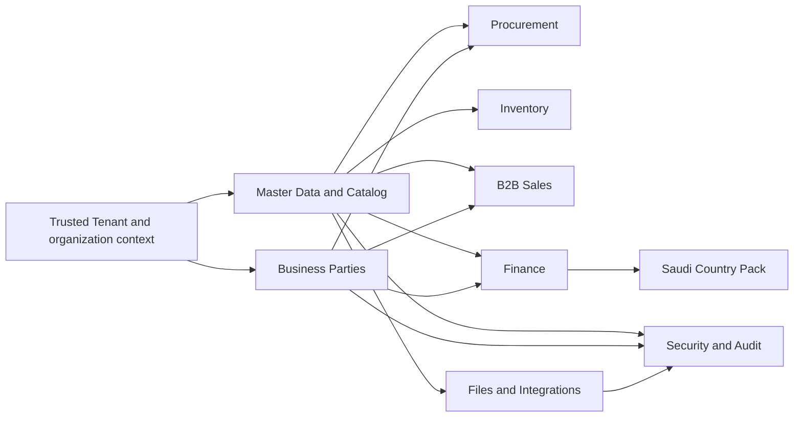

# Master Data and Product Catalog Lean Implementation Specification

> **Authoritative current Product-readiness overlay — 9 August 2026.** MESP-99
> / M95-SL-02 Category and UOM is Done through PR #33, correction PR #34, and
> final audit-semantics correction PR #35, all merged to `main`; the final
> synchronized main baseline is recorded in `.ai/CURRENT_STATE.md`. M95-SL-03
> is the completed bounded Product identity readiness baseline under Jira
> MESP-101, merged through PR #36 at
> `c7392a55e0b60fd83e48447e3f9218f82cfaccea`; closure evidence is comment
> `10672`. Hossam's six Product-only bounds for
> MD-OD-001, MD-OD-003, MD-OD-005, MD-OD-008, MD-OD-010, and MD-OD-011 are
> recorded in `docs/18_Product_Identity_M95_SL_03_Readiness.md` and Jira
> comment `10671`. No Product persistence or Product behavior is implemented
> by this readiness session. The remaining Open Decision Register and
> MESP-48/MESP-49/MESP-50 gates remain preserved.

> **Authoritative MESP-99 completion overlay - 9 August 2026 (PR #33 and post-merge correction PR #34 merged).**
> The bounded M95-SL-02 Category/UOM implementation is complete on branch
> `agent/mesp-99-category-uom` and remains limited to the five approved bounds:
> MD-OD-001, MD-OD-005, MD-OD-008, MD-OD-002, and MD-OD-006. It adds
> module-owned Tenant-filtered Category/UOM persistence, exact production-owned
> scope/authorization, Active/Inactive lifecycle with optimistic concurrency,
> hierarchy and precision rules, conversion calculation, and persistent
> append-before-effect audit evidence. Release build and non-SQL validation are
> green; the existing SQL Server safety gate remains unavailable without
> `MESP_SQLSERVER_CONNECTION_STRING`. No migration, production database,
> Product/Item behavior, or later Master Data slice was added. MESP-99 closure,
> PR #33 merged to `main` at `8364a67bce4d7d782115b7347e4e6607f02f9be4` from
> implementation commits `430996c`, `0cf6906`, and `964766b`. The verified
> post-merge correction commit is `e527f8a0cc32a72cef554e2bd93ab6322e9b1064`;
> focused PR #34 merged to `main` at `35417d35c076d1318474a7e4b31144cc9d94279b`.
> Jira validation evidence is comment `10665`, final closure evidence is comment
> `10666`, and post-merge correction evidence is comment `10667`; MESP-99 is
> Done. Stale MESP-97/MESP-98 administrative duplicates are terminally
> reconciled with comments `10669`/`10668`. MESP-101 has now completed the
> Product identity readiness gate through PR #36. The next exact session is
> M95-SL-03 Product Identity implementation only and must not start automatically.

> The next exact session is M95-SL-03 Product Identity implementation only. It
> must not start automatically; the completed MESP-101 readiness gate and PR #36
> are the required entry evidence.

**Version:** v0.1
**Status:** Completed implementation-readiness baseline; MESP-95 is Done
**Jira:** MESP-95 - Produce Master Data and Product Catalog Lean Implementation Specification
**Parent Epic:** MESP-6 - EPIC 06 - Master Data and Product Catalog
**Branch:** `docs/MESP-95-master-data-lean-implementation-spec`
**Review PR:** #29 - Merged into `main` at `93f4e83992ef46f498cfbfacbb513cfc3d8dda7d`; approved final head `c465d660e49a254f2fffbb95e0d07c5fcf17a193`
**Owner:** Hossam / Product Owner
**Date:** 8 August 2026

> **Historical MESP-100/MESP-99 state overlay - 9 August 2026.** MESP-100 is Done with closure evidence 10663; PR #32 merged at 511f6be9f005e54930f993aead9758d7a66b75a8. MESP-99 was In Progress with activation evidence 10664. This specification remains the readiness baseline, while the historical TASK.md then contained the exact MESP-99 implementation session. No Category/UOM persistence or MESP-99 behavior was added by MESP-100.

> **Historical MESP-100 readiness-correction overlay - 9 August 2026.** MESP-100 was the bounded readiness item for M95-SL-02. MESP-96 was Done, MESP-99 remained To Do until that correction was fully validated, merged, and activated, and no Category/UOM persistence or behavior was implemented here. The five Category/UOM-only bounds were MD-OD-001, MD-OD-005, MD-OD-008, MD-OD-002, and MD-OD-006; the remaining Open Decision Register stays preserved.

> **Current delivery overlay - 8 August 2026.** MESP-95 is **Done** after
> ChatGPT final review passed and PR #29 merged normally. This specification
> remains the implementation-readiness baseline; MESP-96 separately completed
> the bounded, contract-only/non-persistent M95-SL-01 slice. PR #30 merged at
> `87f150d95f583168a86aa56200916343c6404f7f` and Jira completion evidence is
> comment `10655`. The slice created
> no Master Data persistence, endpoint, migration, database access, or
> unresolved Product/Item, availability, approval-catalogue, or lifecycle
> behavior. M95-SL-02 Category and UOM is the next exact session and is not
> started. MD-OD-001 through MD-OD-011 remain unresolved; MESP-48, MESP-49,
> and MESP-50 remain open gates.

This document is the implementation-readiness and technical-design baseline for
the approved MESP-31 business baseline. It is a design and backlog document;
MESP-96 was the separately activated coding item that implemented only the
non-persistent M95-SL-01 contract boundary. This document itself creates no
application code, entities in the repository, EF mapping, migration, database,
endpoint, controller, Angular screen, or automated implementation test. The
remaining data-bearing implementation slices remain unactivated until their
own bounded Definition of Ready and decision gates are satisfied.

> **Historical MESP-100 readiness overlay - 9 August 2026.** MESP-100 was the
> active bounded correction for M95-SL-02. MESP-96 is Done, MESP-99 remains To
> Do until readiness is fully validated and activated, and no Category/UOM
> persistence or production behavior is authorized in this session. The
> Category/UOM-only bounds are MD-OD-001, MD-OD-005, MD-OD-008, MD-OD-002, and
> MD-OD-006. The server-owned operation/capability catalog and detailed
> four-project ADR-002 are readiness corrections; they do not start MESP-99.

## 1. Document control and entry evidence

| Field | Record |
|---|---|
| Business baseline | `docs/16_Master_Data_and_Product_Catalog_BRD.md`, v0.3 Approved Business Baseline |
| Owner approval | Hossam, Jira MESP-31 comment `10649`, 8 August 2026 |
| Approved reviewed BRD content head | `1e2d055354f0ddde833190948d09fa426707484c` |
| PR #28 final head | `8396197b54189cb550f07bd4bb6779fd38ac30cb` |
| PR #28 actual merge commit | `1dc4d2092d6e9a5bf8f6cfc3347e552a5ddbad1b` |
| Merged-main baseline for this work | `1dc4d2092d6e9a5bf8f6cfc3347e552a5ddbad1b` |
| Canonical PRD | `docs/MESP_PRD_v1.2.docx` |
| Protected PRD Git blob | `1f9163b9412cb343a19a98312eb642ad26c1efaa` |
| Jira activation | MESP-95 transitioned to Done after PR #29 merged; MESP-96 separately activated and completed M95-SL-01 |
| Delivery state | MESP-31 Done; MESP-95 Done; MESP-96 Done for M95-SL-01; MESP-99/M95-SL-02 Done through PR #33 and correction PR #34, with correction merge commit `35417d35c076d1318474a7e4b31144cc9d94279b` |

The approval of MESP-31 preserves MD-OD-001 through MD-OD-011. This
specification identifies their implementation impact but does not answer,
rename, close, or reinterpret any of them. A recommendation copied from the
Founder Decision Pack is not treated as a requirement unless the approved BRD
or a later owner decision says so.

## 2. Authority and source priority

The following order governs this specification when sources appear to differ:

1. Explicit Founder or Product Owner decisions recorded in Jira or an approved
   change-control record.
2. The approved MESP-31 BRD, including its rule, validation, acceptance, and
   Open Decision registers.
3. The protected PRD v1.2 at the canonical path.
4. Approved Organization, Multi-Tenancy, Identity and Access, and SaaS
   Platform Administration BRDs.
5. The approved Technology Architecture Baseline and applicable ADRs.
6. The approved Foundation Release 1 Lean Implementation Specification.
7. Jira MESP-95 and the MESP-31 approval evidence.
8. The controlled glossary and Product Delivery Master Plan.

Architecture supplies technical constraints and cannot invent business
behavior. Where a technical design would require an unresolved business
choice, this document isolates that choice behind a policy or contract seam and
marks the affected slice as not Ready.

## 3. Scope and explicit exclusions

### 3.1 In scope

This specification prepares the implementation boundary for all ten MESP-31
domains:

- Product.
- Product Category.
- Unit of Measure.
- Supplier.
- Business Customer.
- Price List.
- Tax.
- Payment Term.
- Currency.
- Exchange Rate.

It also defines tenant ownership and isolation, organization-scope handling,
logical aggregate boundaries, application/API contracts, lifecycle and
effective-dating guards, authorization extension points, historical-value
preservation, localization/search boundaries, downstream contracts, import
boundaries, audit/observability expectations, validation strategy, and a
sequenced implementation backlog proposal.

### 3.2 Explicitly out of scope for MESP-95

- Source entities, EF Core configurations, repositories, application services,
  controllers, endpoints, Angular components, or source tests.
- SQL tables, physical schema, indexes, migrations, seed scripts, or any
  database creation.
- Creating or connecting to the local `MESP` database.
- Selecting a production SQL topology, provider, region, retention policy,
  residency policy, purge behavior, legal-hold behavior, backup policy, or
  restoration target governed by MESP-48/MESP-50.
- Resolving MD-OD-001 through MD-OD-011 by technical preference.
- Detailed Procurement, Inventory, Finance, B2B Sales, Saudi Country Pack, or
  reporting transaction behavior owned by their later BRDs.
- Retail POS, anonymous consumer behavior, or Wafra-specific core behavior.
- Creating implementation Jira children or activating any proposed slice.

## 4. Design principles and safety boundaries

1. The product remains a B2B ERP. Supplier and Business Customer records are
   external business parties, not system Users, and anonymous retail consumers
   are not modeled as Business Customers.
2. Every tenant-owned master record has one trusted Tenant owner. A client
   Tenant identifier can select a requested target but can never establish or
   expand authority.
3. Company/Legal Entity availability is separate from Tenant ownership. The
   specification carries a policy-neutral organizational-scope contract until
   MD-OD-001 is decided.
4. Each business concept has one owning module. Downstream modules consume
   stable identifiers and versioned facts; they do not copy or mutate Master
   Data records in their own tables.
5. Deactivate-not-delete, effective dating, historical snapshots, audit
   evidence, and optimistic concurrency are integrity controls, not UI
   conveniences.
6. An unresolved business decision is represented as an explicit gate or
   policy hook. It is never converted into a default merely to make a slice
   appear Ready.
7. The existing Foundation security model remains authoritative: one server
   derived Tenant context per protected operation, deny-by-default resource
   authorization, downward organization scope, and no Platform Administrator
   or SupportGrant bypass.
8. MESP-48 supported-volume evidence and MESP-50 privacy, retention, legal
   hold, purge, residency, backup, and restoration gates remain open.

## 5. Context map and module ownership

The implementation boundary is a modular-monolith seam. The table distinguishes
the MESP-31 master-record contract from later transactional ownership.

| Business concept | Master-record contract owner | Later transactional owner | Ownership boundary |
|---|---|---|---|
| Product | Master Data and Catalog | Procurement, Inventory, B2B Sales, Finance consume it | Product identity, classification, flags, tax linkage, lifecycle, and stable reference contract are shared master facts. Stock, costing, purchase, sales, and posting behavior stay downstream. |
| Product Category | Master Data and Catalog | Reporting and downstream domains consume classification | Category identity, parent relationship when MD-OD-002 permits it, assignment guard, and lifecycle belong to the master layer. |
| Unit of Measure | Master Data and Catalog | Inventory owns stock valuation and post-stock base-unit rules | UOM identity and conversion contract belong to the master layer. Inventory owns movement and valuation semantics. |
| Supplier | Business Parties master boundary coordinated by Master Data | Procurement and Finance | Supplier remains a distinct external-party role. Shared identity/contact data is not redefined by Procurement; purchasing profile and AP behavior remain downstream. |
| Business Customer | Business Parties master boundary coordinated by Master Data | B2B Sales and Finance | Business Customer remains a distinct B2B role. Sales owns commercial behavior; Finance owns credit-limit mechanics and AR behavior. |
| Price List | Master Data and Catalog | B2B Sales | The master layer owns reusable container, currency, effective dating, lines, and lifecycle. Sales owns precedence, discount authority, and order-time selection. |
| Tax | Master Data and Catalog | Finance and Saudi Country Pack | The master layer owns generic effective-dated configuration. Finance owns posting; MESP-49 owns statutory and e-invoicing detail. |
| Payment Term | Master Data and Catalog | Finance, Procurement, and B2B Sales | The master layer owns reusable identity and lifecycle. Finance owns due-date, aging, and settlement mechanics. |
| Currency | Master Data and Catalog | Finance | The master layer owns reusable currency identity and lifecycle. Finance owns functional/base/reporting assignment, rounding, and GL behavior. |
| Exchange Rate | Master Data and Catalog | Finance | The master layer owns effective-dated rate identity and preservation contract. Finance owns source, approval policy if selected by MESP-34, posting, rounding, and reconciliation. |

The Business Parties boundary is deliberately not a new unified business
Party decision. Supplier and Business Customer remain distinct role records;
a cross-role identity match is only a review/linkage signal as required by
MD-BR-045 and MD-AC-035. No role is allowed to create a login, credential, or
Tenant Membership for the external party.

No downstream module may reach across this map to another module's DbSet,
repository, or physical table. Authoritative commands belong to the owning
module. Notifications, read models, exports, and external delivery use the
approved internal-event/outbox seam after the authoritative transaction.

## 6. Logical model and aggregate boundaries

The following are logical implementation-specification concepts, not source
types or database objects. They are intentionally smaller than a single
cross-domain graph.

### 6.1 Common master-record envelope

Every domain root has the following logical concerns:

| Concern | Required meaning | Gate or owner |
|---|---|---|
| Stable identity | An immutable identifier for cross-module references; business code/name uniqueness is a separate rule. | Technical design; no physical key selected here. |
| Tenant ownership | Exactly one trusted Tenant owner on every Tenant-owned record and every child reference. | Confirmed by MT-BR-002/003 and MD-BR-001. |
| Business availability scope | A policy-neutral scope envelope capable of representing the outcome of MD-OD-001 without interpreting an unset option as Tenant-wide. | MD-OD-001; Organization owns Company/Branch/Warehouse identity. |
| Lifecycle | Active and Inactive are shared states; the creation path and any Draft state remain policy-configurable. | MD-OD-008. |
| Effective window | Required for Price List, Tax, and Exchange Rate values; overlapping entries are rejected within the applicable scope. | MD-BR-007, MD-BR-030, MD-BR-032, MD-BR-041. |
| Localized business name | English is required where the BRD requires it; Arabic is captured where the Tenant requires bilingual usability. | MD-BR-009 and ADR-011 timing. |
| Reference version | A downstream document records the master identifier, version/effective value, and applied business value required for historical reconstruction. | MD-BR-003/004/033/036/039. |
| Concurrency | Mutable changes carry an optimistic version and reject stale writes. | Architecture baseline and implementation design. |
| Audit identity | Create, edit, activate, deactivate, reactivation, effective-dated change, duplicate disposition, and import outcomes are correlated to immutable evidence. | MD-BR-006 and MESP-31 section 36. |

The envelope does not prescribe a table layout, column type, database schema,
or ORM mapping. A later implementation item must make its physical mapping
consistent with ADR-006 and the approved scope decision.

### 6.2 Aggregate and value-object boundaries

| Logical aggregate/root | Child or value concepts | Invariants owned at this boundary |
|---|---|---|
| Product Category | Localized name, code, optional parent reference, lifecycle | Tenant/availability scope, code/name duplicate control, parent-cycle prevention if a hierarchy is approved, deactivation blocks new Product assignment. |
| Unit of Measure | Localized name, code, conversion definition | Tenant scope, code uniqueness, positive non-zero conversion, impact review before deactivation when actively referenced. Precision/rounding remains MD-OD-006. |
| Product | Localized name, code/SKU/Barcode identity, category reference, base-unit reference, tax-classification reference, sellable/purchasable/inventory flags | Active Category and Base Unit references, unique business code, deactivation/reference preservation. Product/Item identity and tracking fields remain MD-OD-011/003/010. |
| Business Party / Supplier role | External identity, localized legal/trading name, contacts, addresses, Supplier role, duplicate candidate evidence | Tenant scope, role-local duplicate control, no login, no cross-role rejection. Procurement owns purchasing profile. |
| Business Party / Business Customer role | External identity, localized legal/trading name, contacts, addresses, Business Customer role | Tenant scope, role-local duplicate control, B2B-only boundary, no anonymous consumer record. Sales owns commercial profile. |
| Price List | Name, one Currency reference, effective window, customer/segment scope, Product price lines | One currency per list, line currency match, no overlapping entries without an approved precedence rule, historical price preservation. |
| Tax configuration | Tax code/name, rate/treatment value, effective window, applicability references | Effective dating, no overlap, no hard-coded transaction tax, historical applied-rate preservation. Statutory treatment is MESP-49. |
| Payment Term | Code/name, interval or schedule contract, lifecycle | Reusable assignment to Supplier or Business Customer, historical meaning preservation. Exact due-date mechanics are MESP-34. |
| Currency | ISO or approved business code, localized name, lifecycle | Unique code, active-reference checks, multi-currency support, no SAR-only implementation. |
| Exchange Rate | Source Currency, target Currency, positive rate, effective date, provenance reference, lifecycle | Different currencies, positive rate, no duplicate/overlapping pair/date, missing-rate block at posting, historical applied-rate preservation. Sourcing/approval is MESP-34/MESP-54. |

The following cross-cutting value concepts are logical contracts only:

- `TenantOwnership` - the trusted Tenant identity, never copied from an
  untrusted request body.
- `BusinessScope` - Tenant plus an explicitly authorized organization anchor
  and a scope-policy version; it cannot silently mean Tenant-wide.
- `LocalizedName` - English/Arabic values with the required-field policy
  supplied by the owning BRD and localization policy.
- `EffectiveWindow` - a business effective date or bounded date range; exact
  date/time and locale handling is finalized with the owning module.
- `ReferenceSnapshot` - stable master identifier, version/effective date, and
  applied value captured by the consuming transaction.
- `LifecycleState` and `ConcurrencyVersion` - shared contract concepts with
  domain-specific guards.

### 6.3 Domain invariants at the implementation boundary

The later code must make the following checks explicit before a command can
commit:

1. The server-derived Tenant context is present and exactly one Tenant owns the
   aggregate and every same-aggregate reference.
2. Organization references are validated against the same Tenant and the
   authorized downward scope; a Company, Branch, or Warehouse reference from
   another Tenant is denied without revealing its existence.
3. A client-provided Tenant, Company, Branch, Warehouse, or master identifier
   never broadens the context.
4. Duplicate checks are executed inside the active Tenant and the relevant
   business role/scope. Tenant A and Tenant B may use the same Product code;
   Tenant A's duplicate search never sees Tenant B's code.
5. An Inactive record is not selected for new use. Historical reads and
   downstream document reconstruction use authorized reference snapshots.
6. A record referenced by a posted transaction cannot be deleted. The
   implementation exposes deactivation as the safe lifecycle action.
7. A new effective-dated value cannot overlap an existing value for the same
   business scope and key unless a later approved business rule explicitly
   changes that guard.
8. A stale version cannot overwrite a newer master record. The caller receives
   a safe concurrency result and must re-read and retry deliberately.
9. Any approval-required operation is blocked until the policy-required,
   distinct approver decision exists; the requester cannot approve its own
   change. The catalogue of which changes require approval remains MD-OD-005.
10. No import row or downstream contract can create a Supplier or Business
    Customer login or credential.
11. No implementation branch, seed, permission, status, report, or rule is
    Wafra-specific or Retail POS-specific.

## 7. Lifecycle, effective dating, and historical preservation

### 7.1 Shared lifecycle

The implementation exposes Active and Inactive as common lifecycle concepts.
Inactive means unavailable for new selection while remaining available for
authorized history and reporting. Deactivation is allowed even when existing
documents reference the record because it does not rewrite those documents.

Whether creation passes through Draft before Active is not decided. The
application boundary therefore carries a lifecycle-policy decision and must
not hard-code the recommended no-Draft option until MD-OD-008 is approved.

Reactivation is also policy guarded. It may not rewrite an already-recorded
effective-dated value; if MD-OD-009 requires a new entry instead, the command
must fail safely and direct the caller to a new effective-dated record. No
reactivation behavior is inferred from the Founder Decision Pack.

### 7.2 Effective-dated values

Price List entries, Tax values, and Exchange Rates are modeled as values with
an effective window and a lifecycle. The implementation must:

- validate the new value and effective date before mutation;
- reject duplicate or overlapping entries for the same key and business
  scope;
- keep the previous value available for historical reconstruction;
- apply a new value only to transactions whose business date falls in its
  approved effective window;
- preserve the exact applied value, record version, and effective date on a
  posted downstream document;
- never silently select a different Exchange Rate or date when a required rate
  is missing.

Finance owns posting, currency conversion, rounding-difference, and
reconciliation behavior. The MESP-54 recommendation for manual Finance-owned
rate approval remains unapproved and is not implemented by this specification.

### 7.3 Reference-preservation contract

Downstream Procurement, Inventory, B2B Sales, and Finance contracts must carry
enough master-data evidence to reproduce the business fact used at the time of
the transaction. A stable master identifier alone is insufficient when a Tax,
Price, Payment Term, Currency, or Exchange Rate can later change. The
downstream owner decides the physical document shape, but the contract must
include the relevant applied value and effective/version evidence before a
slice is Ready.

## 8. Application and API boundaries

This section names candidate boundaries for later implementation; it does not
create routes or contracts in source.

### 8.1 Application boundaries

| Boundary | Responsibility | Required checks |
|---|---|---|
| Master-data command boundary | Create, edit, activate, deactivate, reactivate, and publish effective-dated master facts | Trusted context, Entitlement, plain-language Permission, resource scope, lifecycle, duplicate/effective-date validation, approval hook, optimistic concurrency, idempotency, audit. |
| Master-data query boundary | Read, search, duplicate candidates, effective-date preview, history, and operational lists | Trusted context, resource scope, active/inactive visibility rule, bounded results, no cross-Tenant search, safe not-found/denial behavior. |
| Import and migration boundary | Preview, validate, quarantine, sign off, commit, reconcile, and report row outcomes | Tenant-bound batch, source mapping, duplicate rules, row-level errors, idempotent batch key, rollback/atomic commit strategy, audit. |
| Downstream reference boundary | Expose stable read contracts for Procurement, Inventory, Sales, and Finance | Owner-approved contract version, Tenant and business-scope validation, effective value, lifecycle, and snapshot requirements. |
| Approval-policy boundary | Ask whether the requested change has an approved separate-approval requirement and evaluate the recorded decision | No inferred policy; no self-approval; block publication when an approved policy says approval is required and it is absent. |
| Audit/evidence boundary | Append immutable master-data evidence and denial/exception evidence | Actor, Tenant, scope, action, record, before/after, effective date, reason, decision, result, correlation; no credentials or raw secrets. |

### 8.2 Candidate resource contract boundary

If the API layer is activated later, the resource vocabulary is expected to be
versioned under the approved `/api/v1` boundary and to use the business names
Product, Product Category, Unit of Measure, Supplier, Business Customer, Price
List, Tax, Payment Term, Currency, Exchange Rate, and Import. Exact endpoint
verbs, transport fields, route parameters, and OpenAPI documents belong to the
first approved coding slice.

All mutation commands must support the architecture-approved optimistic
concurrency token and idempotency approach where the operation can be retried
or create an authoritative effect. Errors use safe Problem Details with a
stable business error category, trace identifier, and field-level validation
details where safe. Cross-Tenant denial must not disclose whether a target
record exists.

### 8.3 Command and query catalogue

The following is an implementation-planning catalogue, not an API or source
class list:

| Family | Intents |
|---|---|
| Lifecycle commands | Create, Edit, Activate, Deactivate, Reactivate, and publish an effective-dated value for each applicable domain. |
| Catalog commands | Assign Category/UOM, maintain Product identity and flags, add or revise Price List lines, and validate product references. |
| Party commands | Create/edit/activate/deactivate Supplier and Business Customer role records, maintain contacts, and record cross-role duplicate candidates. |
| Currency/finance-reference commands | Maintain Currency, Payment Term, Tax configuration, and Exchange Rate records within their confirmed master boundaries. |
| Import commands | Create preview batch, validate batch, quarantine row, resolve approved mapping, request sign-off, commit batch, reconcile batch, and report outcomes. |
| Read queries | Get by stable identifier, list active/inactive, search within scope, list effective changes, list duplicate candidates, retrieve history, and retrieve import status. |
| Downstream queries | Read a versioned master reference and its historical value for Procurement, Inventory, Sales, or Finance under an approved contract. |

## 9. Authorization and resource-policy design

### 9.1 Policy inputs

Every Master Data operation composes these inputs on the server:

1. Authenticated active User and valid session.
2. Exactly one active Tenant context established from explicit membership or
   the separately governed SupportGrant path.
3. Tenant Entitlement for the capability where applicable.
4. The plain-language Permission category from the MESP-31 BRD.
5. The requested master record's Tenant ownership and BusinessScope.
6. The actor's downward Company/Branch/Warehouse Access Scope.
7. Record lifecycle and relevant downstream-reference state.
8. Optimistic-concurrency version and idempotency key where required.
9. Approval-policy result for a change that an approved policy marks as
   sensitive.

The Permission catalogue remains distinct from a Role, Entitlement, or job
title. At minimum, the later module must map these MESP-31 capabilities:

| Capability | Resource coverage |
|---|---|
| View, Create, Edit, Activate, Deactivate | All ten domains |
| Approve | Only changes that an approved policy requires to be separately approved; MD-OD-005 is still open |
| Maintain Price Lists | Price List |
| Maintain Taxes | Tax |
| Maintain Exchange Rates | Exchange Rate |
| View audit history | All ten domains |
| Import/migrate | All ten domains |

The repository's plain-language permission convention is retained. A later
implementation may choose internal identifiers, but it must not expose a
dotted technical permission syntax as the business vocabulary.

### 9.2 Resource authorization sequence

For a requested record, the server first establishes context, then loads or
resolves the resource inside that context, then checks Permission, Entitlement,
organization scope, lifecycle, and operation-specific guards. A request that
substitutes another Tenant, Company, Branch, Warehouse, master identifier, or
import batch is denied. Search, duplicate detection, report, export, job, and
audit paths use the same boundary rather than relying on a UI filter.

Platform Administrator status does not grant Tenant business-data access. A
SupportGrant is named, case-bound, purpose-bound, exact-scope, time-bound, and
does not grant export authority. Supplier and Business Customer records have
no user-authentication path.

### 9.3 Approval extension point

MESP-31 confirms the generic control that a requester cannot self-approve when
an approved policy requires a distinct approver. It does not confirm which
changes require that control. The application boundary must therefore accept a
policy result with at least these meanings: policy not applicable, policy
requires approval, approval pending, approved, rejected, and policy not yet
configured. The last state is a readiness signal, not permission to assume a
default. The exact catalogue is MD-OD-005 and later Finance/Sales decisions
remain authoritative for their owned behavior.

## 10. Tenant, organization scope, and reference integrity

### 10.1 Tenant ownership and isolation

The design follows the approved shared-database architecture without choosing
physical persistence here:

- Every tenant-owned logical record and child has a non-null Tenant owner.
- Tenant-aware uniqueness includes Tenant and the approved business scope.
- Parent/child references prove same-Tenant ownership before mutation or read.
- Query filtering, persistence guards, authorization handlers, relational
  constraints, and negative tests are defense in depth; none is optional.
- Background work, imports, exports, files, reports, notifications, search,
  audit, and integration retries carry and revalidate Tenant context.
- Raw SQL, bulk operations, maintenance paths, or filter bypasses are not
  available to ordinary Tenant application paths.
- A same-code Product in Tenant A and Tenant B is valid and is never a
  duplicate across the Tenant boundary.
- Cross-Tenant attempts fail closed without exposing the other Tenant's values
  or existence.

ADR-016 remains the production-timing decision for SQL Server Row-Level
Security adoption or formal deferral. This specification requires the
application and relational controls regardless of the eventual ADR-016 result.

### 10.2 Company / Legal Entity business-scope representation

The approved hierarchy is Platform -> Tenant -> Company / Legal Entity ->
Branch -> Warehouse. MD-OD-001 asks which organizational level controls
business availability of each master-data domain. This specification does not
choose Tenant-wide, Company, or Branch availability.

The logical contract consequently uses a `BusinessScope` envelope with:

- exactly one Tenant owner;
- an optional organization anchor represented only by an Organization-owned
  stable reference;
- an explicit scope-policy/version marker;
- a domain policy that says which anchor kinds are legal after MD-OD-001 is
  approved;
- no implicit inheritance upward and no assumption that an absent anchor means
  Tenant-wide;
- no cross-Tenant organization reference and no Warehouse-level master-data
  behavior unless a later approved decision requires it.

The initial shared boundary may validate and transport this envelope without
persisting domain records. Any slice that persists a master record must have a
resolved MD-OD-001 disposition or an explicitly approved bounded alternative.

### 10.3 Cross-module reference strategy

Downstream modules reference stable master identifiers through versioned
contracts. They may read an authorized current fact and must capture a
ReferenceSnapshot when the business document becomes historically authoritative.
They must not:

- duplicate a Product, Supplier, Customer, Tax, Currency, Payment Term, Price,
  or Exchange Rate as a locally mutable master;
- accept an identifier from another Tenant;
- use a stale Inactive record for new business without an owning-domain rule;
- infer Price List precedence, exchange-rate sourcing, tax statutory treatment,
  credit-limit mechanics, or due-date mechanics from this specification.

## 11. Localization, Arabic search, RTL, and bilingual documents

MESP-31 requires Arabic and English business-facing names where applicable.
The implementation-readiness boundary is:

- Localized names are a deliberate value, not a pair of unrelated UI fields.
- English-required and Arabic-required rules come from the BRD and Tenant
  configuration; the implementation must not require Arabic for a Tenant that
  has no approved bilingual requirement.
- Search accepts the active locale and the permitted fallback behavior. It
  must never search across Tenant boundaries.
- Arabic normalization, collation, tokenization, diacritic behavior, and
  comparison semantics are not invented here. ADR-011 must be completed before
  localized module search, forms, or bilingual document implementation.
- RTL is a user/document presentation concern. The contract supplies locale
  and direction metadata; no Angular layout or document renderer is created in
  MESP-95.
- Audit evidence retains the business values and locale context needed to
  reconstruct a change; it does not store secrets or raw authentication data.

ADR-011 is therefore a mandatory pre-code decision for the affected localized
slices, while this specification records the required boundary and its
dependency without creating or updating the ADR.

## 12. Downstream contracts and multi-currency behavior

| Consumer | Master facts consumed | Contract obligations and exclusions |
|---|---|---|
| Procurement | Product, Category, UOM, Supplier, Currency, Payment Term, Tax, and applicable Price List facts | Validate active/scope-eligible references for new purchasing work; snapshot values at the owning document's authoritative point; Procurement owns quotations, confirmations, and Purchase Order behavior. |
| Inventory | Product, Category, Base/alternate UOM, and the Product tracking configuration only after MD-OD-010 | Preserve Product and UOM identity; Inventory owns stock movement, base-unit immutability after stock, costing, and batch/lot/serial/expiry enforcement. No tracking behavior is invented here. |
| Finance | Currency, Exchange Rate, Tax, Payment Term, and party references | Missing required rate blocks posting; applied rate/tax/term values remain historical; Finance owns posting, rounding, AP/AR, due dates, rate sourcing/approval, and reconciliation. |
| B2B Sales | Product, Customer role, Price List, Currency, Tax, Payment Term | B2B-only; inactive references cannot start new sales work; Sales owns price precedence, discount authority, credit-check, quotation, and Sales Order behavior. No Retail POS behavior. |
| Saudi Country Pack | Tax and party statutory-reference contracts | KSA-002 VAT baseline remains configurable; statutory fields and e-invoicing remain MESP-49 and external-validation/production gates. |
| Reporting/Audit | Current/historical master facts and immutable change evidence | Reports are authorized, Tenant-scoped, bounded, and carry freshness/as-of context; no report becomes a mutation path. |

### 12.1 Multi-currency contract

Currency is a reusable master fact and is not limited to SAR. A Price List has
exactly one Currency and its lines cannot introduce another currency. An
Exchange Rate has distinct active source and target currencies, a positive
rate, and an effective date. A downstream monetary document retains the
transaction amount, its currency, any required base/functional/reporting
amounts, and the exact applied rate/value evidence. Finance owns the physical
posting and rounding design.

The absence of a required rate is a posting blocker, not a reason to apply a
silent default, stale rate, or assumed SAR conversion. The MESP-54
manual/Finance approval recommendation remains unapproved and belongs to
MESP-34.

## 13. Import, migration, and external integration boundary

MESP-95 defines a contract and control sequence, not an ETL implementation:

1. Register a Tenant-bound batch and named source owner.
2. Validate field mapping against the ten-domain business requirements.
3. Preview rows with row-level success, warning, duplicate, and error outcomes.
4. Quarantine ambiguous or incomplete mappings; assign an accountable owner.
5. Produce duplicate and reconciliation evidence without cross-Tenant lookup.
6. Obtain the required business sign-off before authoritative commit.
7. Commit as one controlled, idempotent batch or roll back according to the
   owning persistence design.
8. Reconcile the committed result and retain batch evidence.

The technical implementation must support a stable batch identifier, safe
retry, row-level result, error export where authorized, and no partial
authoritative effect outside the approved commit boundary. MESP-40 owns the
later migration implementation and opening-balance sequencing. No staging
schema, import script, external provider, or migration is created by this PR.

## 14. Failure, concurrency, idempotency, and observability

### 14.1 Failure outcomes

| Failure | Required result |
|---|---|
| Missing or malformed required field | Reject without authoritative mutation; return safe field errors. |
| Same-Tenant duplicate candidate | Hold or reject for reviewed resolution; never silently create a second identity. |
| Cross-role Supplier/Customer identity match | Surface for review/linkage; never auto-reject the second role. |
| Cross-Tenant record, scope, or import reference | Deny without revealing the target value or existence; record a security/audit outcome where appropriate. |
| Inactive reference for new use | Reject or hold according to the owning downstream document rule; historical reads remain governed. |
| Effective-date overlap | Reject the new value; do not alter the existing value. |
| Missing Exchange Rate at posting | Block Finance posting; do not substitute a different date or rate. |
| Required approval absent or self-approval attempted | Block publication when an approved policy requires it; retain the denial evidence. |
| Stale concurrency version | Reject the stale mutation; require re-read and deliberate retry. |
| Import mapping ambiguity | Quarantine the row/batch until accountable resolution and sign-off. |
| Downstream contract failure | Do not silently lose the authoritative fact; use the approved durable event/job and reconciliation path. |

### 14.2 Concurrency and idempotency

Mutable aggregate changes use optimistic concurrency. A stale update cannot
overwrite a newer update, and effective-dated publication rechecks overlap
inside its commit boundary. Create, lifecycle, publish, and import commands
that can be retried accept a scoped idempotency key and return the original
authoritative outcome for a valid replay. Idempotency does not bypass current
authorization, lifecycle, Tenant, or approval checks.

Background import, export, notification, and downstream propagation preserve
the initiating Tenant and organization scope, carry scoped idempotency and
single-effect expectations, retain audit and reconciliation evidence for
success, failure, and uncertain outcomes, and revalidate current authority
immediately before asynchronous execution. They use the existing
durable-work/outbox contract or Foundation durable-work/outbox seam, as
applicable to the later slice, for non-authoritative propagation after the
authoritative transaction. This readiness document does not claim SQL-backed
or crash-durable production persistence: production SQL/durable provider
selection, worker deployment/topology, crash recovery, retention, purge,
supported-volume, backup, and restoration remain later provider/production
gates under ADR-007, ADR-008, MESP-48, and MESP-50.

### 14.3 Audit and operational evidence

For every material master-data operation, evidence must reconstruct:

- actor and authentication/authorization path;
- Tenant and applicable Company/Branch scope;
- action, domain, stable record identifier, and result;
- before/after business value where applicable;
- effective date or window where applicable;
- approval decision and approver when a policy requires it;
- reason, correlation identifier, and authoritative timestamp;
- import batch and row identity for migration work.

Security/Audit owns immutable evidence. Technical logs, metrics, and traces
are correlated but do not replace business audit. Planned operational measures
include Tenant-denial counts, duplicate holds, effective-date conflicts,
concurrency conflicts, approval-pending outcomes, import quarantine/commit
counts, downstream contract failures, and audit-write failures. No metric or
log may contain credentials, connection strings, or the supplied local SQL
password.

## 15. Local SQL Server development boundary

The Owner selected local SQL Server on instance `.` with database name `MESP`
for the later development phase. This is a local environment decision only;
it is not a production topology selection. MESP-95 does not connect to SQL
Server, create the database, create a migration, or record a password.

When a later coding item is authorized, local secrets must use .NET User
Secrets, environment variables, an ignored local settings mechanism, or
another repository-approved non-versioned store. Credentials must never enter
Git, Markdown, Jira, PR text, tests, logs, screenshots, or committed
configuration.

## 16. Open Decision impact matrix

All entries below remain the exact MESP-31 business decisions. The
classification describes implementation impact; it is not a resolution.

| Decision | Implementation classification | Impact on safe design | Must be decided before |
|---|---|---|---|
| MD-OD-001 - business availability scope inside a Tenant | Specific slice; blocks data-bearing persistence scope finalization, not a non-persistent contract-only foundation slice | Keep `BusinessScope` policy-neutral. Do not interpret an absent anchor as Tenant-wide, and do not choose Company/Branch inheritance. | Any slice that persists or authorizes a master record for business use; the first domain persistence slice. |
| MD-OD-002 - Category hierarchy depth | Specific slice; does not block the initial foundation | Keep parent relationship behind a policy. A flat Category slice may be bounded only if the owner accepts that as the slice contract; no hierarchy depth is assumed here. | Category hierarchy and rollup implementation; before downstream rules depend on it. |
| MD-OD-003 - SKU/Barcode coding structure | Specific slice; does not block the initial foundation | Treat business code, SKU, and Barcode formats as opaque validated values; no generator or format is chosen. | Product identity and import mapping. |
| MD-OD-004 - Price List precedence | Deferred to downstream B2B Sales / specific Price List integration slice | Master data rejects ambiguous overlap; it does not invent Sales selection precedence. | B2B Sales pricing selection and any order-time Price List implementation. |
| MD-OD-005 - separate-approver catalogue | Specific slice; blocks final approval-workflow authorization design, not policy plumbing | Implement the generic approval extension point and no-self-approval guard only; do not select Tax, Price List, rate, or other sensitive changes as approval-required. | Any slice that publishes a change covered by an approved separate-approval policy; final authorization design. |
| MD-OD-006 - UOM precision/rounding | Specific slice / downstream Inventory dependency | Keep conversion factor validation and precision policy separate. Do not choose a rounding algorithm or scale. | Conversion execution and quantity-sensitive Inventory behavior. |
| MD-OD-007 - Saudi statutory fields beyond VAT registration | External-validation/production-only gate; does not block bounded design or initial foundation | Keep an extensible statutory-reference contract and mark additional fields unresolved. MESP-49 and qualified Saudi legal/tax validation govern launch. | Saudi Country Pack and production readiness, not this documentation draft. |
| MD-OD-008 - Draft-before-Active | Specific lifecycle slice; does not block the non-persistent foundation | Carry lifecycle policy as a gate and do not adopt the recommended no-Draft option. | Final create/activation behavior for any domain. |
| MD-OD-009 - reactivation of effective-dated records | Specific lifecycle slice | Guard reactivation behind an effective-history policy; require a new value when reactivation would rewrite history. | Final Tax, Price List, and Exchange Rate lifecycle commands. |
| MD-OD-010 - batch/lot/serial/expiry tracking | Specific Product/Inventory slice; does not block initial foundation | Do not add a tracking flag or enforcement behavior until MESP-31/MESP-33 resolve the decision. | Product configuration and Inventory tracking implementation. |
| MD-OD-011 - Product versus Item identity | Specific Product slice; blocks final Product identity model | Keep Product/Item identity boundary explicit and do not create a variant/product-family model or assume the recommended one-concept option. | Product identity, downstream references, and Product migration mapping. |

No MD-OD entry is classified as silently resolved. MD-OD-001, MD-OD-005, and
MD-OD-008 are the baseline gates for the first data-bearing Master Data slice.
MD-OD-003, MD-OD-010, and MD-OD-011 apply to the Product slice; MD-OD-006
becomes mandatory for Category/UOM conversion execution; MD-OD-004 and
MESP-54 remain downstream ownership boundaries.

### 16.1 Decision-gate hierarchy by implementation slice

`M95-SL-01` is the only proposed first coding item that can proceed without a
data-bearing Master Data decision package. If later activated, it is limited
to the shared module boundary, trusted Tenant contract, policy-neutral
`BusinessScope` transport, authorization/audit contracts, and stable reference
vocabulary. It must not create a record, choose Product/Item identity, adopt a
Draft/Active default, choose a business-availability scope, or define an
approval catalogue. ADR-002 must be completed before module structure is
implemented, and ADR-011 must be completed before any affected localized
search, form, or document behavior is implemented.

For the first data-bearing domain slice — a bounded domain slice, not a
requirement to implement the whole catalogue — the following gates apply to
the affected domains only:

1. **MD-OD-001** must be resolved or explicitly owner-bounded for the affected
   business-availability and Company/Branch scope.
2. **MD-OD-008** must be resolved or explicitly bounded for the affected
   create/lifecycle behavior.
3. **MD-OD-005** must have an explicit owner-approved disposition and boundary
   for the changes that the slice can publish. This does not require deciding
   the entire separate-approval catalogue globally; changes outside the
   bounded first-slice policy remain not Ready.

The affected-slice gates then narrow as follows:

- **Category/UOM:** additionally resolve or explicitly bound MD-OD-002
  (Category hierarchy) and MD-OD-006 (UOM precision/rounding) before the
  affected hierarchy or conversion behavior.
- **Product:** resolve MD-OD-003, MD-OD-010, and MD-OD-011 before dependent
  Product identity, SKU/Barcode, or tracking implementation. No Product/Item
  boundary or tracking behavior is selected here.
- **Effective-dated reactivation:** MD-OD-009 must be resolved or explicitly
  bounded before final reactivation behavior can be implemented for an
  effective-dated record.
- **Price List selection:** MD-OD-004 remains a downstream B2B Sales selection
  gate; Master Data must not invent Price List precedence.
- **Saudi statutory fields:** MD-OD-007 remains an external-validation and
  production gate under MESP-49; it is not silently resolved by this design.

No MD-OD entry is resolved by this hierarchy. A later slice must carry the
owner decision or bounded disposition that applies to its own behavior and
must leave every out-of-boundary decision explicitly gated.

## 17. ADR review and technical decision register

### 17.1 Applicable ADR review

| ADR | MESP-95 result | Timing consequence |
|---|---|---|
| ADR-002 - backend project structure and module enforcement | Published and approved at `docs/ADR-002_Backend_Project_Structure_and_Module_Enforcement.md` | Product implementation must honor the actual four-project direction and module-owned persistence/architecture tests. |
| ADR-005 - policy and resource authorization | Existing approved baseline remains applicable | MESP-95 supplies the Master Data resource-policy inputs and open approval hook; no conflicting policy or new ADR is created. |
| ADR-006 - module schemas, EF Core contexts, migrations, transactions | Existing Foundation implementation baseline remains applicable | Physical schema, migrations, context mapping, and cross-module transaction details are deferred to the relevant Ready slice. No migration is created here. |
| ADR-011 - runtime localization, Arabic search, RTL, bilingual documents | Evaluated as a mandatory pre-code dependency | The required locale/search boundary is recorded here; ADR-011 must be completed before affected localized forms/search/documents are implemented. No collation decision is invented. |
| ADR-016 - SQL Server Row-Level Security adoption or formal deferral | Evaluated as a production-timing boundary only | No local or domain decision is made. Application isolation and relational safeguards remain required; production adoption/deferral remains under MESP-48/MESP-50 and the ADR-016 gate. |
| ADR-003, ADR-004, ADR-006, ADR-007, ADR-008, ADR-018 | Existing approved/foundation seams consumed as constraints | Reuse trusted Tenant context, policy, transaction, durable work, audit, and SQL-validation boundaries; do not extend them with source in MESP-95. |

**ADRs created or updated by MESP-95: none.** The mandated timing of ADR-002
and ADR-011 is recorded as a Definition-of-Ready dependency rather than
prematurely authored as an implementation decision. No unnecessary ADR is
invented and no production ADR is closed by this specification.

### 17.2 MESP-95 technical decision register

These are implementation-planning positions and gates, not new business
requirements. Each identifier is defined once here and remains subject to the
applicable ADR and owner review.

| ID | Technical position |
|---|---|
| M95-TD-001 | Use the approved Modular Monolith with explicit Master Data/Catalog and Business Parties seams; do not create a module-per-table or microservice boundary. |
| M95-TD-002 | Treat Tenant ownership as mandatory and server-derived for every tenant-owned master record and child reference. |
| M95-TD-003 | Represent Company/Legal Entity business availability through a policy-neutral BusinessScope contract until MD-OD-001 is decided. |
| M95-TD-004 | Use stable identifiers and versioned read contracts across module boundaries; prohibit direct cross-module table mutation. |
| M95-TD-005 | Require downstream authoritative documents to retain ReferenceSnapshot evidence for mutable/effective-dated master facts. |
| M95-TD-006 | Use optimistic concurrency for mutable master records and effective-dated publication; stale writes fail safely. |
| M95-TD-007 | Provide an approval-policy extension point with no inferred catalogue and a generic no-self-approval guard. |
| M95-TD-008 | Carry locale and localized values as an explicit contract while deferring Arabic collation/search semantics to ADR-011. |
| M95-TD-009 | Enforce no-overlap effective windows within the approved business key/scope; do not invent precedence for ambiguous Price Lists. |
| M95-TD-010 | Treat import/migration as a Tenant-bound, previewed, quarantined, signed-off, idempotent batch boundary; no ETL implementation is part of MESP-95. |
| M95-TD-011 | Keep local SQL Server choice and all credentials outside this specification's implementation and versioned evidence. |
| M95-TD-012 | Keep MESP-48/MESP-50 and ADR-016 production/capacity/retention/RLS decisions open; no production topology is selected here. |
| M95-TD-013 | Use bounded API collections, safe Problem Details, correlation, idempotency, and optimistic version tokens at the later transport boundary. |
| M95-TD-014 | Keep Supplier and Business Customer as distinct external-party roles with role-local duplicate control; no unified Party behavior is added. |
| M95-TD-015 | Use the existing durable internal-event/outbox boundary for non-authoritative propagation and revalidate Tenant authority before asynchronous execution. |

## 18. Proposed implementation backlog and readiness gates

The following is a recommended, sequential backlog proposal only. No Jira
children are created or activated by MESP-95. The generic Definition of Ready
(DoR) and Definition of Done (DoD) apply to every slice.

### 18.1 Generic Definition of Ready

A proposed slice is Ready only when:

- the exact MESP-31 rules and acceptance scenarios are linked;
- its module owner and cross-module contracts are approved;
- Tenant ownership and the applicable BusinessScope disposition are explicit;
- for `M95-SL-01`, the non-persistent contract-only boundary is explicit and
  no MD-OD is treated as resolved; for a data-bearing slice, MD-OD-001,
  MD-OD-008, and the affected MD-OD-005 boundary are resolved or bounded in
  an owner-approved way, together with every other decision affecting that
  slice;
- the required ADR timing is satisfied;
- authorization, audit, lifecycle, concurrency, idempotency, failure, and
  migration effects are described;
- the targeted validation and demonstration outcome are agreed;
- the slice does not depend on an unapproved MESP-48/MESP-50 or legal/tax
  production assumption;
- no source-code item is started without a separate activated Jira item.

### 18.2 Generic Definition of Done

A later implementation slice is Done only when its implementation is scoped
to the approved slice, its positive and negative Tenant/resource tests pass,
its audit/effective/lifecycle/concurrency behavior is demonstrated, its
downstream contracts are verified, its documentation and traceability are
updated, and the complete task diff is reviewed. A slice cannot claim Done by
silently closing an Open Decision or by relying on a UI-only authorization
check.

### 18.3 Sequential slice proposal

| Slice | Objective and dependencies | Exact MESP-31 trace | Open-decision / ADR gates | Slice-specific DoR | DoD, targeted validation, and demonstration |
|---|---|---|---|---|---|
| M95-SL-01 Shared boundary and Tenant/scope contracts | Establish the Master Data/Catalog and Business Parties seams, trusted Tenant context, policy-neutral BusinessScope, authorization/audit contracts, and stable reference vocabulary. Depends on the approved Foundation baseline. | MD-BR-001/006/008/044/046; MD-VR-010/011; MD-AC-028/029/032. | No MD-OD is resolved for this contract-only slice; it must not encode MD-OD-001 availability, MD-OD-005 approval catalogue, MD-OD-008 lifecycle defaults, or MD-OD-011 Product identity. ADR-002 before module structure; ADR-011 before affected localized search/forms/documents. | Contract-only scope; no persisted master record, no lifecycle default, no Product identity choice, no business-availability scope, and no approval catalogue. | Tenant-positive/negative authorization, same-code different-Tenant proof, cross-Tenant denial, audit contract inspection, architecture dependency proof. Demonstrate a policy-neutral request context without a database record. |
| M95-SL-02 Category and UOM | Implement Category/UOM identity and safe conversion boundary after SL-01. | MD-BR-016-021; MD-VR-003/004/010/012; MD-AC-005-007/026-027. | First-data-bearing gates MD-OD-001/005/008 resolved or owner-bounded for the affected Category/UOM scope; additionally MD-OD-002/006 resolved or explicitly bounded; ADR-002/006; ADR-011 before affected localized search/forms/documents. | Owner selects/bounds hierarchy, precision, lifecycle creation, and business scope; conversion policy is explicit. | Category deactivation and UOM positive-factor/concurrency/isolation validation; demonstrate Product-reference impact without Product persistence. |
| M95-SL-03 Product identity | Prepare/implement the bounded Product master identity, Category/Base UOM references, Product-side tracking configuration, identifiers, and lifecycle; Tax behavior and downstream operations remain outside this slice. | MD-BR-001-015, MD-BR-044/046; MD-VR-001-003/010-012; MD-AC-001-004/026-028/030/032. | Product-only dispositions for MD-OD-001/003/005/008/010/011 are recorded in MESP-101 and `docs/18_Product_Identity_M95_SL_03_Readiness.md`; ADR-002/005/006/011 remain applicable. | Product/Item one-concept model, hybrid SKU/barcode boundary, Product tracking configuration ownership, lifecycle, Tenant-wide scope, Product-owned policies, audit/concurrency, and downstream reference contract are explicit. | Product duplicate, barcode multiplicity/uniqueness, active-reference, deactivation/reactivation, stale-write, audit, localization-requiredness, and Tenant-isolation validation; demonstrate historical reference preservation without Inventory behavior. |
| M95-SL-04 Supplier | Implement external Supplier role master boundary and duplicate/contact lifecycle. Depends on SL-01 and Business Parties seam. | MD-BR-022-024/045; MD-VR-001/002/010/014; MD-AC-008-010/026/028-029/035. | First-data-bearing gates MD-OD-001/005/008 resolved or owner-bounded for the affected Supplier scope; MD-OD-007 remains an external-validation/production gate for Saudi fields; ADR-002/005/006/011. | Supplier role-local duplicate and statutory-field policy are explicit; no user path; procurement reference contract is approved. | Same-role duplicate, cross-role non-blocking match, no-login proof, deactivation/history, scope denial, and audit checks. Demonstrate a Supplier record cannot create a credential. |
| M95-SL-05 Business Customer | Implement distinct B2B Business Customer role master boundary. Depends on SL-01 and Business Parties seam. | MD-BR-025-028/045; MD-VR-001/002/010/014; MD-AC-011-012/026/028-032/035. | First-data-bearing gates MD-OD-001/005/008 resolved or owner-bounded for the affected Business Customer scope; MD-OD-007 remains an external-validation/production gate for Saudi fields; ADR-002/005/006/011. | B2B scope, statutory fields, role-local duplicate, customer/sales reference contract, and no anonymous consumer behavior are approved. | Retail-consumer rejection, cross-role match, deactivation/history, Tenant isolation, bilingual validation, and audit checks. Demonstrate Sales receives a stable B2B reference only. |
| M95-SL-06 Currency | Establish reusable Currency identity and lifecycle before monetary dependent slices. Depends on SL-01. | MD-BR-037-038; MD-VR-001/002/010; MD-AC-020-021/026/028-029. | First-data-bearing gates MD-OD-001/005/008 resolved or owner-bounded for the affected Currency scope; ADR-002/006/011 for localized names. | Currency scope and active-reference rule are approved; Finance contract for functional/transaction/reporting roles is signed. | Same-code cross-Tenant, active-reference deactivation, bilingual names, concurrency, and audit checks. Demonstrate a second currency can be referenced without SAR-only logic. |
| M95-SL-07 Payment Term | Establish reusable Payment Term identity/lifecycle and party assignment contracts. Depends on SL-04, SL-05, and SL-06. | MD-BR-035-036; MD-VR-010/012; MD-AC-019/026/032. | First-data-bearing gates MD-OD-001/005/008 resolved or owner-bounded for the affected Payment Term scope; Finance due-date detail remains MESP-34; ADR-002/005/006. | Term shape is supplied by MESP-34 or explicitly bounded; historical-value contract is approved. | Assignment isolation, deactivation/history preservation, concurrency, audit, and downstream contract checks. Demonstrate the term's meaning is preserved without implementing AP/AR. |
| M95-SL-08 Tax | Establish generic effective-dated Tax configuration and policy hook. Depends on SL-01 and SL-06. | MD-BR-032-034/046; MD-VR-001/006/010-012; MD-AC-016-018/026-027/032. | First-data-bearing gates MD-OD-001/005/008 resolved or owner-bounded for the affected Tax scope; MD-OD-009 applies to final effective-dated reactivation; MD-OD-007 remains an external-validation/production gate; MESP-49; ADR-002/005/006/011. | Approval catalogue and statutory boundary are explicit; tax treatment and historical snapshot contract are approved. | Effective-date overlap, no-hard-code, self-approval only where policy says required, deactivation/history, Tenant denial, and audit checks. Demonstrate future rate does not rewrite a posted-value contract. |
| M95-SL-09 Exchange Rate | Establish effective-dated Currency-pair rate boundary. Depends on SL-06 and the Finance reference contract. | MD-BR-039-042/046; MD-VR-001/006-009/010-012; MD-AC-022-025/026-027/032. | First-data-bearing gates MD-OD-001/005/008 resolved or owner-bounded for the affected Exchange Rate scope; MD-OD-009 applies to final effective-dated reactivation; MESP-54/MESP-34 ownership; ADR-002/005/006. | Source/provenance and approval ownership are explicit without adopting MESP-54; Finance posting contract is approved. | Positive-rate/different-currency, duplicate/overlap, missing-rate block, historical applied-rate, concurrency, and audit checks. Demonstrate a new rate cannot mutate an older application. |
| M95-SL-10 Price List | Establish reusable Price List/container and effective-dated line boundary. Depends on SL-03, SL-05, and SL-06. | MD-BR-029-031/046; MD-VR-001/005/006/010-012; MD-AC-013-015/026-027/031-032. | First-data-bearing gates MD-OD-001/005/008 resolved or owner-bounded for the affected Price List scope; MD-OD-009 applies to final effective-dated reactivation; MD-OD-004 remains a downstream B2B Sales selection gate; ADR-002/005/006/011. | Price-list scope, overlap behavior, customer/segment meaning, approval catalogue, and Sales selection contract are approved. | Currency mismatch, overlap hold, deactivation/history, Tenant/scope, concurrency, bilingual search, and audit checks. Demonstrate ambiguity is rejected rather than resolved by an invented precedence rule. |
| M95-SL-11 Import and migration boundary | Add a common, Tenant-bound preview/quarantine/sign-off/commit contract after all affected domain contracts exist. | MD-BR-005/006/043; MD-VR-001/010/013/014; MD-AC-002/009/033-035. | All affected MD-OD gates, including MD-OD-001/005/008 where this is the first data-bearing slice; MESP-40 ownership; ADR-006/007/008/018. | Source ownership, mapping, duplicate, rollback, batch idempotency, row outcome, and reconciliation sign-off are approved. | Repeated batch, ambiguous mapping quarantine, cross-Tenant denial, row-level errors, rollback/reconcile, and audit evidence. Demonstrate a dry run with no authoritative commit. |
| M95-SL-12 Audit, reporting, and downstream integration | Connect immutable master evidence, authorized read models, effective-change reporting, and versioned consumer contracts. Depends on SL-01 through affected domain slices. | MD-BR-006/007/009/043-046; MD-VR-010/011/013; MD-AC-028-034. | All affected MD-OD gates, including MD-OD-001/005/008 for any newly data-bearing boundary; ADR-005/007/008/010/011/016; MESP-48/MESP-50 remain open. | Report ownership, freshness/as-of semantics, audit fields, consumer contract versions, and production gates are approved. | Tenant-scoped report/search, audit reconstruction, effective-change listing, downstream snapshot, event replay, and retention-boundary checks. Demonstrate history/report output without granting mutation or cross-Tenant visibility. |

The sequence is intentionally conservative: it allows safe contract design
first, keeps Product identity and approval-sensitive behavior behind decisions,
and prevents a broad all-domain coding task from hiding unresolved risk.

## 19. Targeted validation strategy

No test project or test file is created by MESP-95. The following validation
strategy is the acceptance plan for the later slices.

### 19.1 Isolation and authorization

- two Tenants may use the same Product/Customer/Supplier code without a
  duplicate result across the boundary;
- Tenant A cannot read, write, search, import, export, report, queue, audit,
  or reference Tenant B master data;
- a client-supplied Tenant or organization identifier cannot expand authority;
- Company/Branch/Warehouse scope inherits only downward and is checked against
  the same Tenant;
- Platform Administrator and SupportGrant paths cannot bypass Tenant resource
  policy or grant support export authority;
- Permission, Entitlement, lifecycle, and approval policy are all required
  inputs for a protected write.

### 19.2 Integrity and lifecycle

- duplicate code/name/tax registration behavior is checked within the Tenant
  and role;
- cross-role Supplier/Customer matches are surfaced but never auto-rejected;
- deactivation blocks new selection and preserves posted references;
- deletion of a referenced record is denied;
- effective-date overlap and reactivation guards preserve history;
- Category/UOM/Product reference integrity and positive conversion behavior
  are checked;
- stale version updates fail and cannot overwrite a newer value.

### 19.3 Localization and monetary behavior

- English/Arabic required-field rules follow the approved Tenant policy;
- Arabic search/collation/fallback tests are written only after ADR-011;
- RTL direction and bilingual document acceptance are tested at the owning UI/
  document slice, not in this documentation task;
- Price List currency mismatch is rejected;
- missing rate blocks posting and no silent default is used;
- posted tax/rate/price/term evidence remains unchanged after master-data
  changes;
- decimal precision/rounding tests are owned by the relevant Finance/Inventory
  slice and not guessed by MESP-95.

### 19.4 Import, concurrency, audit, and asynchronous work

- preview, row-level validation, quarantine, sign-off, atomic commit/rollback,
  replay/idempotency, and reconciliation are verified;
- audit evidence contains actor, Tenant, scope, before/after, date, reason,
  approval, result, and correlation as applicable;
- durable work revalidates initiating Tenant and scope before execution;
- failure/retry/dead-letter paths do not drop authoritative facts or audit
  evidence;
- local SQL Server integration probes use disposable, non-production fixtures
  only after a later coding item is authorized and preserve MESP-48/MESP-50
  gates.

## 20. Traceability matrix

| Approved source / register | MESP-95 coverage |
|---|---|
| PRD PLT-003 | Sections 4, 5, 8, 9, 10, 13, 19: validated create/review/activate/deactivate/import/export/search contract. |
| PRD PLT-002 and Organization hierarchy | Sections 5, 6, 10, 12: Tenant and Company/Legal Entity/Branch/Warehouse boundary without resolving MD-OD-001. |
| PRD SAL-001, PROC-002, PROC-008 | Sections 5, 6, 8, 12, 18: customer/supplier/product/pricing references and external-party boundary. |
| PRD FIN-001, FIN-003, FIN-007, FIN-010, KSA-002 | Sections 7, 12, 16, 18, 19: currency, rate, tax, effective dating, historical values, and statutory gates. |
| PRD BR-013 and ADM-003 | Sections 8, 13, 18, 19: preview, duplicate control, row-level errors, quarantine, sign-off, rollback, reconciliation. |
| MD-BR-001-009 | Sections 4, 6, 7, 9, 10, 11, 14, 19. |
| MD-BR-010-021 | Product, Category, and UOM aggregate boundaries in sections 6, 7, 18, 19. |
| MD-BR-022-028 and MD-BR-045 | Business Parties/Supplier/Customer boundaries in sections 5, 6, 9, 12, 18, 19. |
| MD-BR-029-042 | Price List, Tax, Payment Term, Currency, and Exchange Rate in sections 6, 7, 12, 14, 18, 19. |
| MD-BR-043-046 | Import, permission, approval, audit, and downstream contract boundaries in sections 8, 9, 13, 14, 18, 19. |
| MD-VR-001-014 | Validation and failure behavior in sections 6, 8, 10, 13, 14, 18, 19. |
| MD-AC-001-035 | Slice-specific acceptance links in section 18 and validation strategy in section 19. No acceptance scenario is implemented by this PR. |
| MD-OD-001-011 | Dedicated impact matrix and decision package in section 16; no entry is resolved. |
| Foundation specification and ADRs | Sections 4, 5, 8, 9, 10, 11, 13, 14, 17, 18, 19. |

## 21. Historical Definition of Ready for MESP-95 review

This document is Ready for ChatGPT/Product Owner review when:

- all ten MESP-31 domains have an ownership and aggregate boundary;
- Tenant ownership, cross-Tenant denial, and policy-neutral organizational
  scope are explicit;
- lifecycle, effective dating, historical values, concurrency, authorization,
  audit, localization, currency, downstream, import, and failure boundaries
  are described;
- MD-OD-001 through MD-OD-011 are individually classified and none is silently
  answered;
- the pre-first-code decision package is concise and traceable;
- ADR-002, ADR-005, ADR-006, ADR-011, and ADR-016 timing is evaluated;
- proposed slices carry dependencies, rules, acceptance scenarios, decision
  gates, DoR, DoD, validation, and demonstration outcomes;
- planned validation confirms no code, migration, database, credentials,
  Retail POS, Wafra-specific behavior, or production assumption leaked into
  the repository;
- the document remains explicitly Draft and is not marked Approved by the
  delivery agent.

## 22. Superseding review status and delivery boundary

MESP-95 is **Done** in Jira. ChatGPT final review passed at approved head
`c465d660e49a254f2fffbb95e0d07c5fcf17a193`, and PR #29 merged at actual commit
`93f4e83992ef46f498cfbfacbb513cfc3d8dda7d`. The specification remains a
documentation/readiness baseline; no source implementation begins from this
document. MESP-96 is the next separately activated implementation item and is
limited to contract-only/non-persistent M95-SL-01.

The local SQL Server choice is recorded without a password. MESP-48,
MESP-49, MESP-50, ADR-011, ADR-016, Saudi legal/tax validation, and every
affected MD-OD gate remain visible. The repository continues to contain no
Master Data source implementation, migration, database, or credential.

## 23. MESP-96 post-merge correction overlay - 8 August 2026

MESP-96/M95-SL-01 is complete and remains contract-only/non-persistent. The
post-merge correction was committed as
`85d3c48f20a97f8057e5960c305a3bcc0cb8d672` on
`fix/mesp-96-optional-scope-hint`, published as PR #31, and merged at
`4eeefe0d1a9af209cc3e31608812ec35ef283fd9`. It repairs
`MasterDataTenantContextResolver.Resolve` so that no selection, an empty
selection, and a same-Tenant tenant-only hint preserve trusted server-derived
Tenant/scope authority; exact trusted scope remains compatible, while foreign
Tenant and sibling/foreign scope remain denied. Client selection remains an
optional hint and cannot create broader or replacement authority.

The correction added no persistence, migration, database, endpoint,
Product/Item, SKU/Barcode, tracking, availability, approval-catalogue,
Draft/Active lifecycle, Retail POS, or Wafra-specific behavior. MESP-96 remains
**Done** in Jira; correction evidence is comment `10657`. Merged-main
validation passed with 0 Release build warnings/errors and 34/34 focused
boundary tests, and the original PR #30 review thread was replied to and
resolved.

M95-SL-02 Category and UOM is the next exact root `TASK.md` session and has
not started. Before any data-bearing implementation, the session must inspect
and apply the approved handling for MD-OD-001 business availability scope,
MD-OD-008 Draft-before-Active lifecycle, MD-OD-005 approval catalogue/slice
boundary, MD-OD-002 Category hierarchy depth, and MD-OD-006 UOM
precision/rounding. No open decision may be silently invented. MESP-48,
MESP-49, and MESP-50 remain open gates.

## 24. MESP-100 Category/UOM readiness-correction overlay — 9 August 2026

MESP-100 is the bounded readiness correction between completed MESP-96 /
M95-SL-01 and MESP-99 / M95-SL-02. It does not create Category/UOM entities,
tables, mappings, migrations, database access, repositories, services, or
endpoints.

The following five Owner dispositions are now explicit for MESP-99 only:

| Decision | MESP-99 bound |
|---|---|
| MD-OD-001 | Category/UOM business availability is Tenant-wide inside the owning Tenant; all Companies and Branches in that Tenant may reuse the records; no cross-Tenant sharing or client authority substitution. |
| MD-OD-005 | Routine Category/UOM Create, Edit, Activate, Deactivate, and Reactivate require no separate approver; permission, exact server-derived authority, scope/resource authorization, and audit remain mandatory. |
| MD-OD-008 | No Draft lifecycle; a valid authorized record is created Active and may later be Deactivated or Reactivated. |
| MD-OD-002 | Optional same-Tenant Category parent, maximum three levels, no cycles, with an evolvable/configuration-led depth policy. |
| MD-OD-006 | Quantity precision 6, conversion-factor precision 8, positive/non-zero factors, calculated values rounded to 6 with `MidpointRounding.AwayFromZero`, and over-precision user input rejected. |

These are affected-slice bounds, not global resolutions of the MD-OD register.
MESP-99 must not generalize them to Product, Supplier, Business Customer,
Price List, Tax, Currency, Exchange Rate, Product/Item, tracking, or any later
slice.

### Readiness corrections completed by MESP-100

- The server-owned immutable `MasterDataOperationCatalog` maps every defined
  `MasterDataOperation` to exactly one existing `MasterDataCapability`. The
  authorization service derives that capability from the operation; callers
  cannot pass an unrelated capability. Unknown/unmapped operations fail closed.
- ADR-002 is published at
  `docs/ADR-002_Backend_Project_Structure_and_Module_Enforcement.md`. The
  actual four-project direction and Api-to-Infrastructure composition path are
  explicit and reconciled with ADR-006. No fifth production project or
  microservice is introduced.
- The existing trusted Tenant context, optional empty/same-Tenant target hint,
  exact trusted scope, foreign-Tenant denial, and sibling/foreign-scope denial
  remain unchanged. MESP-100 does not implement Category/UOM scope
  persistence or turn a generic Tenant-only `BusinessScope` into a fallback
  authority. MESP-99 must introduce the production-owned Category/UOM
  Tenant-wide policy from MD-OD-001.

### Non-blocking Opus follow-up carried into MESP-99

Before lifecycle implementation, MESP-99 must replace the M95-SL-01
case-insensitive substring forbidden-token guard with an identifier/symbol-aware
check; harden the audit-evidence factory/type boundary against friend-assembly
construction bypass; preserve full first-persistent-audit fidelity (Tenant,
actor, session, affected record, business code, business scope, action,
before/after, policy outcome, approver where applicable, correlation/evidence
identity, timestamp/reason); use production-owned Category/UOM scope behavior;
and make module-registration evidence reflect actual composition. These
follow-ups do not authorize any data-bearing work in MESP-100.

## 25. M95-SL-03 Product identity readiness overlay — 9 August 2026

MESP-99 / M95-SL-02 Category and UOM is complete through PR #33, correction
PR #34, and final audit-semantics correction PR #35. M95-SL-03 Product
readiness is complete through PR #36 under MESP-101. This overlay is
traceability for the next Product implementation session; it does not add
Product source behavior to this specification.

Hossam's Product-only dispositions are:

| Decision | Product disposition | Boundary |
|---|---|---|
| MD-OD-011 | Product and Item are one Release-1 concept; no separate variant/product-family layer. | No variant architecture or separate Item persistence. |
| MD-OD-003 | Hybrid Tenant-unique SKU; manual/imported and optional Tenant-configured generated values; optional zero-or-many Tenant-unique barcodes; no mandatory EAN/GS1/core format. | Generation and format validation remain configuration/integration-led; no Wafra rule. |
| MD-OD-010 | Product-side tracking configuration is disabled by default; Category default plus Product override. | Inventory owns stock/transaction enforcement and traceability. |
| MD-OD-001 | Product catalogue is Tenant-wide inside its owning Tenant and reusable across Companies/Branches. | No cross-Tenant sharing; Warehouse stock availability remains Inventory-owned. |
| MD-OD-005 | Routine Product Create/Edit/Activate/Deactivate/Reactivate need no separate approver. | Permission, server-derived Tenant/scope authorization, audit, concurrency, and fail-closed policy remain mandatory. |
| MD-OD-008 | No Draft; authorized creation is Active; Deactivate/Reactivate preserve history. | Downstream new-use restrictions and integrity guards remain owned by the consuming domain. |

The detailed Product identity model, policy separation, API boundary, future
schema expectations, downstream contracts, exclusions, and validation matrix
are in `docs/18_Product_Identity_M95_SL_03_Readiness.md`. The Product task
must create Product-owned resource/scope/approval policies and must not reuse
`CategoryUomScopePolicy` as a general Master Data policy. It must preserve the
ADR-002 four-project graph, ADR-006 module-owned persistence, the App EF-free
and Contracts provider-free boundaries, and the ADR-011 pre-code gate for
localized search/forms/RTL/bilingual documents.

MESP-101 is readiness/documentation only. No Product/Item/SKU/Barcode/tracking
entity, table, migration, repository, service, endpoint, or business behavior
is authorized in this session. The original MD-OD-001 through MD-OD-011
register remains preserved; these dispositions apply only to Product identity.
